# Setup the Azure Synapse Analytics (ASA) workspace

## Task 1 - Create resources

1. Create a new resource group

2. In the resource group, create a regular blob storage account. In the storage account, create two private containers named `staging` and `models`.

3. In the resource group, create an empty Azure Synapse Analytics workspace.

4. Create the following file systems in the primary storage account of the workspace: `dev`, `staging`, and `wwi`.

5. Create a linked service to the first pool of the workspace. Configure it to connect with username and password and use the workspace's SQL admin account credentials. It is recommended to name the linked service `sqlpool01` to simplify importing datasets, data flows, and pipelines later.

6. Create a linked service to the primary storage account. Configure it to connect with the account key. It is recommended to name the linked service `asadatalake01` to simplify importing datasets, data flows, and pipelines later.

7. Create a linked service to the blob storage account. Configure it to connect with the account key. It is recommended to name the linked service `asastore01` to simplify importing datasets, data flows, and pipelines later.

8. Create an Apache Spark pool named `SparkPool01`. Ensure Apache Spark version is set to 3.1.

    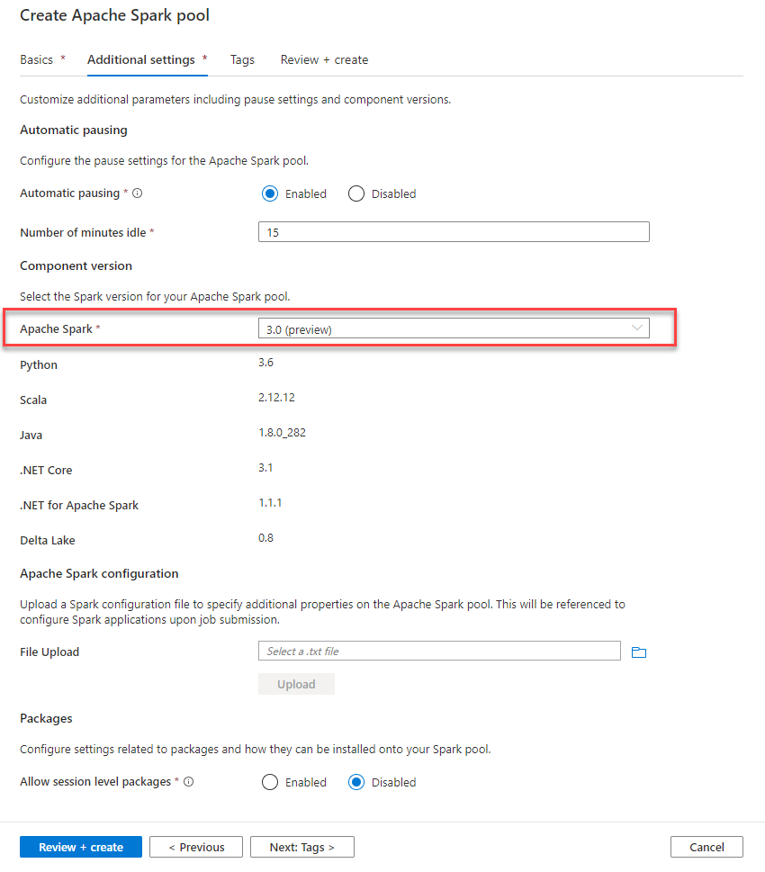

9. Create another Apache Spark pool named `SparkPool02`. Ensure Apache Spark version is set to 2.4.

    >NOTE:
    >
    >This second Spark pool is required for Exercise 08 which runs AutoML in the Spark session. AutoML libraries are currently not supported by the Synapse Spark 3.1 runtime.

10. For the remainder of this guide, the following terms will be used for various ASA-related resources (make sure you replace them with actual names and values):

    | ASA resource                              | To be referred to as     |
    |-------------------------------------------|--------------------------|
    | Workspace resource group                  | `WorkspaceResourceGroup` |
    | Workspace                                 | `Workspace`              |
    | Identity used to create `Workspace`       | `MasterUser`             |
    | Primary storage account                   | `PrimaryStorage`         |
    | Blob storage account                      | `BlobStorage`            |
    | First Spark pool                          | `SparkPool01`            |
    | Second Spark pool                         | `SparkPool02`            |
    | First SQL pool                            | `SQLPool01`              |
    | SQL admin account                         | `asa.sql.admin`          |
    | Linked service to first SQL pool          | `sqlpool01`              |
    | Linked service to primary storage account | `asadatalake01`          |
    | Linked service to blob storage account    | `asastore01`             |

11. Ensure the `Workspace` security principal (which has the same name as the `Workspace`) and the `MasterUser` (the one used to create the `Workspace`) are added with the `Storage Blob Data Owner` role to the `PrimaryStorage`.

## Task 2 - Upload the data used in the exercises

1. Create a folder named `bronze` in the `dev` file system of `PrimaryStorage`.

2. Create a folder named `sentiment` in the `bronze` folder in the `dev` file system of `PrimaryStorage`.

3. Upload the following data files to the `bronze` folder created above:

    | File name                    | Size      | Download from                                                                         |
    |------------------------------|-----------|---------------------------------------------------------------------------------------|
    | `postalcodes.csv`            | 1.8 MB    | <https://solliancepublicdata.blob.core.windows.net/wwi-01/postalcodes.csv>            |
    | `wwi-dimcity.csv`            | 17.5 MB   | <https://solliancepublicdata.blob.core.windows.net/wwi-01/wwi-dimcity.csv>            |
    | `wwi-dimcustomer.csv`        | 67.3 KB   | <https://solliancepublicdata.blob.core.windows.net/wwi-01/wwi-dimcustomer.csv>        |
    | `wwi-dimdate.csv`            | 146.3 KB  | <https://solliancepublicdata.blob.core.windows.net/wwi-01/wwi-dimdate.csv>            |
    | `wwi-dimemployee.csv`        | 18.7 KB   | <https://solliancepublicdata.blob.core.windows.net/wwi-01/wwi-dimemployee.csv>        |
    | `wwi-dimpaymentmethod.csv`   | 514 B     | <https://solliancepublicdata.blob.core.windows.net/wwi-01/wwi-dimpaymentmethod.csv>   |
    | `wwi-dimstockitem.csv`       | 114.6 KB  | <https://solliancepublicdata.blob.core.windows.net/wwi-01/wwi-dimstockitem.csv>       |
    | `wwi-dimsupplier.csv`        | 3.8 KB    | <https://solliancepublicdata.blob.core.windows.net/wwi-01/wwi-dimsupplier.csv>        |
    | `wwi-dimtransactiontype.csv` | 1.3 KB    | <https://solliancepublicdata.blob.core.windows.net/wwi-01/wwi-dimtransactiontype.csv> |
    | `wwi-factmovement.csv`       | 11.1 MB   | <https://solliancepublicdata.blob.core.windows.net/wwi-01/wwi-factmovement.csv>       |
    | `wwi-factorder.csv`          | 31.3 MB   | <https://solliancepublicdata.blob.core.windows.net/wwi-01/wwi-factorder.csv>          |
    | `wwi-factpurchase.csv`       | 461.1. KB | <https://solliancepublicdata.blob.core.windows.net/wwi-01/wwi-factpurchase.csv>       |
    | `wwi-factsale-big-1.csv`     | 3.0 GB    | <https://solliancepublicdata.blob.core.windows.net/wwi-01/wwi-factsale-big-1.csv>     |
    | `wwi-factsale-big-2.csv`     | 3.0 GB    | <https://solliancepublicdata.blob.core.windows.net/wwi-01/wwi-factsale-big-2.csv>     |
    | `wwi-factsale-big-3.csv`     | 3.0 GB    | <https://solliancepublicdata.blob.core.windows.net/wwi-01/wwi-factsale-big-3.csv>     |
    | `wwi-factsale-big-4.csv`     | 3.0 GB    | <https://solliancepublicdata.blob.core.windows.net/wwi-01/wwi-factsale-big-4.csv>     |
    | `wwi-factsale.csv`           | 1.8 GB    | <https://solliancepublicdata.blob.core.windows.net/wwi-01/wwi-factsale.csv>           |
    | `wwi-factstockholding.csv`   | 8.9 KB    | <https://solliancepublicdata.blob.core.windows.net/wwi-01/wwi-factstockholding.csv>   |
    | `wwi-facttransaction.csv`    | 7.2 MB    | <https://solliancepublicdata.blob.core.windows.net/wwi-01/wwi-facttransaction.csv>    |
    | `wwi-comments.csv`           | 7.7 KB    | <https://solliancepublicdata.blob.core.windows.net/wwi-01/wwi-comments.csv>           |

4. Create a file system named `database1` in `PrimaryStorage`.
5. Create a folder named `fact-sale` in the `database1` file system.
6. Create a folder named `Day=20191201` in the `fact-sale` folder.
7. Upload the file `sale-small-20191201-snappy.parquet` (<https://solliancepublicdata.blob.core.windows.net/wwi-02/sale-small/Year%3D2019/Quarter%3DQ4/Month%3D12/Day%3D20191201/sale-small-20191201-snappy.parquet>) to the `Day=20191201` folder.

8. Create a file system named `database1-staging` in `PrimaryStorage`.
9. Upload the file `customer.csv` (<https://solliancepublicdata.blob.core.windows.net/wwi-02/data-generators/customer.csv>) to the root of the `database1-staging` file system.

10. Create a folder named `sale-small-telemetry` in the `wwi` file system in `PrimaryStorage`.
11. Upload the following data files to the `sale-small-telemetry` folder:

    | File name | Size | Download from |
    |---|---|---|
    | `sale-small-telemetry-20191201.csv`            | 24.7 MB    | <https://solliancepublicdata.blob.core.windows.net/wwi-02/sale-small-telemetry/sale-small-telemetry-20191201.csv>            |
    | `sale-small-telemetry-20191202.csv`            | 98.5 MB    | <https://solliancepublicdata.blob.core.windows.net/wwi-02/sale-small-telemetry/sale-small-telemetry-20191202.csv>            |
    | `sale-small-telemetry-20191203.csv`            | 98.4 MB    | <https://solliancepublicdata.blob.core.windows.net/wwi-02/sale-small-telemetry/sale-small-telemetry-20191203.csv>            |
    | `sale-small-telemetry-20191204.csv`            | 98.8 MB    | <https://solliancepublicdata.blob.core.windows.net/wwi-02/sale-small-telemetry/sale-small-telemetry-20191204.csv>            |
    | `sale-small-telemetry-20191205.csv`            | 98.7 MB    | <https://solliancepublicdata.blob.core.windows.net/wwi-02/sale-small-telemetry/sale-small-telemetry-20191205.csv>            |
    | `sale-small-telemetry-20191206.csv`            | 98.9 MB    | <https://solliancepublicdata.blob.core.windows.net/wwi-02/sale-small-telemetry/sale-small-telemetry-20191206.csv>            |
    | `sale-small-telemetry-20191207.csv`            | 24.4 MB    | <https://solliancepublicdata.blob.core.windows.net/wwi-02/sale-small-telemetry/sale-small-telemetry-20191207.csv>            |
    | `sale-small-telemetry-20191208.csv`            | 24.4 MB    | <https://solliancepublicdata.blob.core.windows.net/wwi-02/sale-small-telemetry/sale-small-telemetry-20191208.csv>            |


## Task 3 - Setting Up Azure Cognitive Services

1. Navigate to [Create Cognitive Services](https://portal.azure.com/#create/Microsoft.CognitiveServicesAllInOne) page and fill in the appropriate values exemplified below to create an All-In-One Cognitive Services account.

    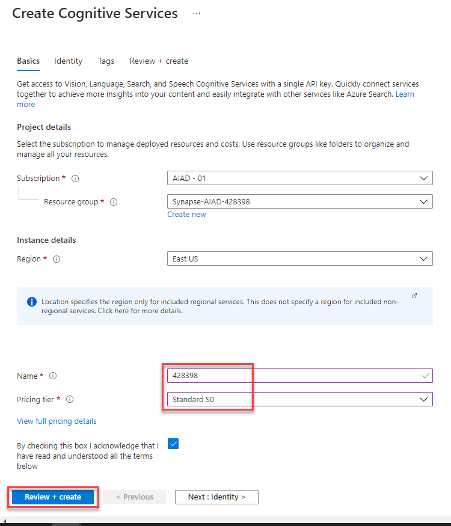

2. Go to **Cognitive Service > Keys and Endpoint (1)**. Copy **Key 1 (2)** and **Endpoint (3)** to a text editor of your choice to be used in the following steps.

    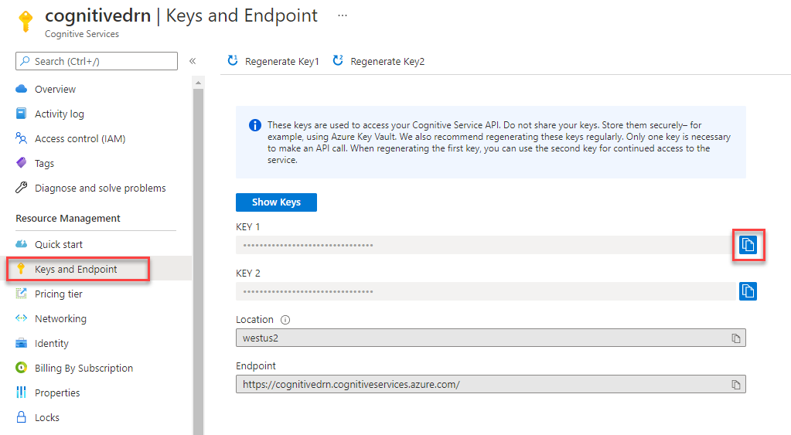

3. Navigate to [Create Key Vault](https://portal.azure.com/#create/Microsoft.KeyVault) page and fill in the appropriate values exemplified below to create a Key Vault account.

    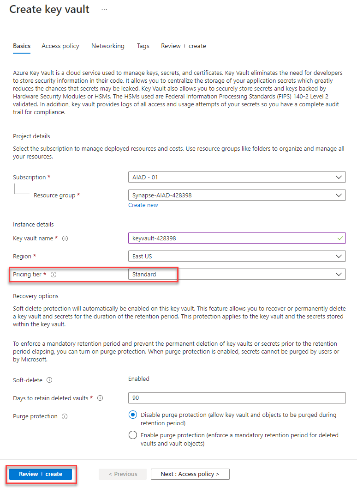

4. Go to **Key Vault > Access policies (1)**, and grant **(2)** the Azure Synapse workspace Managed Service Identity permissions **(3)** to read secrets from Azure Key Vault.

    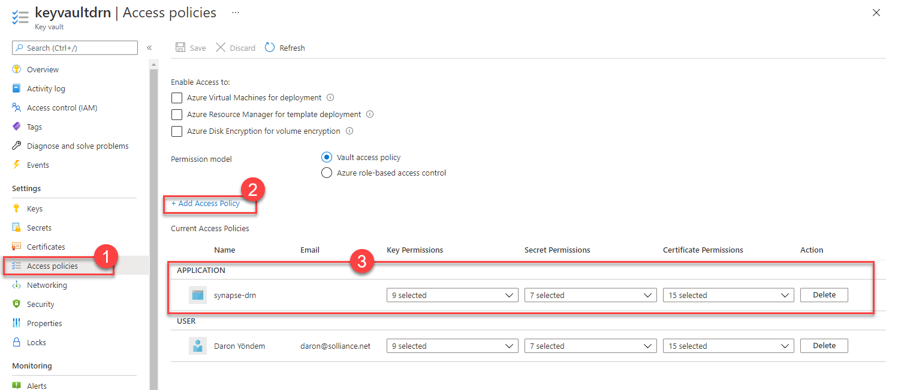

5. Go to **Key Vault > Secret** to create a new secret. Select **+Generate/Import** to continue.

    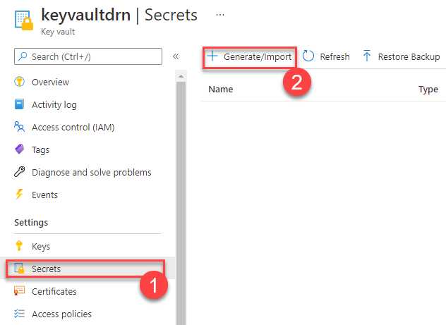

6. Set the secret's name to **CognitiveKey**, and then paste the key from the previous step into the Value field. Finally, select Create.

    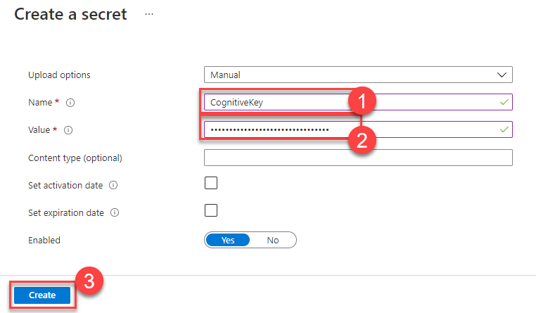

7. In the Synapse Workspace, create an **Azure Key Vault** linked service by pointing to the key vault you just created. It is recommended to name the linked service `KeyVault`.  Verify the connection by selecting the **Test connection** button. If the connection is green, select **Create** and then select **Publish all** to save your change.

8. In the Synapse Workspace, create an **Azure Cognitive Service** linked service by pointing to the cognitive service and key vault you just created. Make sure **Secret name** is set to **CognitiveKey**. It is recommended to name the linked service `CognitiveService`. Select **Create (2)** and then select **Publish all** to save your change.

    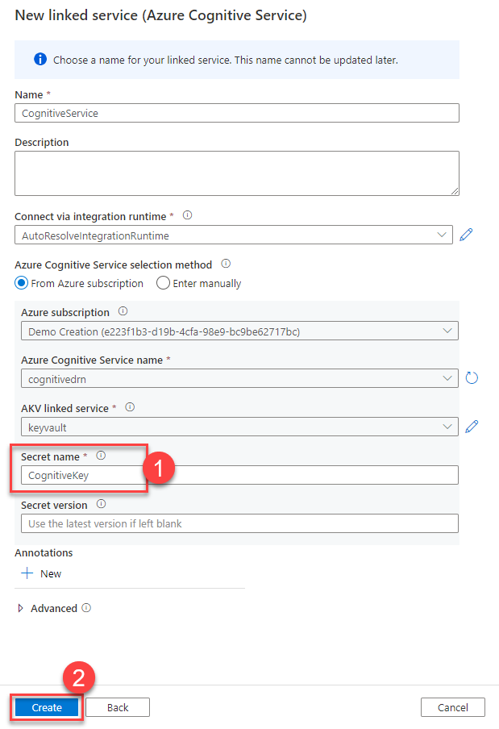

9. In the Synapse Workspace, create a **REST** linked service. Set **Base URL** to the previously copied Cognitive Service Endpoint value. Set Authentication Type to **Anonymous (3)**. It is recommended to name the linked service `CognitiveRESTEndpoint`. Select **Create (2)** and then select **Publish all** to save your change.

    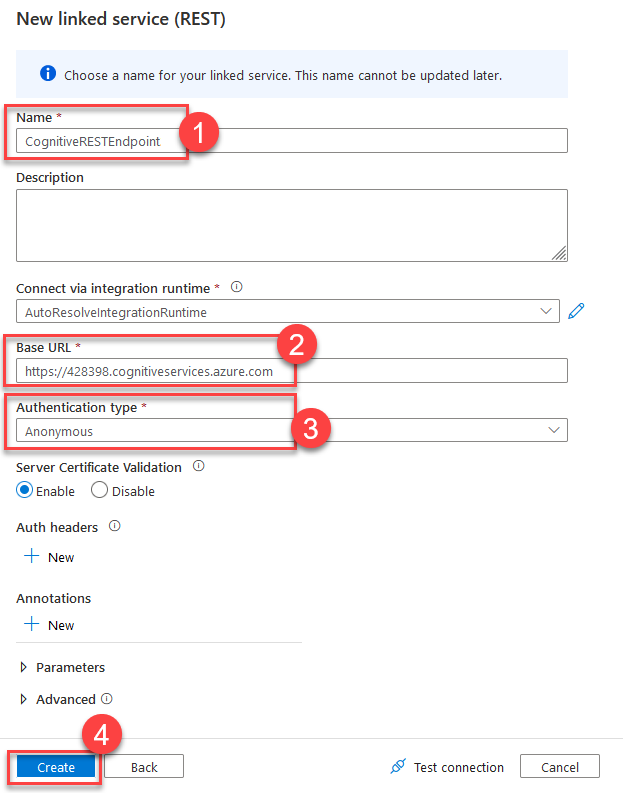

10. Create a new, empty dataset with the `cognitive_rest_dataset` name.

11. Switch to code view and replace the code with the content of the [cognitive_rest_dataset.json](artifacts/00/datasets/cognitive/cognitive_rest_dataset.json) JSON file.

12. If the name used for the linked service to the REST Linked Service is not `CognitiveRESTEndpoint`, replace the `properties.linkedServiceName.referenceName` value in JSON with the actual name of the linked service.

13. Save and publish the dataset.

14. Open the [Exercise 2 - Enrich Data.json](./artifacts/00/pipelines/Exercise%202%20-%20Enrich%20Data.json) file in a text editor.  Find the `REPLACE-WITH-YOUR-COGNITIVE-KEY` text and replace it with the previously copied Cognitive Service **Key 1**. Save the file for future use. This is the new pipeline definition file you will when creating pipeline during the following steps.

    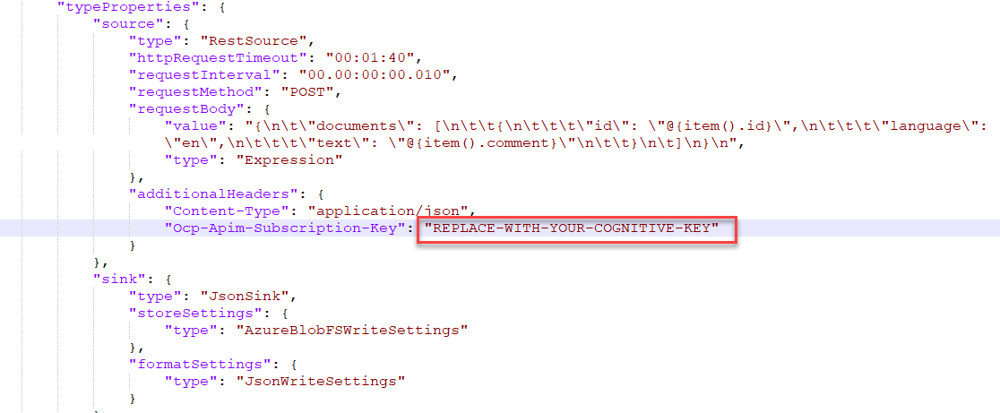

## Task 4 - Setting up a Synapse Analytics Data Explorer pool

1. In Synapse Studio, go to the `Manage` hub and create a new Data Explorer pool. Use the `Compute optimized` workload and the `Extra Small (2 cores)` size. Leave all other options with defaults.

2. Add the Synapse workspace managed identiy as `Contributor` to the Data Explorer workspace.

    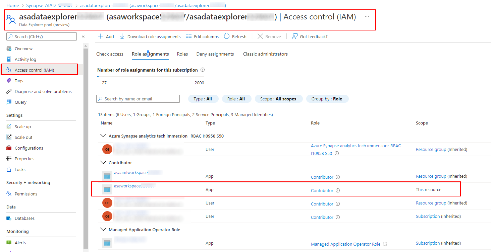

3. Once the Data Explorer pool is created, create a linked service pointing to it. Make sure you use the options highlighed below. Once the linked service is created, make sure you publish it to the Synapse workspace.

    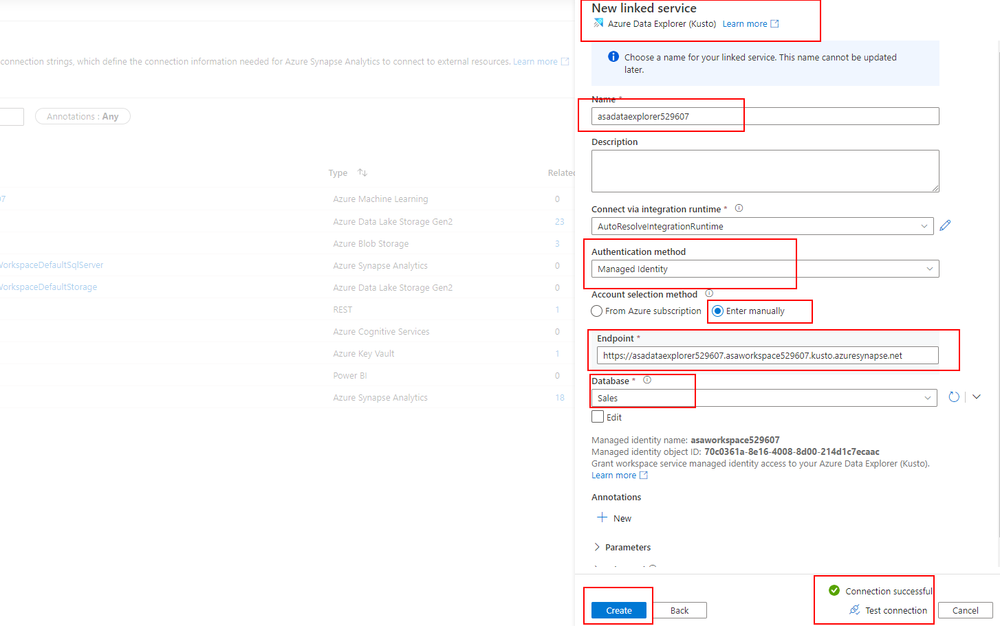

## Task 5 - Setting up an Azure Purview workspace

1. In the resource group, create an Azure Purview workspace.

2. In Synapse Studio, navigate to the `Manage` hub and select the `Azure Purview` section. Connect the Azure Purview workspace to the Synapse Analytics workspace.

3. Add the Purview managed identity to the `Reader` role of the Synapse workspace object.

    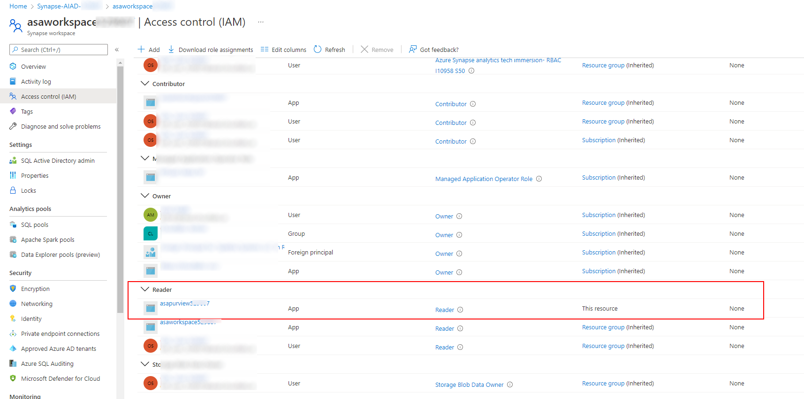

    Add the Purview managed identity to the `Storage Blob Data Reader` role of the primary data lake storage account assigned to the Synapse workspace.

    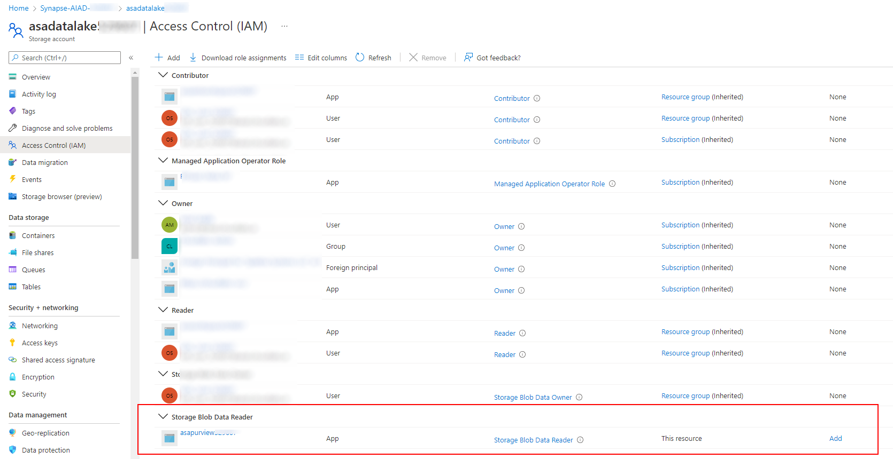

    Create a login for the Purview managed identity in the Synapse serverless SQL pool by running the following script on the `Built-in`, `master` database (make sure you replace `<purview_workspace_name>` with the name of your Purview workspace):

    ```sql
    CREATE LOGIN [<purview_workspace_name>] FROM EXTERNAL PROVIDER;
    ```

    Provide read permissions for the Purview managed identity in the `SQLPool01` Synapse dedicated SQL pool by running the following script on the `SQLPool01` SQL pool:

    ```sql
    CREATE USER [asapurview529607] FROM EXTERNAL PROVIDER
    GO

    EXEC sp_addrolemember 'db_datareader', [asapurview529607]
    GO
    ```

4. In Purview Studio, navigate to the `Data map` hub and select the root collection. Add the Synapse workspace managed identity to the `Data curators` role.

    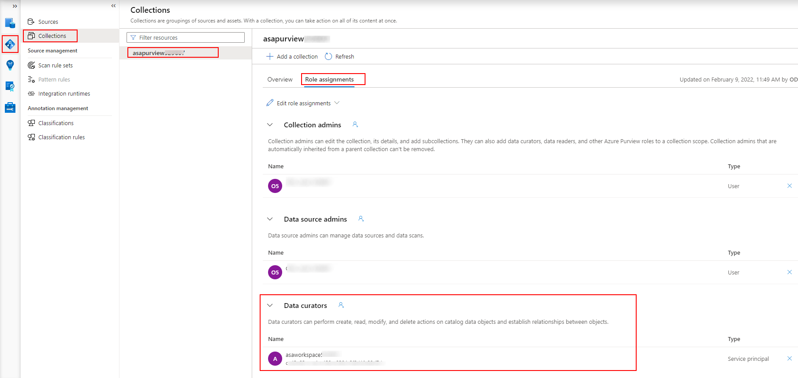

5. In Purview Studio, register your Synapse workspace as a source into the root collection.

    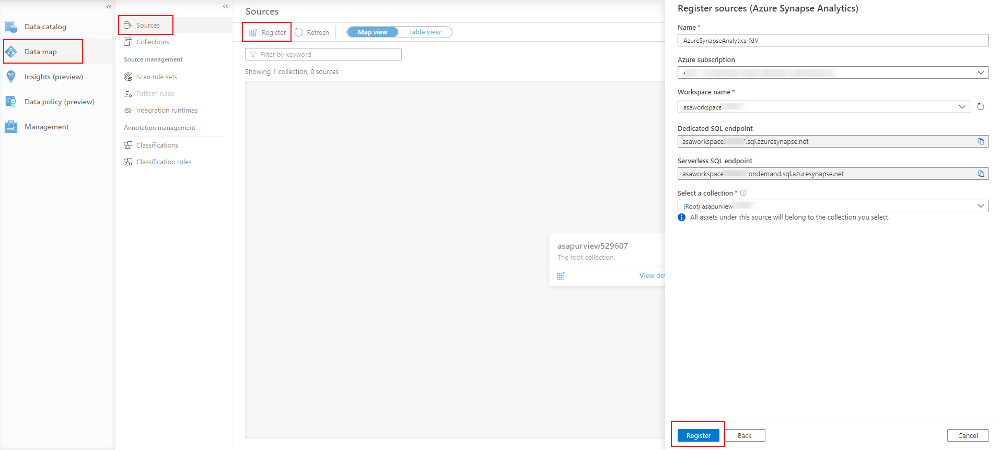

6. Initiate a new scan using the newly registered source. Make sure the scan completes successfully.

    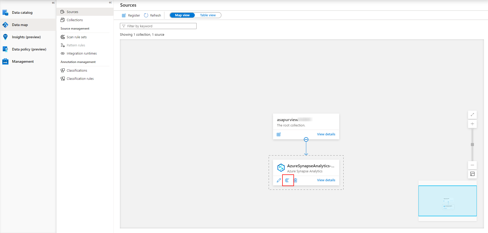

7. Configure the scan to target the `SQLPool01` dedicated SQL pool and make sure you test the connection before selecting `Continue`.

    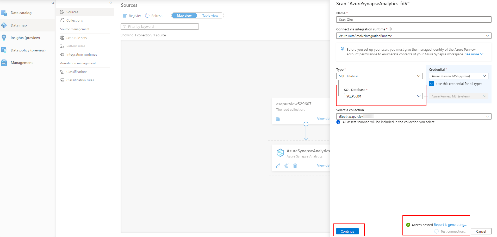

8. Select the `AzureSynapseSQL` scan rule set and `Continue`.
9. Select `Once` in the scan trigger section and `Continue`.
10. Select `Save and run` to start the scan. Wait until the scna completes successfully.

## Task 6 - Import datasets, data flows, and pipelines

### Import datasets pointing to `PrimaryStorage`

Perform the following steps for each dataset to be imported:

1. Create a new, empty dataset with the same name as the one to be imported.

2. Switch to code view and replace the code with the content of the associated JSON file.

3. If the name used for the linked service to `PrimaryStorage` is not `asadatalake01`, replace the `properties.linkedServiceName.referenceName` value in JSON with the actual name of the linked service.

4. Save and publish the dataset. Optionally, you can publish all datasets at once at the end of the import procedure.

The following datasets pointing to `PrimaryStorage` must be imported:

| Dataset                         | Source code                                                                                         |
|---------------------------------|-----------------------------------------------------------------------------------------------------|
| `external_postalcode_adls`      | [external_postalcode_adls.json](artifacts/00/datasets/adls/external_postalcode_adls.json)           |
| `staging_enrichedcustomer_adls` | [staging_enrichedcustomer_adls.json](artifacts/00/datasets/adls/staging_enrichedcustomer_adls.json) |
| `wwi_comments_adls`             | [wwi_comments_adls.json](artifacts/00/datasets/adls/wwi_comments_adls.json) |
| `wwi_dimcity_adls`              | [wwi_dimcity_adls.json](artifacts/00/datasets/adls/wwi_dimcity_adls.json)                           |
| `wwi_dimcustomer_adls`          | [wwi_dimcustomer_adls.json](artifacts/00/datasets/adls/wwi_dimcustomer_adls.json)                   |
| `wwi_dimdate_adls`              | [wwi_dimdate_adls.json](artifacts/00/datasets/adls/wwi_dimdate_adls.json)                           |
| `wwi_dimemployee_adls`          | [wwi_dimemployee_adls.json](artifacts/00/datasets/adls/wwi_dimemployee_adls.json)                   |
| `wwi_dimpaymentmethod_adls`     | [wwi_dimpaymentmethod_adls.json](artifacts/00/datasets/adls/wwi_dimpaymentmethod_adls.json)         |
| `wwi_dimstockitem_adls`         | [wwi_dimstockitem_adls.json](artifacts/00/datasets/adls/wwi_dimstockitem_adls.json)                 |
| `wwi_dimsupplier_adls`          | [wwi_dimsupplier_adls.json](artifacts/00/datasets/adls/wwi_dimsupplier_adls.json)                   |
| `wwi_dimtransactiontype_adls`   | [wwi_dimtransactiontype_adls.json](artifacts/00/datasets/adls/wwi_dimtransactiontype_adls.json)     |
| `wwi_factmovement_adls`         | [wwi_factmovement_adls.json](artifacts/00/datasets/adls/wwi_factmovement_adls.json)                 |
| `wwi_factorder_adls`            | [wwi_factorder_adls.json](artifacts/00/datasets/adls/wwi_factorder_adls.json)                       |
| `wwi_factpurchase_adls`         | [wwi_factpurchase_adls.json](artifacts/00/datasets/adls/wwi_factpurchase_adls.json)                 |
| `wwi_factsale_adls`             | [wwi_factsale_adls.json](artifacts/00/datasets/adls/wwi_factsale_adls.json)                         |
| `wwi_factsale_big_1_adls`       | [wwi_factsale_big_1_adls.json](artifacts/00/datasets/adls/wwi_factsale_big_1_adls.json)             |
| `wwi_factsale_big_2_adls`       | [wwi_factsale_big_2_adls.json](artifacts/00/datasets/adls/wwi_factsale_big_2_adls.json)             |
| `wwi_factsale_big_3_adls`       | [wwi_factsale_big_3_adls.json](artifacts/00/datasets/adls/wwi_factsale_big_3_adls.json)             |
| `wwi_factsale_big_4_adls`       | [wwi_factsale_big_4_adls.json](artifacts/00/datasets/adls/wwi_factsale_big_4_adls.json)             |
| `wwi_factstockholding_adls`     | [wwi_factstockholding_adls.json](artifacts/00/datasets/adls/wwi_factstockholding_adls.json)         |
| `wwi_facttransaction_adls`      | [wwi_facttransaction_adls.json](artifacts/00/datasets/adls/wwi_facttransaction_adls.json)           |
| `wwi_sentiments_adls`           | [wwi_sentiments_adls.json](artifacts/00/datasets/adls/wwi_sentiments_adls.json)                     |
| `wwi_sale_small_telemetry_adls` | [wwi_sale_small_telemetry_adls.json](artifacts/00/datasets/adls/wwi_sale_small_telemetry_adls.json) |

### Import datasets pointing to `SQLPool1`

Perform the following steps for each dataset to be imported:

1. Create a new, empty dataset with the same name as the one to be imported.

2. Switch to code view and replace the code with the content of the associated JSON file.

3. If the name used for the linked service to `SQLPool01` is not `sqlpool01`, replace the `properties.linkedServiceName.referenceName` value in JSON with the actual name of the linked service.

4. Save and publish the dataset. Optionally, you can publish all datasets at once at the end of the import procedure.

The following datasets pointing to `SQLPool01` must be imported:

| Dataset                            | Source code                                                                                              |
|------------------------------------|----------------------------------------------------------------------------------------------------------|
| `wwi_dimcity_asa`                  | [wwi_dimcity_asa.json](artifacts/00/datasets/asa/wwi_dimcity_asa.json)                                   |
| `wwi_dimcustomer_asa`              | [wwi_dimcustomer_asa.json](artifacts/00/datasets/asa/wwi_dimcustomer_asa.json)                           |
| `wwi_dimdate_asa`                  | [wwi_dimdate_asa.json](artifacts/00/datasets/asa/wwi_dimdate_asa.json)                                   |
| `wwi_dimemployee_asa`              | [wwi_dimemployee_asa.json](artifacts/00/datasets/asa/wwi_dimemployee_asa.json)                           |
| `wwi_dimpaymentmethod_asa`         | [wwi_dimpaymentmethod_asa.json](artifacts/00/datasets/asa/wwi_dimpaymentmethod_asa.json)                 |
| `wwi_dimstockitem_asa`             | [wwi_dimstockitem_asa.json](artifacts/00/datasets/asa/wwi_dimstockitem_asa.json)                         |
| `wwi_dimsupplier_asa`              | [wwi_dimsupplier_asa.json](artifacts/00/datasets/asa/wwi_dimsupplier_asa.json)                           |
| `wwi_dimtransactiontype_asa`       | [wwi_dimtransactiontype_asa.json](artifacts/00/datasets/asa/wwi_dimtransactiontype_asa.json)             |
| `wwi_factmovement_asa`             | [wwi_factmovement_asa.json](artifacts/00/datasets/asa/wwi_factmovement_asa.json)                         |
| `wwi_factorder_asa`                | [wwi_factorder_asa.json](artifacts/00/datasets/asa/wwi_factorder_asa.json)                               |
| `wwi_factpurchase_asa`             | [wwi_factpurchase_asa.json](artifacts/00/datasets/asa/wwi_factpurchase_asa.json)                         |
| `wwi_factsale_asa`                 | [wwi_factsale_asa.json](artifacts/00/datasets/asa/wwi_factsale_asa.json)                                 |
| `wwi_factstockholding_asa`         | [wwi_factstockholding_asa.json](artifacts/00/datasets/asa/wwi_factstockholding_asa.json)                 |
| `wwi_facttransaction_asa`          | [wwi_facttransaction_asa.json](artifacts/00/datasets/asa/wwi_facttransaction_asa.json)                   |
| `wwi_perf_factsale_fast_asa`       | [wwi_perf_factsale_fast_asa.json](artifacts/00/datasets/asa/wwi_perf_factsale_fast_asa.json)             |
| `wwi_perf_factsale_slow_asa`       | [wwi_perf_factsale_slow_asa.json](artifacts/00/datasets/asa/wwi_perf_factsale_slow_asa.json)             |
| `wwi_staging_dimcustomer_asa`      | [wwi_staging_dimcustomer_asa.json](artifacts/00/datasets/asa/wwi_staging_dimcustomer_asa.json)           |
| `wwi_staging_enrichedcustomer_asa` | [wwi_staging_enrichedcustomer_asa.json](artifacts/00/datasets/asa/wwi_staging_enrichedcustomer_asa.json) |

### Import datasets pointing to the Data Explorer pool

Perform the following steps for each dataset to be imported:

1. Create a new, empty dataset with the same name as the one to be imported.

2. Switch to code view and replace the code with the content of the associated JSON file.

3. If the name used for the linked service does not match the one of the previously created Data Explorer linked service, replace the `properties.linkedServiceName.referenceName` value in JSON with the actual name of the linked service.

4. Save and publish the dataset. Optionally, you can publish all datasets at once at the end of the import procedure.

The following datasets pointing to the Data Explorer pool must be imported:

| Dataset                            | Source code                                                                                              |
|------------------------------------|----------------------------------------------------------------------------------------------------------|
| `wwi_sale_small_telemetry_ade`                  | [wwi_sale_small_telemetry_ade.json](artifacts/00/datasets/ade/wwi_sale_small_telemetry_ade.json)                                   |

### Import data flows

Perform the following steps for each data flow to be imported:

1. Create a new, empty data flow with the same name as the one to be imported.

2. Switch to code view and replace the code with the content of the associated JSON file.

3. Save and publish the data flow. Optionally, you can publish all data flows at once at the end of the import procedure.

The following data-flows must be imported:

| Data flow            | Source code                                                                 |
|----------------------|-----------------------------------------------------------------------------|
| `EnrichCustomerData` | [EnrichCustomerData.json](./artifacts/00/dataflows/EnrichCustomerData.json) |

### Import pipelines

Perform the following steps for each pipeline to be imported:

1. Create a new, empty pipeline with the same name as the one to be imported.

2. Switch to code view and replace the code with the content of the associated JSON file.

3. Save and publish the pipeline. Optionally, you can publish all pipelines at once at the end of the import procedure.

The following pipelines must be imported:

| Pipeline                                | Source code                                                                                                                     |
|-----------------------------------------|---------------------------------------------------------------------------------------------------------------------------------|
| `Exercise 2 - Enrich Data`*         | [Exercise 2 - Enrich Data.json](./artifacts/00/pipelines/Exercise%202%20-%20Enrich%20Data.json)                                 |
| `Import WWI Data`                       | [Import WWI Data.json](./artifacts/00/pipelines/Import%20WWI%20Data.json)                                                       |
| `Import WWI Data - Fact Sale Full`      | [Import WWI Data - Fact Sale Full.json](./artifacts/00/pipelines/Import%20WWI%20Data%20-%20Fact%20Sale%20Full.json)             |
| `Import WWI Perf Data - Fact Sale Fast` | [Import WWI Perf Data - Fact Sale Fast.json](./artifacts/00/pipelines/Import%20WWI%20Perf%20Data%20-%20Fact%20Sale%20Fast.json) |
| `Import WWI Perf Data - Fact Sale Slow` | [Import WWI Perf Data - Fact Sale Slow.json](./artifacts/00/pipelines/Import%20WWI%20Perf%20Data%20-%20Fact%20Sale%20Slow.json) |
| `Exercise 5 - Import sales telemetry data` | [Exercise 5 - Import sales telemetry data](./artifacts/00/pipelines/Exercise%205%20-%20Import%20sales%20telemetry%20data.json)

\* Make sure you are using the updated Pipeline file where you replaced the `REPLACE-WITH-YOUR-COGNITIVE-KEY` value with the actual Cognitive Services Key 1 value.

## Task 7 - Populate `PrimaryStorage` with data

1. Import the [Setup - Export Sales to Data Lake](./artifacts/00/notebooks/Setup%20-%20Export%20Sales%20to%20Data%20Lake.ipynb) notebook.

2. Replace `<primary_storage>` with the actual data lake account name of `PrimaryStorage` in cells 1, 3, 4 and 5.

3. Run the notebook to populate `PrimaryStorage` with data.

## Task 8 - Configure the SQL on-demand pool

1. Create a SQL on-demand database running the following script on the `master` database of the SQL on-demand pool:

    ```sql
    CREATE DATABASE SQLOnDemand01
    ```

2. Ensure the SQL on-demand pool can query the storage account using the following script:

    ```sql
    CREATE CREDENTIAL [https://<primary_storage>.dfs.core.windows.net]
    WITH IDENTITY='User Identity';
    ```

    In the script above, replace `<primary_storage>` with the name of `PrimaryStorage`.

## Task 9 - Configure `SQLPool01`

1. Connect with either the SQL Active Directory admin or the `asa.sql.admin` account to `SQLPool01` using the tool of your choice.

2. Run the [WWI-Reset-SQLPoolSchema](./artifacts/00/sql/WWI-Reset-SQLPool-Schema.sql) SQL script to initialize the schema of the SQL pool.

3. Create the `asa.sql.staging` login in the `master` database of `Workspace` using the following script:

    ```sql
    CREATE LOGIN [asa.sql.staging]
    WITH PASSWORD = '<password>'
    GO
    ```

    In the script above, replace `<password>` with the actual password of the login.

4. Create the `asa.sql.staging` user in `SQLPool01` using the following script:

    ```sql
    CREATE USER [asa.sql.staging]
        FOR LOGIN [asa.sql.staging]
        WITH DEFAULT_SCHEMA = dbo
    GO

    -- Add user to the required roles

    EXEC sp_addrolemember N'db_datareader', N'asa.sql.staging'
    GO

    EXEC sp_addrolemember N'db_datawriter', N'asa.sql.staging'
    GO

    EXEC sp_addrolemember N'db_ddladmin', N'asa.sql.staging'
    GO
    ```

5. Configure access control to workspace pipeline runs in `SQLPool01` using the following script:

    ```sql
    --Create user in DB
    CREATE USER [<workspace>] FROM EXTERNAL PROVIDER;

    --Granting permission to the identity
    GRANT CONTROL ON DATABASE::<sqlpool> TO [<workspace>];
    ```

    In the script above, replace `<workspace>` with the actual name of `Workspace` and `<sqlpool>` with the actual name of `SQLPool01`.

6. Run the `Import WWI Data` pipeline to import all data except the sale facts into `SQLPool01`.

7. Run the `Import WWI Data - Fact Sale Full` pipeline to import the sale facts into `SQLPool01`.

8. Run the `Import WWI Perf Data - Fact Sale Fast` and `Import WWI Perf Data - Fact Sale Slow` pipelines to import the large-sized sale facts into `SQLPool01`.

## Task 10 - Configure Power BI

1. Ensure the `MasterUser` has a Power BI Pro subscription assigned.

2. Sign in to the [Power BI portal](https://powerbi.com) using the credentials of `MasterUser` and create a new Power BI workspace. In the remainder of this guide, this workspace will be referred to as `PowerBIWorkspace`.

3. Perform all the steps described in [Exercise 3 - Task 1](03-power-bi-integration.md##task-1---create-a-power-bi-dataset-in-synapse). In step 11, instead of using the suggested naming convention, name your dataset `wwifactsales`.

4. In the Power BI portal, edit the security settings of the `wwifactsales` dataset and configure it to authenticate to `SQLPool01` using the credentials of the `asa.sql.admin` account. This allows the `Direct Query` option to work correctly for all participants in the exercise.

## Task 11 - Create and configure the Azure Machine Learning workspace

1. In the resource group, create a new Azure Machine Learning workspace (with default settings).

2. Add the managed identity of the Synapse Analytics workspace as `Contributor` to the newly created Azure Machine Learning workspace.

    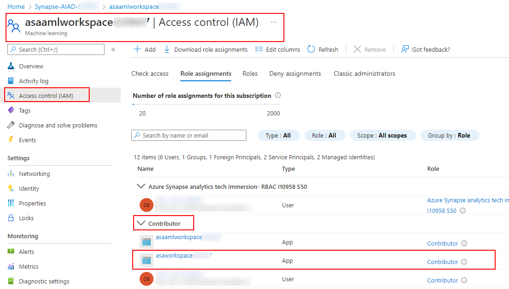

3. In Synapse Analytics Studio, create a new Azure Machine Learning linked service pointing to the newly created Azure Machine Learning workspace. Set the linked service name to be the same as the Azure Machine Learning workspace name and select it from the subscription. Make sure you test the connection to validate that all settings are correct. After the linked service is created, make sure to publish it in Synapse Studio.

    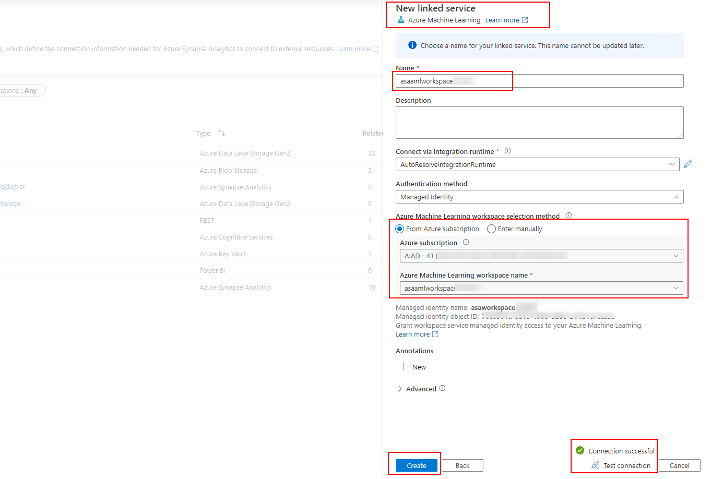

## Task 12 - Import all SQL scripts and Spark notebooks

Import the following SQL scripts into `Workspace`:

| SQL script name                               | Source code                                                                                                                     | Replacements                                                                                                                                |
|-----------------------------------------------|---------------------------------------------------------------------------------------------------------------------------------|---------------------------------------------------------------------------------------------------------------------------------------------|
| `Exercise 1 - Read with serverless SQL Pool`  | [Exercise 1 - Read with serverless SQL Pool.sql](./artifacts/01/Exercise%201%20-%20Read%20with%20serverless%20SQL%20Pool.sql)   | `<primary_storage>` with the actual name of `PrimaryStorage`                                                                                |
| `Exercise 3 - Analyze Transactions`           | [Exercise 3 - Analyze Transactions.sql](./artifacts/03/Exercise%203%20-%20Analyze%20Transactions.sql)                           | None                                                                                                                                        |
| `Exercise 3 - Investigate query performance`  | [Exercise 3 - Investigate query performance.sql](./artifacts/03/Exercise%203%20-%20Investigate%20query%20performance.sql)       | None                                                                                                                                        |

Import the following Spark notebooks into `Workspace`:

| Spark notebook name                       | Source code                                                                                                               | Spark Pool to use | Replacements                                                                                                                                                                                                                                                                                            |
|-------------------------------------------|---------------------------------------------------------------------------------------------------------------------------|---|---------------------------------------------------------------------------------------------------------------------------------------------------------------------------------------------------------------------------------------------------------------------------------------------------------|
| `Exercise 1 - Read with Spark`            | [Exercise 1 - Read with Spark.ipynb](./artifacts/01/Exercise%201%20-%20Read%20with%20Spark.ipynb)                         | `SparkPool01` | `<primary_storage>` with the actual name of `PrimaryStorage`                                                                                                                                                                                                                                            |
| `Exercise 2 - Ingest Sales Data`          | [Exercise 2 - Ingest Sales Data.ipynb](./artifacts/02/Exercise%202%20-%20Ingest%20Sales%20Data.ipynb)                     | `SparkPool01` | In cell 1 - `<primary_storage>` with the actual name of `PrimaryStorage`                                                                                                                                                                                                                                |
| `Exercise 2 - Bonus Notebook with CSharp` | [Exercise 2 - Bonus Notebook with CSharp.ipynb](./artifacts/02/Exercise%202%20-%20Bonus%20Notebook%20with%20CSharp.ipynb) |`SparkPool01` | In cell 1 - `<primary_storage>` with the actual name of `PrimaryStorage`; In cell 3 - `<sql_staging_password>` with the password of `asa.sql.staging` created above in Task 9, step 3; In cell 3 - `<workspace>` with the name of the `Workspace`; In cell 3 - `<sql_pool>` with the name of `SQLPool1` |
| `Exercise 8 - AutoML with Spark` | [Exercise 8 - Automl with Spark.ipynb](./artifacts/08/Exercise%208%20-%20AutoML%20with%20Spark.ipynb) |`SparkPool02` | In cell 4 - `<subscription_id>` with the subscription id, `<resource_group_name>` with the name of the resource group, `<aml_workspace_name>` with the name of the Azure Machine Learning workspace, `<aml_workspace_location>` with the location of the Azure Machine Learning workspace. |

## Task 13 - Configure additional users to access the workspace

For each additional user that needs to have access to `Workspace` and run exercises 1 through 8, the following steps must be performed:

1. Assign the `Reader` role on the `WorkspaceResourceGroup` to the user.

2. Assign the `Reader` and `Blob Data Contributor` roles on the `PrimaryStorage` to the user.

3. Assign the `Workspace admin` role in the `Workspace` to the user.

4. Grant access to the `SQLPool01` to the user using the script below. You must be signed in with the `MasterUser` credentials (use SQL Server Management Studio if the script fails in Synapse Studio).

    ```sql
    CREATE USER [<user_principal_name>] FROM EXTERNAL PROVIDER;
    EXEC sp_addrolemember 'db_owner', '<user_principal_name>';
    ```

    In the script above, replace `<user_principal_name>` with Azure Active Directory user principal name of the user.

5. Assign the `Contributor` role on the Power BI workspace of the `MasterUser` created in Task 10, step 2.

## Task 14 - Setting Cognitive Services Access Key for Pipelines

1. In Synapse Workspace, open **Exercise 2 - Enrich Data (2)** pipeline. Select the **Edit (3)** button for Activities in the **ForEachComment** ForEach activity.

    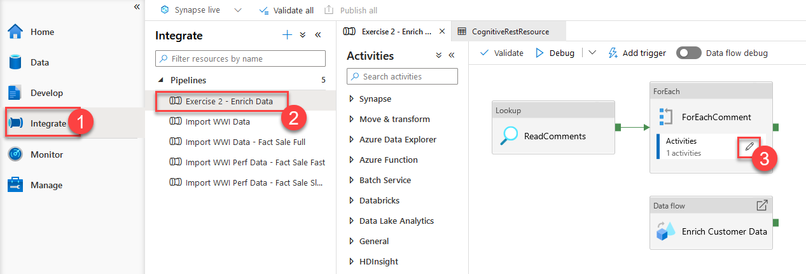

2. Select **Sentiment Analysis (1)** copy data activity. Switch to the **Source (2)** tab. Paste the Cognitive Service access key previously copied into a text editor.

    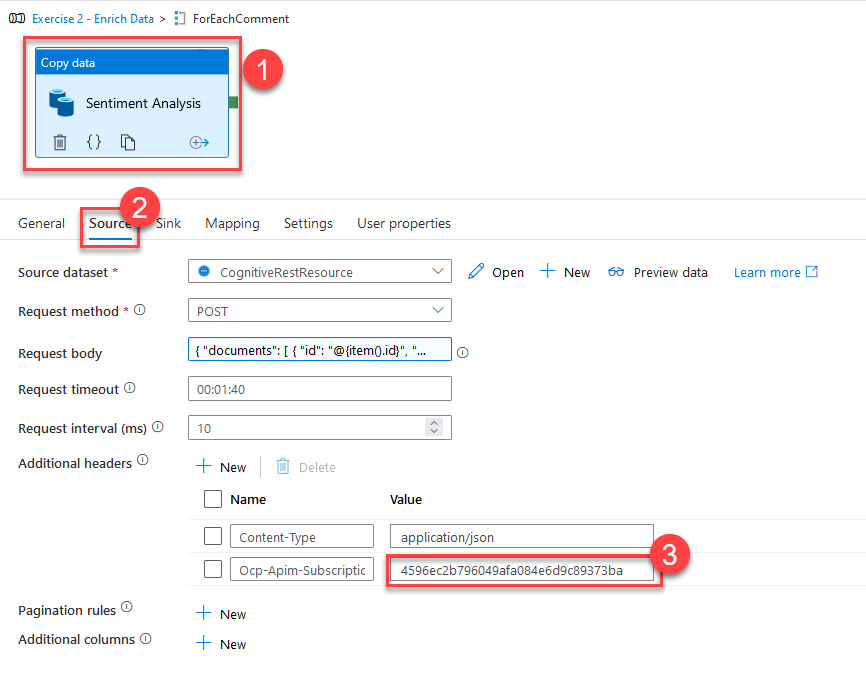
