# Exercise 1 - Explore the data lake with Azure Synapse SQL On-demand and Azure Synapse Spark

In this exercise, you will explore data using the engine of your choice (SQL or Spark).

Understanding data through data exploration is one of the core challenges faced today by data engineers and data scientists as well. Depending on the underlying structure of the data as well as the specific requirements of the exploration process, different data processing engines will offer varying degrees of performance, complexity, and flexibility.

In Azure Synapse Analytics, you can use either the SQL Serverless engine, the big-data Spark engine, or both.

The tasks you will perform in this exercise are:

- Explore the Data Lake with SQL On-demand and Spark
  - Task 1 - Explore the Data Lake with Synapse SQL On-demand
  - Task 2 - Explore the Data Lake with Synapse Spark

## Task 1 - Explore the data lake with Azure Synapse SQL On-demand

In this task, you will browse your data lake using SQL On-demand.

1. In a web browser, navigate to the Azure portal (`https://portal.azure.com`) and login with your credentials. Then select **Resource groups**.

   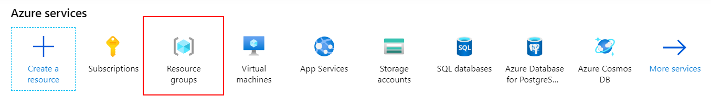

2. Select the **Synapse Analytics** resource group.

   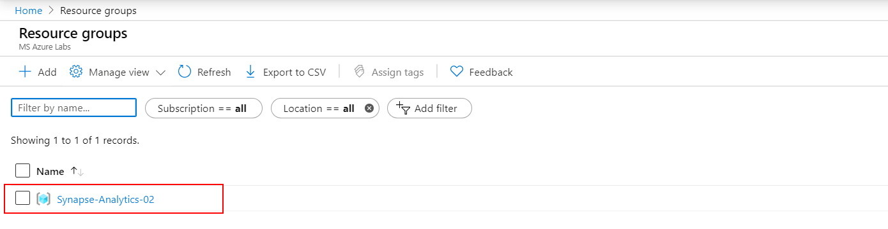

3. Select the **Synapse Analytics** workspace.

   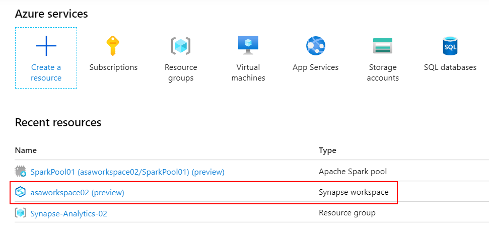

4. On the Synapse workspace blade, open Synapse Analytics Studio by selecting **Launch Synapse Studio** from the toolbar.

   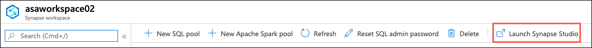

5. In Synapse Analytics Studio, navigate to the `Data` hub.

   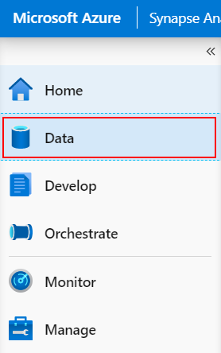

6. Switch to the `Linked` tab. Under `Storage accounts`, expand the **Storage account** node, expand the data lake storage account, and then select the `wwi` file system.

7. Inside the selected file system, navigate to `factsale-parquet` -> `2012` -> `Q1` -> `InvoiceDateKey=2012-01-01`.

8. Once you are in `InvoiceDateKey=2012-01-01` right-click the Parquet file and select `New SQL script - Select TOP 100 rows`.

   > A script is automatically generated. Run this script to see how SQL on demand queries the file and returns the first 100 rows of that file with the header, allowing you to easily explore data in the file

   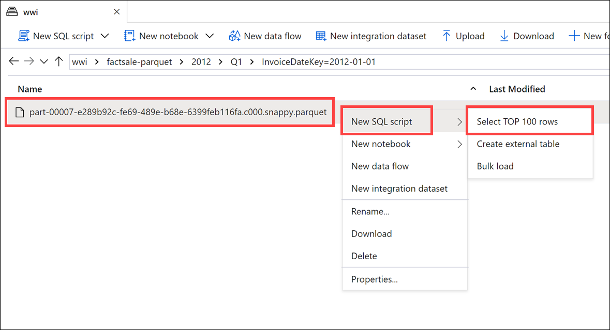

9. Ensure the newly created script is connected to the `SQL on-demand` pool and select `Run`. Data is loaded by the on-demand SQL pool and processed as if it was coming from any regular relational database.

   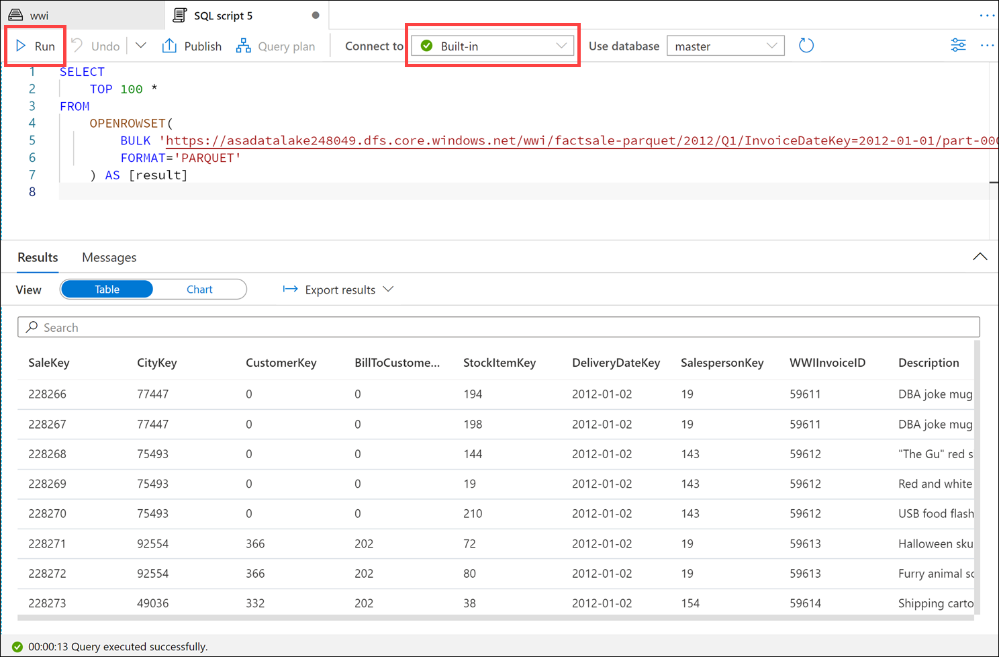

10. Let us change the initial script to load multiple Parquet files at once.

    - In line 2, replace `TOP 100 *` with `COUNT(*)`.
    - In line 5, replace the path to the individual file with

    ```python
    https://<yourdatalake storage account name>.dfs.core.windows.net/wwi/factsale-parquet/2012/Q1/*/*
    ```

11. Select `Run` to re-run the script.

    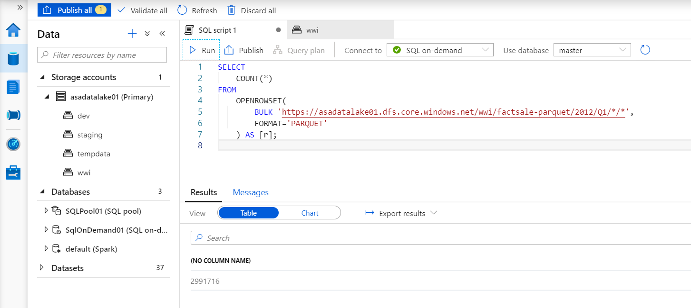

12. In Azure Synapse Analytics Studio, navigate to the `Develop` hub, select the `Exercise 1 - Read with SQL on-demand` SQL script, and then select `Run`.

    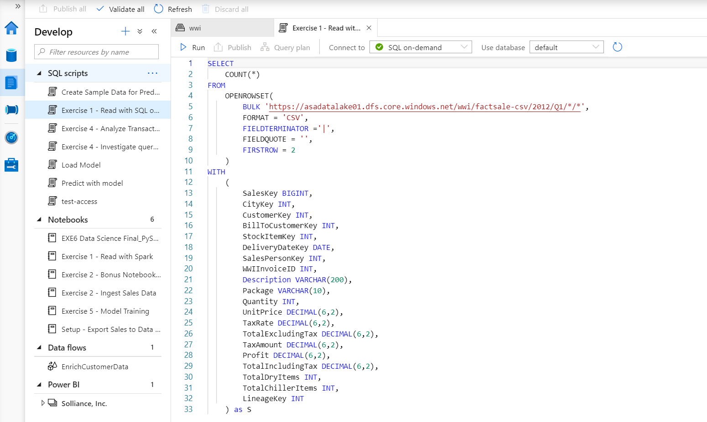

    > This query demonstrates the same functionality, except this time, it loads CSV files instead of Parquet ones (notice the `factsale-csv` folder in the path).

## Task 2 - Explore the data lake with Azure Synapse Spark

1. Navigate to the `Data` hub, browse to the data lake storage account folder `wwi/factsale-parquet/2012/Q1/InvoiceDateKey=2012-01-01`, then right-click the Parquet file and select `New notebook`.

   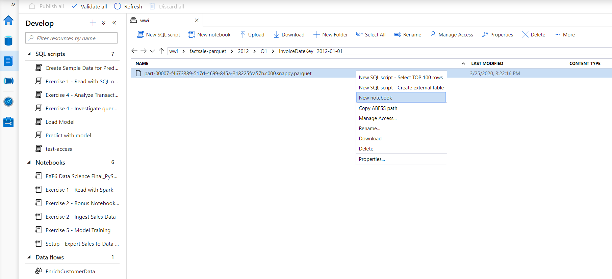

2. This will generate a notebook with PySpark code to load the data in a dataframe and display 100 rows with the header.

   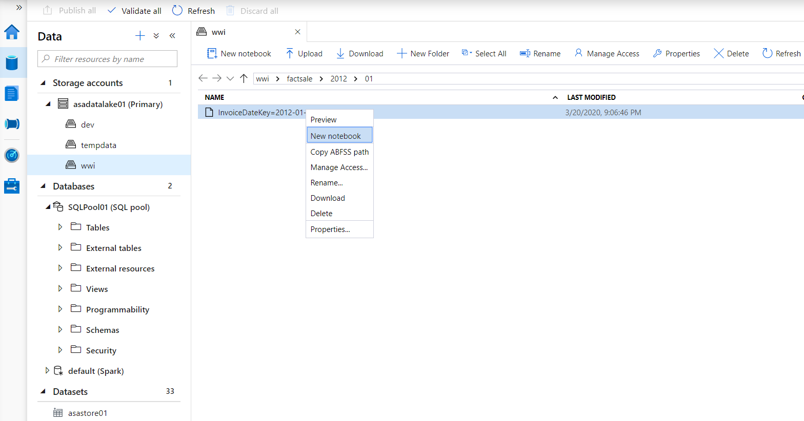

3. Attach the notebook to a Spark pool.

   

4. Before running the notebook, select **Configure session**, which you will find at the bottom left-hand side of the notebook.

   

5. In the Configure session dialog, enter the following configuration:

   - **Executors**: Set to `1`.
   - **Executor size**: Ensure `Small (4 vCPU, 28GB memory)` is selected.

6. Select **Apply** to save the session configuration.

7. Select **Run all** on the notebook toolbar to execute the notebook.

   > **Note**: The first time you run a notebook in a Spark pool, Synapse creates a new session. This can take approximately 3 minutes.

8. As you can see, the output is not formatted very well. To change this, replace the last line of code with the following:

   ```python
   display(data_path.limit(100))
   ```

9. Rerun the notebook again to see the improved display.

   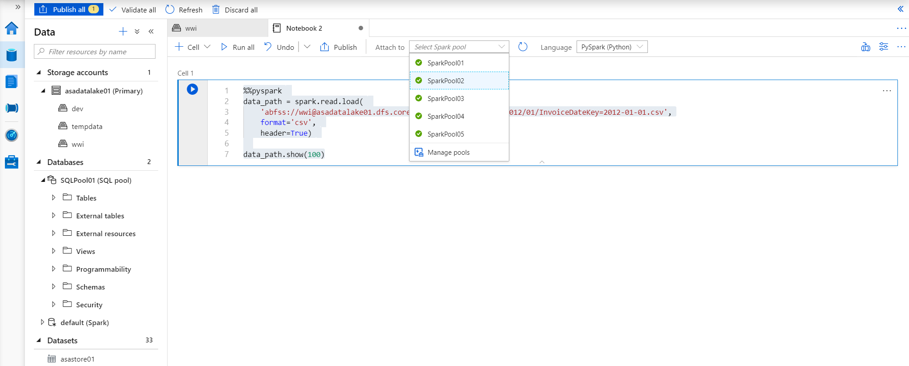

10. Notice the included charting capabilities that enable visual exploration of your data. Switch to **Chart** view. Select **View Options** and change the **Key** to `CustomerKey` and **Values** to `CityKey`.

    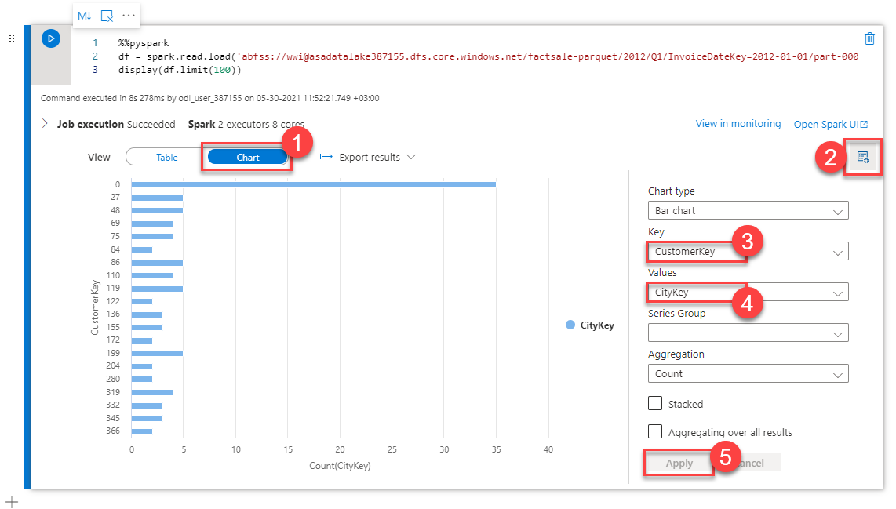

11. **Important**: Close the notebook by selecting the **X** in the top right of the tab and then select **Discard Changes**. Closing the notebook will ensure you free up the allocated resources on the Spark Pool. By not saving, you will ensure that the next user in the shared environment gets the original copy of the notebook.

12. In Azure Synapse Analytics Studio, navigate to the `Develop` hub, select the `Exercise 1 - Read with Spark` notebook

13. As you did above, before running the notebook, select **Configure session**, which you will find at the bottom left-hand side of the notebook.

    

14. In the Configure session dialog, enter the following configuration:

    - **Executors**: Set to `1`.
    - **Executor size**: Ensure `Small (4 vCPU, 28GB memory)` is selected.

15. Select **Apply** to save the session configuration.

16. Select `Run all` on the toolbar to execute the notebook.

    > This notebook demonstrates the same functionality, except this time, it loads CSV files instead of Parquet ones (notice the `factsale-csv` folder in the path).

    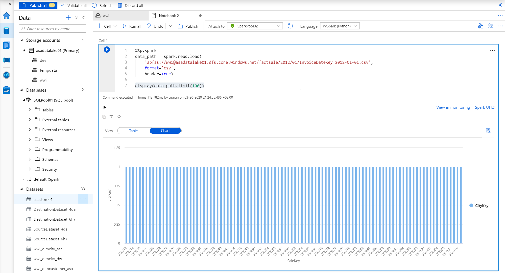

17. **Important**: Close the notebook by selecting the **X** in the top right of the tab and then select **Discard Changes**. Closing the notebook will ensure you free up the allocated resources on the Spark Pool. By not saving, you will ensure the next user in the shared environment gets the original copy of the notebook.
