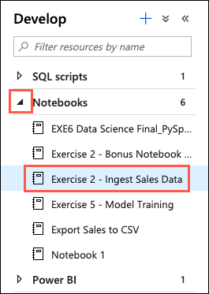
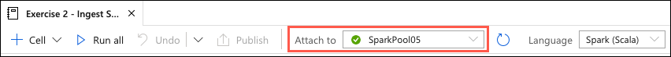
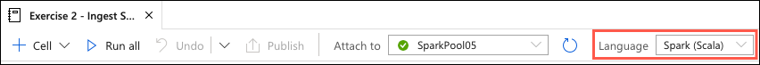
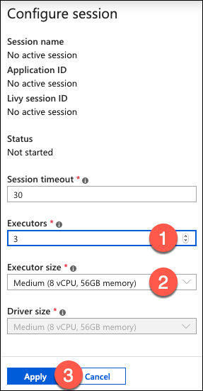
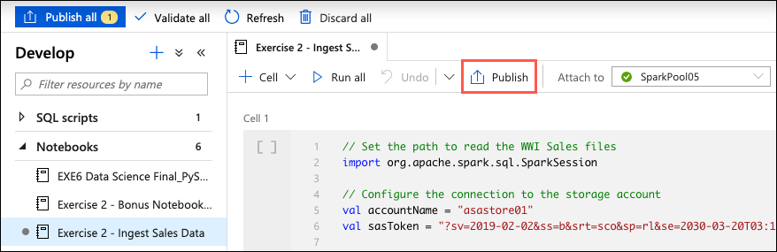
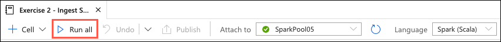
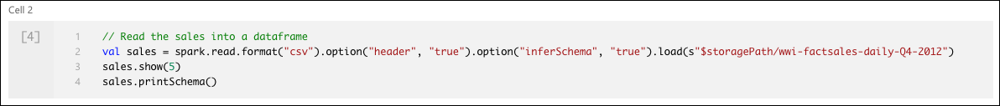
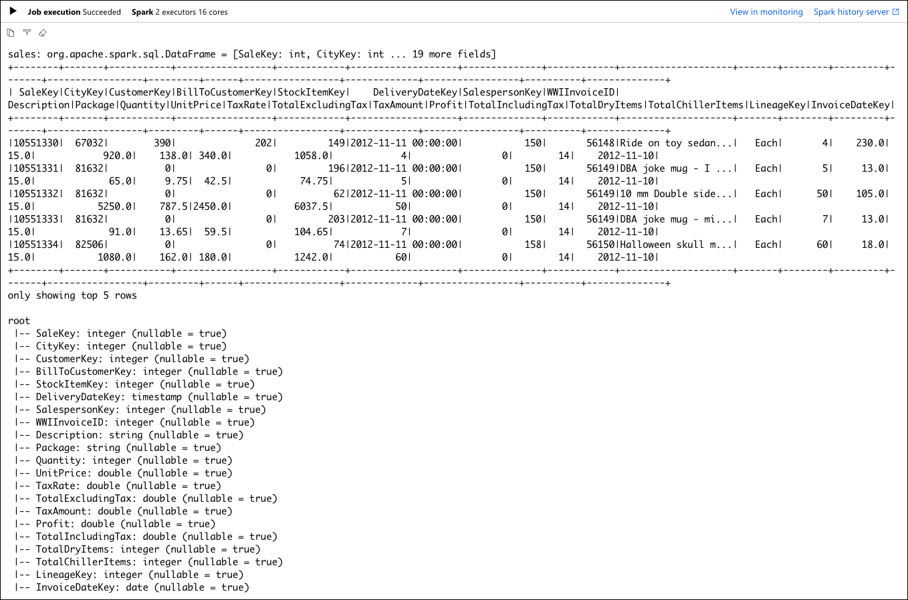
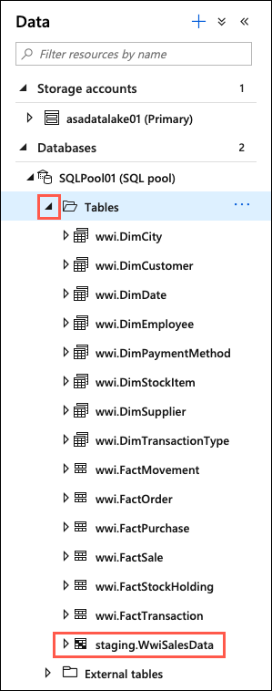
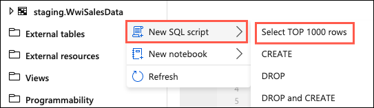

# Build Modern Data Warehouse pipelines

In this exercise, you examine various methods for ingesting data into Azure Synapse Analytics and Azure Data Lake Storage Gen2. You use notebooks and Data Flows to ingest, transform, and load data.

## Task 1 - Explore and modify a notebook

In this task, you will see how easy it is to write into a SQL Pool table with Spark thanks to the SQL Analytics Connector.

1. In Synapse Analytics Studio, select **Develop** from the left-hand menu.

   

2. In the Develop menu, expand **Notebooks** and select the notebook named **Exercise 2 - Ingest Sales Data**.

   

3. Attach your Spark Compute by selecting it from the **Attach to** drop-down list.

   

4. Ensure Spark (Scala) is selected in the Language drop-down list.

   

5. At the bottom left corner of the open notebook, select **Configure session**.

   

6. In the Configure session dialog, enter the following:

   - **Executors**: Enter 3.
   - **Executor size**: Select Medium (8 vCPU, 56GB memory).

   

7. Select **Apply** in the Configure session dialog.

8. Publish the notebook to save the changes by selecting **Publish** on the notebook toolbar.

   

9. Select **Run all** from the notebook toolbar to execute each cell within the notebook.

   

10. While the notebook is running, let's take a look at what is happening in each cell.

    - **Cell 1** sets the required configuration to connect to an Azure Blob Storage account. A SAS token is used to restrict the notebook to only read and list actions on the storage account container.

    

    - **Cell 2** loads data from CSV files in the Blob Storage account into a DataSet. Note the `option` parameters indicate that the first row of the files containers the column headers and that we want Spark to infer the schema of the files based on an analysis of the contents of each column. Finally, we display the first five records of the data retrieved and print the inferred schema to the screen.

    

    - **Cell 3**, writes the data retrieve from Blob Storage into a staging table in Azure Synapse Analytics using the SQL Analytics connector.

    

11. Once all the cells in the notebook have finished running, take a moment to review the output for each cell. The output for cells one and two are mostly informational. The output for cell 3, however, provides some insight into the structure of the data and the data types that have been inferred.

    

12. Next, select **Data** from the left-hand menu.

    

13. Expand **Databases** and then expand the **SQLPool01** database.

    

14. Expand **Tables** and locate the table named `staging.WwiSalesData`.

    

15. To the right of the `staging.WwiSalesData` table, select the Actions ellipsis.

    

16. In the Actions menu, select **New SQL script > Select TOP 1000 rows**.

    

17. Observe the results in the output pane, and see how easy it was to use Spark notebooks to write data from Blob Storage into Azure Synapse Analytics.

### Bonus Challenge

Now, take some time to review the **Exercise 2 - Bonus Notebook with CSharp** notebook. This notebook demonstrates how easy it is create and run notebooks using C# for Spark. The notebook shows the code for retrieving data from Azure Blob Storage and writing that into a staging table in Azure Synapse Analytics using a JDBC connection.

## Task 2 - Explore, modify, and run a DataFlow

In this task,...

## Task 3 - Monitor pipelines

In this task,...

## Task 4 - Monitor Spark applications

In this task,...
