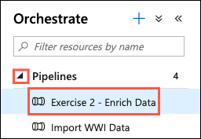

# Build Modern Data Warehouse pipelines

In this exercise, you examine various methods for ingesting data into Azure Synapse Analytics and Azure Data Lake Storage Gen2. You use notebooks and Data Flows to ingest, transform, and load data.

- [Build Modern Data Warehouse pipelines](#build-modern-data-warehouse-pipelines)
  - [Task 1 - Explore and modify a notebook](#task-1---explore-and-modify-a-notebook)
    - [Bonus Challenge](#bonus-challenge)
  - [Task 2 - Explore, modify, and run a Pipeline containing a Data Flow](#task-2---explore-modify-and-run-a-pipeline-containing-a-data-flow)
  - [Task 3 - Monitor pipelines](#task-3---monitor-pipelines)
  - [Task 4 - Monitor Spark applications](#task-4---monitor-spark-applications)

## Task 1 - Explore and modify a notebook

In this task, you will see how easy it is to write into a SQL Pool table with Spark thanks to the SQL Analytics Connector.

1. In Synapse Analytics Studio, select **Develop** from the left-hand menu.

   

2. In the Develop menu, expand **Notebooks** and select the notebook named `Exercise 2 - Ingest Sales Data`.

   

3. Attach your Spark Compute by selecting it from the **Attach to** drop-down list.

   

4. Ensure **Spark (Scala)** is selected in the Language drop-down list.

   

5. At the bottom left corner of the open notebook, select **Configure session**.

   

6. In the Configure session dialog, enter the following:

   - **Executors**: Enter 3.
   - **Executor size**: Select Medium (8 vCPU, 56GB memory).

   

7. Select **Apply** in the Configure session dialog.

8. Publish the notebook to save the changes by selecting **Publish** on the notebook toolbar.

   

9. Select **Run all** from the notebook toolbar to execute each cell within the notebook.

   

10. While the notebook is running, let's take a look at what each cell is doing.

    - **Cell 1** sets the required configuration to connect to an Azure Blob Storage account. A shared access signature or [SAS token](https://docs.microsoft.com/azure/storage/common/storage-sas-overview) is used to grant limited access to the storage account. The SAS token specified restricts the notebook to only read and list actions on blob storage container.

    

    - **Cell 2** loads data from CSV files in the Blob Storage account into a DataSet. Note the `option` parameters indicate that the first row of the files containers the column headers and that we want Spark to infer the schema of the files based on an analysis of the contents of each column. Finally, we display the first five records of the data retrieved and print the inferred schema to the screen.

    

    - **Cell 3** writes the data retrieve from Blob Storage into a staging table in Azure Synapse Analytics using the SQL Analytics connector.

    

11. When Cell 2 finishes running, take a moment to review the associated output.

    

    > The output of Cell 2 provides some insight into the structure of the data and the data types that have been inferred. The `show(5)` command results in the first five rows of the data read being output, allowing you to see the columns and a sample of data contained within each. The `printSchema()` command outputs a list of columns and their inferred types.

12. Next scroll down to Cell 3 and select the arrow icon below the cell to expand the details for the Spark job.

    

    > This pane allows you to monitor the underlying Spark jobs, and observe the status of each. As you can see, Cell 3 is split into two Spark jobs and the progress of each can be observed. We will take a deeper look at monitoring Spark applications in Task 4 below.

13. When the execution of Cell 3 completes, select **Data** from the left-hand menu.

    

14. Expand **Databases** and then expand the **SQLPool01** database.

    

15. Expand **Tables** and locate the table named `staging.WwiSalesData`.

    

16. To the right of the `staging.WwiSalesData` table, select the Actions ellipsis.

    

17. In the Actions menu, select **New SQL script > Select TOP 1000 rows**.

    

18. Observe the results in the output pane, and see how easy it was to use Spark notebooks to write data from Blob Storage into Azure Synapse Analytics.

### Bonus Challenge

Now, take some time to review the **Exercise 2 - Bonus Notebook with CSharp** notebook. This notebook demonstrates how easy it is create and run notebooks using C# for Spark. The notebook shows the code for retrieving data from Azure Blob Storage and writing that into a staging table in Azure Synapse Analytics using a JDBC connection.

You can run each cell in this notebook and observe the output. Be aware, however, that writing data into a staging table in Azure Synapse Analytics with this notebook takes a long time, so you don't need to wait on the notebook to finish before attempting to query the `staging.WwiSalesDataCSharp` table to observe the data being written or to move on to the next task.

Running the following query every 5-10 seconds allows you to observe the count of records in the table, and how it changes as new records are being added by the notebook.

TODO: Type of more instructions around how to run this query.

```sql
SELECT COUNT(*) FROM [staging].[WwiSalesDataCSharp]
```

## Task 2 - Explore, modify, and run a Pipeline containing a Data Flow

In this task, you use a Pipeline containing a Data Flow to explore, transform and load data into an Azure Synapse Analytics table. Using pipelines and data flows allows you to perform data ingestion and transformations, similar to what you did in Task 1, but without having to write any code.

1. In Synapse Analytics Studio, select **Orchestrate** from the left-hand menu.

   

2. In the Orchestrate menu, expand **Pipelines** and select the pipeline named `Exercise 2 - Enrich Data`.

   

3. Selecting a pipeline opens the pipeline canvas for that pipeline, where you can review and edit the pipeline using a code-free, graphical interface. This view shows the various activities within the pipeline and the links and relationships between those activities. The `Exercise 2 - Enrich Data` pipeline contains two activities, a copy data activity named `Import Customer dimension` and a mapping data flow activity named `Enrich Customer Data`.

   

4. Let's now take a closer look at each of those activities within the pipeline. On the canvas graph, select the **Copy data** activity named `Import Customer dimension`. Below the graph is a series of tabs, each of which provides additional details about selected the activity. The **General** tab displays the name and description assigned to the activity, along with a few other properties.

   

5. Select the **Source** tab. The source defines the location from which data will be copied by the activity. The **Source dataset** field is a pointer to the location of the source data.

   > Take a moment to review the various properties available on the Source tab. Data is being retrieve from a SQL database and, in this case, the entire table is being copied.

   

6. Next, select the **Sink** tab. The sink specifies where the copied data will be written. Similar to the Source, the sink uses a dataset to define a pointer to the target data store.

   > Reviewing the fields on this tab, you will notices that it is possible to define the copy method, table options, and to provide pre-copy scripts to execute. For this copy activity, the `wwi.DimCustomer` table is truncated prior to being loaded with the data copied from the source specified on the Source tab. Also, take special note of the sink dataset, `wwi_dimcustomer_asa`. This dataset points to the `wwi.DimCustomer` table in Synapse Analytics, which is one of the data sources for the Mapping Data Flow. We will need to ensure that the copy activity successfully populates this table prior to running the data flow.

   

7. Finally, select the **Mapping** tab. On this tab, you can review and set the column mappings. As you can see on this tab, the spaces are being removed from the column names in the sink.

   

8. Now, let's take a look at the **Mapping Data Flow** activity. On the canvas, select the `Enrich Customer Data` Mapping Data Flow activity.

   

9. Select the **Settings** tab and take a moment to look over the properties available here.

   > The Settings tab includes a pointer to the Data flow being executed by the Mapping Data Flow activity, along with the Integration Runtime and compute resource type and size to use. If you wish to use staging, you can also specify that here.

   

10. The properties on the tabs within the pipeline define the behavior of the activities within the pipeline. Now, let's take a look at the definition of the data flow the Mapping Data Flow activity references. Double-click the **Mapping Data Flow** activity on the pipeline canvas to open the underlying Data Flow in a new tab.

    > **Important**: Typically, when working with Data Flows, you would want to enable **Data flow debug**. [Debug mode](https://docs.microsoft.com/azure/data-factory/concepts-data-flow-debug-mode) creates a Spark cluster to use for interactively testing each step of the data flow and allows you to validate the output prior to saving and running the data flow. Enabling a debugging session can take up to 10 minutes, so for the purposes of this workshop, you will not enable this. Screenshots will be used to provide details that would otherwise require a debug session to view.

    

11. The [Data Flow canvas](https://docs.microsoft.com/azure/data-factory/concepts-data-flow-overview#data-flow-canvas) allows you to see the construction of the data flow and each component contained within it in greater detail.

    > From a high level, the `EnrichCustomerData` data flow is composed of two data sources, multiple transformations, and two sinks. The data source components, `PostalCodes` and `DimCustomer`, ingest data into the data flow. The `EnrichedCustomerData` and `EnrichedCustomerDataAdls` components on the right are sinks, used to write data to data stores. The remaining components between the sources and sinks are transformation steps, which can perform filtering, joins, select, and other transformational actions on the ingested data.

    

12. To better understand how a data flow functions, let's inspect the various components. Select the `PostalCodes` data source on the data flow canvas.

    > On the **Source settings** tab, we see properties similar to what we saw on the pipeline activities property tabs. The name of the component can be defined, along with the source dataset and a few other properties. The `PostalCodes` dataset points to a CSV file stored in an Azure Data Lake Storage Gen2 account.

    

13. Select the **Projection** tab.

    > The **Projections** tab allows you to define the schema of the data being ingested from a data source. A schema is required for each data source in a data flow to allow downstream transformations to perform actions against the fields in the data source. Note that selecting **Import schema** requires an active debug session to retrieve the schema data from the underlying data source, as it uses the Spark cluster to read the schema. However, you can manually enter a schema without an active debug session. In the screenshot above, notice the `Zip` column is highlighted. The schema inferred by the import process set the column type to `integer`. For US zip code data, the data type was changed to `string` so leading zeros are not discarded from the five-digit zip codes. It is import to review the schema to ensure the correct types are set, both for working with the data and to ensure it is displayed and stored correctly in the data sink.

    

14. The **Data preview** tab allows you to ingest a small subset of data and view it on the canvas. This functionality requires an active debug session, so for this workshop, a screenshot that displays the execution results for that tab is provided below.

    > The `Zip` column is highlighted on the Data preview tab to show a sample of the values contained within that field. Below, you will filter the list of zip codes down to just those that appear in the customer dataset.

    

15. Before looking at the `PostalCodeFilter`, quickly select the `+` button to the right of the `PostalCodes` data source to display a list of available transformations.

    > Take a moment to browse the list of transformations available in Mapping Data Flows. From this list, you get an idea of the types of transformations that are possible using data flows. Transformations are broken down into three categories, **multiple inputs/outputs**, **schema modifiers**, and **row modifiers**. You can learn about each transformation in the docs by reading the [Mapping data flow transformation overview](https://docs.microsoft.com/azure/data-factory/data-flow-transformation-overview) article.

    

16. Next, select the `PostalCodeFilter` transformation in the graph on the data flow canvas.

    

17. In the **Filter settings** tab of the configuration panel, click anywhere inside the **Filter on** box.

    

18. This will open the Visual expression builder.

    > In mapping data flows, many transformation properties are entered as expressions. These expressions are composed of column values, parameters, functions, operators, and literals that evaluate to a Spark data type at run time. To learn more, visit the [Build expressions in mapping data flow](https://docs.microsoft.com/azure/data-factory/concepts-data-flow-expression-builder) page in the documentation.

    

19. The filter currently applied ensures all zip codes are between 00001 and 99999. To reduce this list to only zip codes that appear in our customer data, you are going to updated the filter. Our customer data has postal codes that fall within the range of 90000 to 98000.

    

20. To update the filter and reduce the incoming zip codes to those found in our customer data, do the following:

    - Edit the `greaterOrEqual()` function by changing the `1` to `90000`.
    - Change the `99999` in the `lesserOrEqual()` function to `98000`.

21. Your updated expression should look like the code below.

    ```sql
    and(
       greaterOrEqual(toInteger(Zip), 90000),
       lesserOrEqual(toInteger(Zip), 98000)
    )
    ```

22. Select **Save and finish**.

    > If a debug session were enabled, you would be able to select the **Data preview** tab and see them result of this change. A screenshot of what this would look like is included below.

    

23. Select the `DimCustomer` data source on the data flow canvas graph.

    > Take a few minutes to review the various tabs in the configuration panel for this data source to get a better understand of how it is configured, as you did above. Note that this data source relies on the `DimCustomer` table from Azure Synapse Analytics for its data. Before running the pipeline, you will add a dependency to the Mapping Data Flow activity to ensure the Copy activity has populated the `DimCustomer` in Azure Synapse Analytics before allowing the data flow to execute.

    

24. Next, select the `JoinOnPostalCode` transformation and ensure the **Join settings** tab is selected to see how you can join datasets using a simple and intuitive graphical interface.

    > The **Join settings** tab allows you to specify the data sources being joined, as well as the join type and conditions. Notice the **Right stream** points to the `PostalCodeFilter` and not the `PostalCodes` data source directly. By referencing the filtered dataset, the join works with a smaller set of postal codes. For very large datasets, this can provide performance benefits.

    

25. Moving on to the next transformation, the `SelectDesiredColumns` transformation uses a **Select** schema modifier to allow choosing what columns to include.

    > You have probably noticed that the `SelectDesiredColumns` transformation appears twice in the graph. To enable writing the resulting dataset to two different sinks, Azure Synapse Analytics and Azure Data Lake Storage Gen2, a **Conditional split** multiple outputs transformation is required. This split is displayed in the graph as a repeat of the split item.

    

26. The last two items in the data flow are the defined sinks. These provide the connection settings necessary to write the transformed data into the desired data sink. Select the `EnrichCustomerData` sink and inspect the settings on the **Sink** tab.

    

27. Next, select the **Settings** tab and observe the properties set there.

    > The **Settings** tab defines how data is written into the target table in Azure Synapse Analytics. The Update method has been set to only allow inserts, and the table action is set to recreate the table whenever the data flow runs.

    

28. Now that you've taken the time to review the data flow, let's return to the pipeline. On the canvas, select the **Exercise 2 - Enrich Data** tab.

    

29. Before running the pipeline there is one more change we need to make. As mentioned above, the data flow depends on the data written by the copy activity, so you are going to add a dependency between the two activities.

30. In the data flow canvas graph, select the green box on the right-hand side of the **Copy data** activity and drag the resulting arrow up onto the **Mapping Data Flow** activity.

    

31. This creates a requirement that the **Copy data** activity completes successfully before the **Mapping Data Flow** can execute, and enforces our requirement of the Synapse Analytics table being populated before running the data flow.

    

32. The last step before running the pipeline is to publish the changes you have made. Select **Publish all** on the toolbar.

    

33. On the **Publish all** dialog, select **Publish**.

    

34. Within a few seconds, you will receive a notification that the publish completed. Select **Dismiss** in the notification.

    

35. Your pipeline is now ready to run. Select **Add trigger** then **Trigger now** on the toolbar for the pipeline.

    

36. Select **OK** on the Pipeline run dialog to start the pipeline run.

    

37. To monitor the pipeline run, move on to the next task.

## Task 3 - Monitor pipelines

After you finish building and debugging your data flow and its associated pipeline, you will want to be able to monitor execution of the pipeline and all of the activities contained within it, including the Data Flow activity. In this task, you review the pipeline monitoring functionality in Azure Synapse Analytics.

TODO: Use this article as a reference for the language and steps.
<https://docs.microsoft.com/en-us/azure/data-factory/concepts-data-flow-monitoring>

1. Select **Monitor** from the left-hand menu.

   

2. Under Orchestration, select **Pipeline runs**.

   

3. Select the top `Exercise 2 - Enrich Data` pipeline run from the list. This will have a status of `In progress`.

   

4. On the pipeline run details screen, you will see a graphical representation of the activities within the pipeline, as well as a list of the individual activity runs.

   

5. TODO: Copy activity monitoring

   

   

   

   

6. TODO: Data Flow monitoring

   

   

   

   

7. When the pipeline execution completes, all activities runs will reflect a status of Succeeded.

   

8. Switching to the Gantt view, provides a graphical representation of the run times of the various activities within the pipeline.

   

## Task 4 - Monitor Spark applications

In this task, you examine the Apache Spark application monitoring capabilities built into Azure Synapse Analytics. The Spark application monitoring screens provides a view into the logs for the Spark application, including a graphical view of those logs.

1. As you did in the previous task, select **Monitor** from the left-hand menu.

   

2. Next, select **Apache Spark applications** under Activities.

   

3. On the Apache Spark applications page, select the **Submit time** value and observe the available options for limiting the time range for Spark applications that are displayed in the list. In this case, you are looking at the current run, so ensure **Last 24 hours** is selected and then select **OK**.

   

4. From the list of Spark applications, select the first job, which should have a status of `In progress`.

   TODO: Check on this status, as it should really be Complete or Success, but doesn't seem to update correctly.

   

5. On the **Log query** screen, you will see a detailed view of the job, broken into three different sections.

   - The first section is a graphical representation of the stages that make up the Spark application.
   - The second section is a summary of the Spark application.
   - The third section displays the logs associated with the Spark application.

   

6. In the graph section, the initial graph displayed is that of the overall job progress. Here, you can see the progress of each stage.

   

7. Selecting any individual stage from the graph opens a new browser window showing the selected stage in the Spark UI, where you can dive even deeper into the tasks that make up each stage. Select **Stage 5** and observe the information displayed in Spark UI.

   

8. Return to the Synapse Analytics Monitoring page for your Spark application.

9. To look closer at any individual stage, you can use the **Job IDs** drop-down to select the stage number. In this case, select the drop-down and choose **5** from the list.

   

10. This view isolates the specific stage within the graphical view.

    

11. Return the view to all stages by selecting **All job IDs** in the job ID drop-down list.

    

12. Within the graph section, you also have the ability to **Playback** the Spark application.

    

    > **Note**: Playback functionality is not available until the job status changes out of the `In progress` status. The job's status will remain listed as `In progress` until the underlying Spark resources are cleaned up by Azure Synapse Analytics, which can take some time.

13. Running a Playback allows you to observe the time required to complete each stage, as well as review the rows read or written as the job progresses.

    

14. You can also preform a playback on an individual stage. Returning to a view of only Stage 5, the **Playback** button shows the rows written at this stage, along with the progress of reads and writes.

    

15. You can also change the view to see which stages were involved in read and write activities. In the **Display** drop-down, select **Read**.

    

16. In the read graph, stages that involved read tasks are highlighted in orange.

    

17. Next, select **Written** from the Display drop-down list, and observe the stages where data was written.

    
