# Exercise 2 - Build a Modern Data Warehouse with Azure Synapse Pipelines

In this exercise, you examine various methods for ingesting data into Azure Synapse Analytics and Azure Data Lake Storage Gen2. You use notebooks and Data Flows to ingest, transform, and load data.

The tasks you will perform in this exercise are:

- Build Modern Data Warehouse pipelines
  - Task 1 - Explore and modify a notebook
    - Bonus Challenge
  - Task 2 - Explore, modify, and run a Pipeline containing a Data Flow
  - Task 3 - Monitor pipelines
  - Task 4 - Monitor Spark applications

---

**Important**:

In the tasks below, you will be asked to enter a unique identifier in several places. You can find your unique identifier by looking at the username you were provided for logging into the Azure portal. Your username is in the format `user-UNIQUEID@msazurelabs.onmicrosoft.com`, where the _UNIQUEID_ component looks like `A01`, `B22`, or `C04`, as examples.

Please locate this value and note it for the steps below.

---

## Task 1 - Explore and modify a notebook

In this task, you see how easy it is to write into a SQL Pool table with Spark thanks to the SQL Analytics Connector. Notebooks are used to write the code required to write to SQL Pool tables using Spark.

1. In Synapse Analytics Studio, select **Develop** from the left-hand menu.

   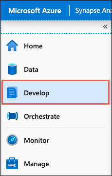

2. In the Develop menu, expand **Notebooks** and select the notebook named `Exercise 2 - Ingest Sales Data`.

   

3. If not already attached, attach your Spark Compute by selecting it from the **Attach to** drop-down list.

   

4. Ensure **Spark (Scala)** is selected in the Language drop-down list.

   

5. Next, in the first cell of the notebook, **Cell 1**, locate the variable named `uniqueId` on line 8.

   

6. Update the value of the `uniqueId` variable, setting it to the unique identifier you were assigned for this workshop. This will be the _UNIQUEID_ component of your username, as mentioned above. For example:

   ```scala
   val uniqueId = "A03"
   ```

   > **Important**: Every workshop attendee needs to set this variable to their assigned unique identifier to ensure the table name this notebook targets is unique. Failure to set this value will prevent the notebook from running.

   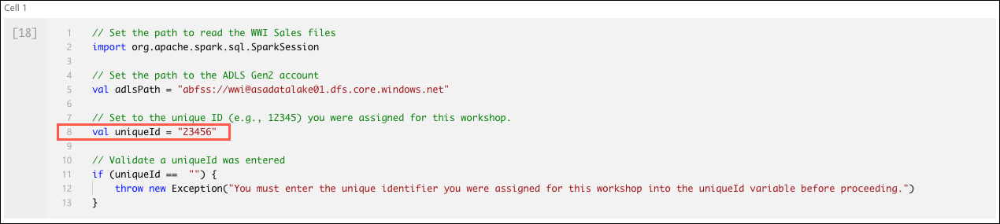

   > **Note**: You may notice the **Publish all** button is highlighted after making changes. Please **do not publish** your changes, as this will impact the notebook used by all workshop attendees. You do not need to publish the changes to run the notebook in the steps below.

7. Before running the notebook, select **Configure session**, which you will find at the bottom left-hand side of the notebook.

   

8. In the Configure session dialog, enter the following configuration:

   - **Executors**: Set to `1`.
   - **Executor size**: Ensure `Small (4 vCPU, 28GB memory)` is selected.

9. Select **Apply** to save the session configuration.

10. Select **Run all** from the notebook toolbar to execute each cell within the notebook. It can take several minutes for the Spark session to start. You can continue with the steps below to review the notebook contents.

    

    > **Note**: If you see the output from the cells containing the message, `Error : java.lang.Exception: You must enter the unique identifier you were assigned for this workshop into the uniqueId variable before proceeding`, return to step 9 above, and enter your assigned unique identifier.

11. While the notebook is running, let's take a look at what each cell is doing.

    - **Cell 1** imports required libraries and sets a few variables. The `adlsPath` variable defines the path used to connect to an Azure Data Lake Storage (ADLS) Gen2 account. Connecting to ADLS Gen2 from a notebook in Azure Synapse Analytics uses the power of Azure Active Directory (AAD) pass-through between compute and storage. The `uniqueId` provides a unique value to use for creating a new table in Azure Synapse Analytics.

    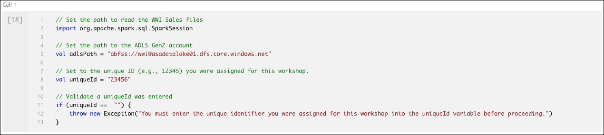

    - **Cell 2** loads data from CSV files in the data lake into a DataSet. Note the `option` parameters in the `read` command on line 7. These options specify the settings to use when reading the CSV files. The options tell Spark that the first row of each file containers the column headers, the separator in the files in the `|` character, and that we want Spark to infer the schema of the files based on an analysis of the contents of each column. Finally, we display the first five records of the data retrieved and print the inferred schema to the screen.

    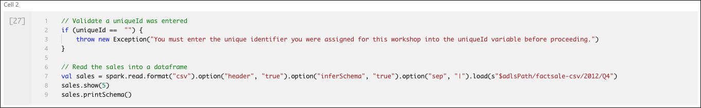

    - **Cell 3** writes the data retrieve from Blob Storage into a staging table in Azure Synapse Analytics using the SQL Analytics connector. Using the connector simplifies connecting to Azure Synapse Analytics because it uses AAD pass-through. There is no need to create a password, identity, external table, or format sources, as it is all managed by the connector.

    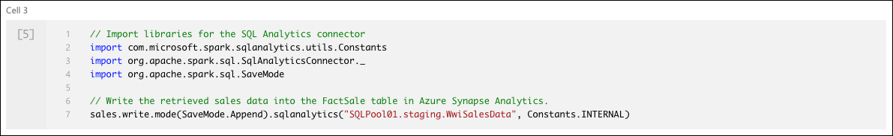

12. When Cell 2 finishes running, take a moment to review the associated output.

    > The output of Cell 2 provides some insight into the structure of the data and the data types that have been inferred. The `show(5)` command results in the first five rows of the data read being output, allowing you to see the columns and a sample of data contained within each. The `printSchema()` command outputs a list of columns and their inferred types.

    

13. Next, scroll down to Cell 3 and select the arrow icon below the cell to expand the details for the Spark job.

    > This pane allows you to monitor the underlying Spark jobs, and observe the status of each. As you can see, Cell 3 is split into two Spark jobs, and the progress of each can be observed. We will take a more in-depth look at monitoring Spark applications in Task 4 below.

    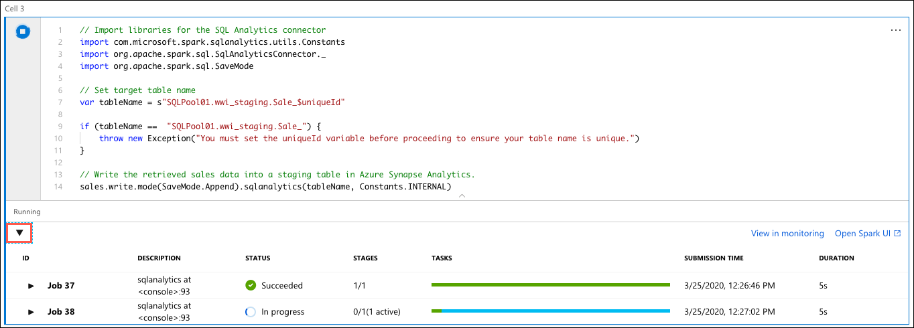

14. After approximately 1-2 minutes, the execution of Cell 3 will complete. Once it has completed, select **Data** from the left-hand menu.

    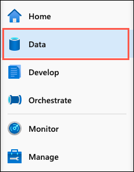

15. **Important**: Close the notebook by selecting the **X** in the top right of the tab and then select **Discard Changes**. Closing the notebook will ensure you free up the allocated resources on the Spark Pool. By not saving, you will ensure that the next user in the shared environment gets the original copy of the notebook.

16. Expand **Databases** and then expand the **SQLPool01** database.

    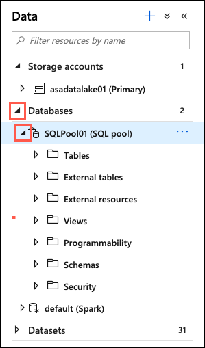

17. Expand **Tables** and locate the table named `wwi_staging.Sale_UNIQUEID`, where `UNIQUEID` is the unique identifier assigned to you for this workshop. Which you retrieved from your username above (e.g., `A03`).

    > If you do not see the table, select the Actions ellipsis next to Tables and then select **Refresh** from the fly-out menu.

    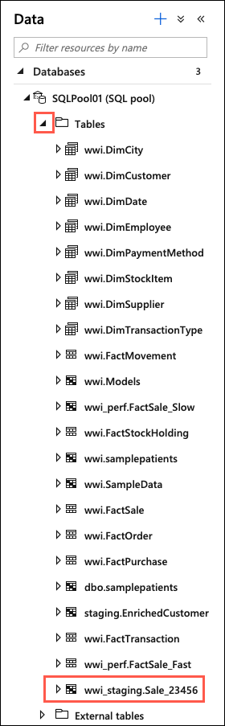

18. To the right of the `wwi_staging.Sale_UNIQUEID` table, select the Actions ellipsis.

    

19. In the Actions menu, select **New SQL script > Select TOP 100 rows**.

    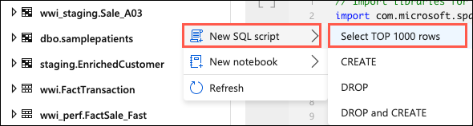

20. Observe the results in the output pane, and see how easy it was to use Spark notebooks to write data from Blob Storage into Azure Synapse Analytics.

21. Close the SQL script generated by `wwi_staging.Sale_UNIQUEID` 

### Bonus Challenge

Now, take some time to review the **Exercise 2 - Bonus Notebook with CSharp** notebook.

1. In Synapse Analytics Studio, select **Develop** from the left-hand menu. Expand **Notebooks** and select the notebook named `Exercise 2 - Bonus Notebook with CSharp`.

   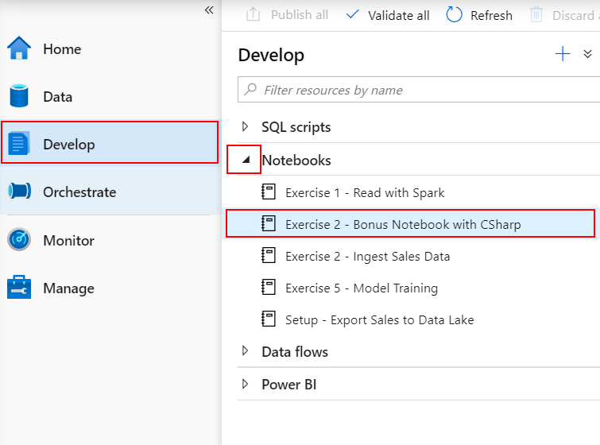

2. Notice the language of choice being C# for Spark:

   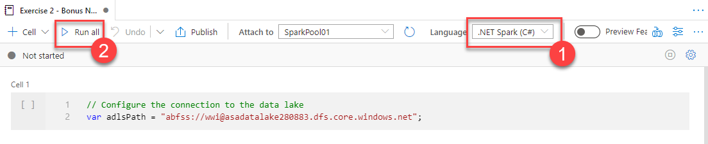

This notebook demonstrates how easy it is to create and run notebooks using C# for Spark. The notebook shows the code for retrieving data from Azure Blob Storage and writing that into a staging table in Azure Synapse Analytics using a JDBC connection.

You can run each cell in this notebook and observe the output. Be aware, however, that writing data into a staging table in Azure Synapse Analytics with this notebook takes several minutes, so you don't need to wait on the notebook to finish before attempting to query the `wwi_staging.Sale_CSharp_UNIQUEID` table to observe the data being written or to move on to the next task.

Before running the notebook:

1. **Important**: Do not forget to set the `uniqueId` variable with the unique identifier assigned to you for this workshop.

2. Select **Configure session**, which you will find at the bottom left-hand side of the notebook.

   

3. In the Configure session dialog, enter the following configuration:

   - **Executors**: Set to `1`.
   - **Executor size**: Ensure `Small (4 vCPU, 28GB memory)` is selected.

4. Select **Apply** to save the session configuration.

To observe the data being written into the table:

1. Select **Data** from the left-hand menu, expand Databases, SQLPool01, and Tables.

2. Right-click the table named `wwi_staging.Sale_CSharp_UNIQUEID`, where `UNIQUEID` is the unique identifier assigned to you for this workshop, and choose **New SQL Script** then **SELECT TOP 100 rows**.

   > If you do not see the table, select the Actions ellipsis next to Tables, and then select **Refresh** from the fly-out menu.

3. Replace the `SELECT` query in the editor with the query below, replacing `UNIQUEID` with the unique identifier assigned to you for this workshop.

   ```sql
   SELECT COUNT(*) FROM [wwi_staging].[Sale_CSharp_UNIQUEID]
   ```

4. Select **Run** on the toolbar.

   > Re-run the query every 5-10 seconds to watch the count of records in the table, and how it changes as new records are being added by the notebook. The notebook limits the number of rows to 1500, so if you see a count of 1500, the notebook has completed processing.

5. **Important**: Close the notebook by selecting the **X** in the top right of the tab and then select **Discard Changes**. Closing the notebook will ensure you free up the allocated resources on the Spark Pool. By not saving, you will ensure that the next user in the shared environment gets the original copy of the notebook.

## Task 2 - Explore, modify, and run a Pipeline containing a Data Flow

In this task, you use a Pipeline containing a Data Flow to explore, transform, and load data into an Azure Synapse Analytics table. Using pipelines and data flows allows you to perform data ingestion and transformations, similar to what you did in Task 1, but without having to write any code.

**Important**: The first few steps in this task involve creating a copy of the Data Flow and Pipeline for you to use in this task. You will append your assigned _UNIQUEID_ to your copies of these resources to ensure they are named uniquely.

1. In Synapse Analytics Studio, select **Develop** from the left-hand menu.

   

2. In the Develop menu, expand **Data flows**.

   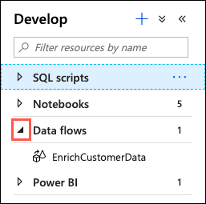

3. Hover your mouse icon over the `EnrichCustomerData` data flow, select the **Actions** ellipsis, and then select **Clone** from the fly-out menu.

   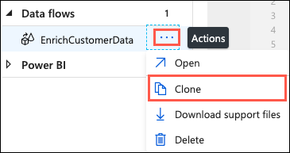

4. A copy of the data flow with a name such as `EnrichedCustomerData_copy1` will be displayed.

   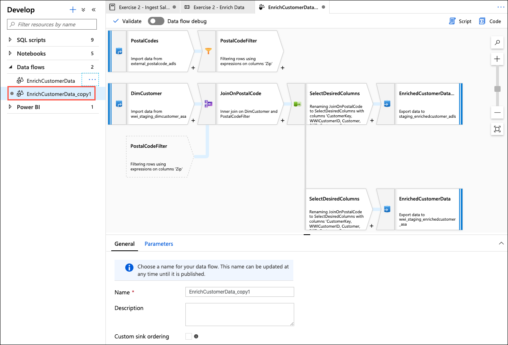

5. On the right of the screen, you will be able to select the **Settings** button to update the name in the settings panel. Replace the **copyX** value after the underscore in the Name with your assigned _UNIQUEID_ from your username. For example, `EnrichCustomerData_A03`.

   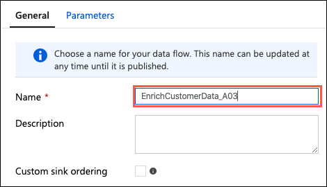

6. Next, select **Orchestrate** from the left-hand menu.

   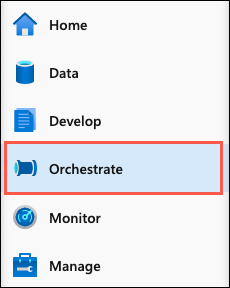

7. In the Orchestrate menu, expand **Pipelines**.

   

8. Hover your mouse over the pipeline named `Exercise 2 - Enrich Data`, select the Actions ellipsis and then select **Clone** from the fly-out menu.

   

9. A copy of the pipeline with a name such as `Exercise 2 - Enrich Data_copy1` will be displayed.

   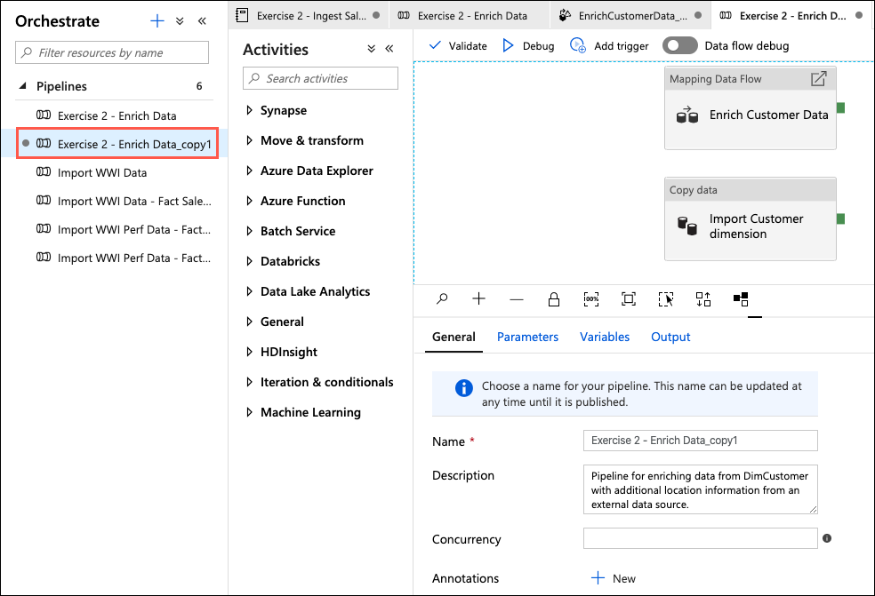

10. On the right of the screen, you will be able to select the **Settings** button to update the name in the settings panel. Replace the **copyX** value after the underscore in the Name with your assigned _UNIQUEID_ from your username. For example, `Exercise 2 - Enrich Data_A03`.

    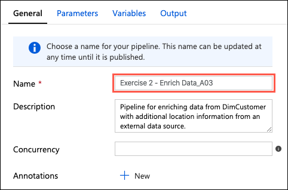

11. Next, you also need to update the Mapping Data Flow activity to use your cloned Data flow. Select the **Enriched Customer Data** Mapping Data Flow activity in the graph for your cloned pipeline.

    

12. Select the **Settings** tab in the configuration panel of the Mapping Data Flow activity.

    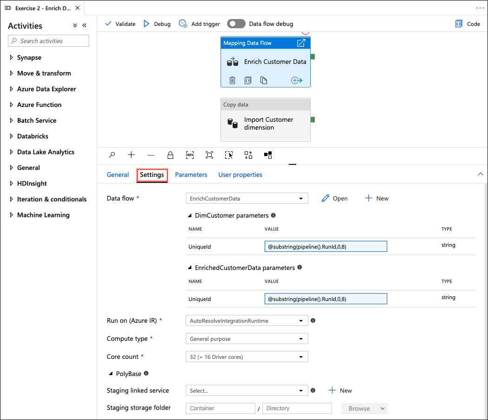

13. On the **Settings** tab, select the **Data flow** drop-down list and select your cloned data flow from the list.

    > **Important**: You may see data flows for other workshop participants in the list of data flows. Make sure you carefully select the data flow that ends with your assigned _UNIQUEID_.

    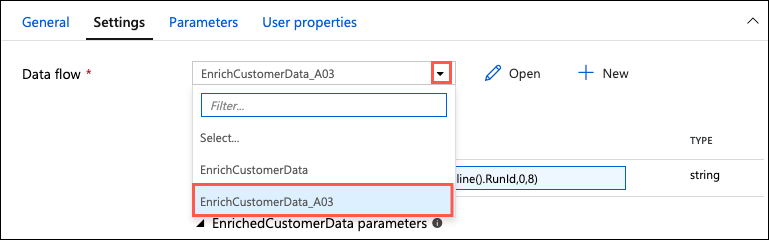

    > While you are on the Settings tab, take a moment to look at the other settings configurable on this tab. They include parameters to pass into the data flow, the Integration Runtime and compute resource type and size to use. If you wish to use staging, you can also specify that here.

14. Next, select the **Parameters** tab in the configuration panel of the Mapping Data Flow activity.

    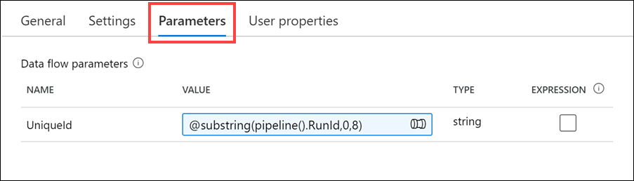

15. Select the **UniqueId** value box and then select **Pipeline expression** in the fly-out menu that appears.

    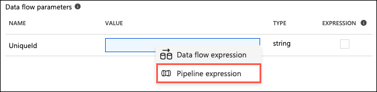

16. In the **Add dynamic content** dialog, paste the following into the content box at the top of the dialog:

    ```sql
    @substring(pipeline().RunId,0,8)
    ```

    > This sets the UniqueId parameter required by the `EnrichCustomerData` data flow to a unique substring extracted from the pipeline run ID.

    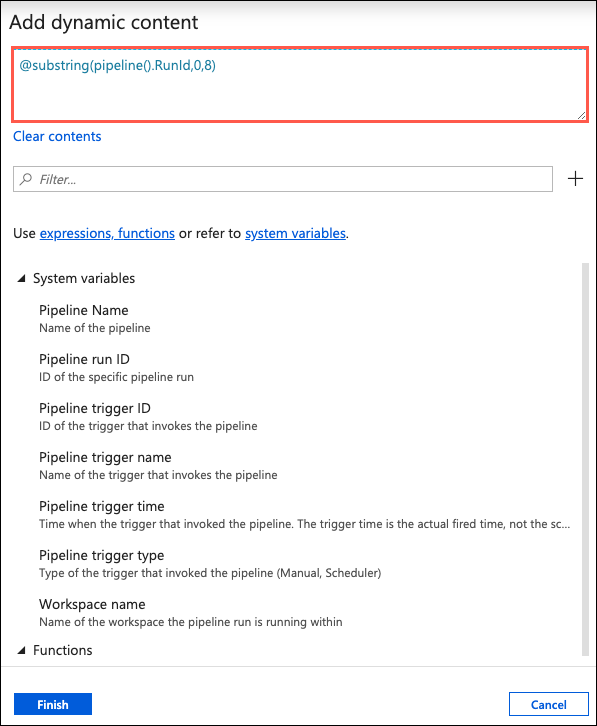

17. Select **Finish** to save the changes.

18. Let us now take a moment to review the pipeline.

    > Selecting a pipeline opens the pipeline canvas, where you can review and edit the pipeline using a code-free, graphical interface. This view shows the various activities within the pipeline and the links and relationships between those activities. Your cloned `Exercise 2 - Enrich Data` pipeline contains two activities, a copy data activity named `Import Customer dimension` and a mapping data flow activity named `Enrich Customer Data`.

    

19. Now, take a closer look at each of the activities within the pipeline. On the canvas graph, select the **Copy data** activity named `Import Customer dimension`.

    > Below the graph is a series of tabs, each of which provides additional details about selected the activity. The **General** tab displays the name and description assigned to the activity, along with a few other properties.

    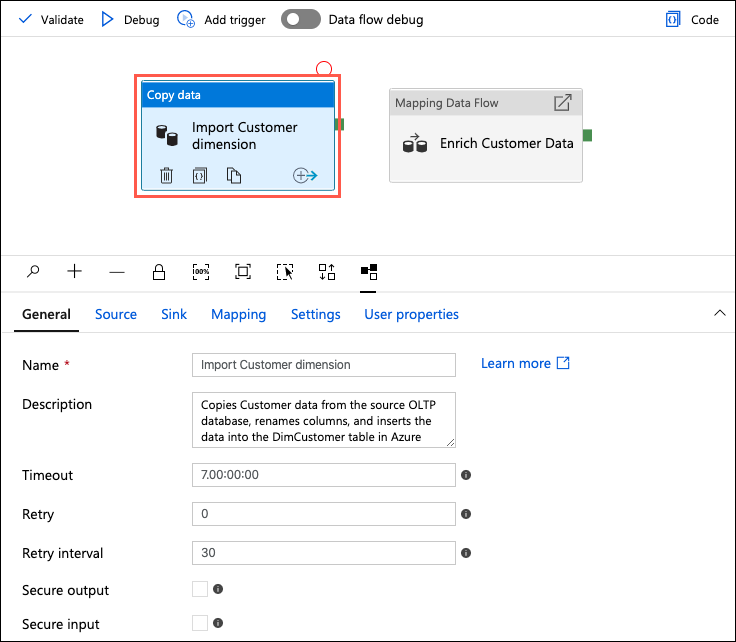

20. Select the **Source** tab. The source defines the location from which data will be copied by the activity. The **Source dataset** field is a pointer to the location of the source data.

    > Take a moment to review the various properties available on the Source tab. Data is being retrieved from files stored in a data lake.

    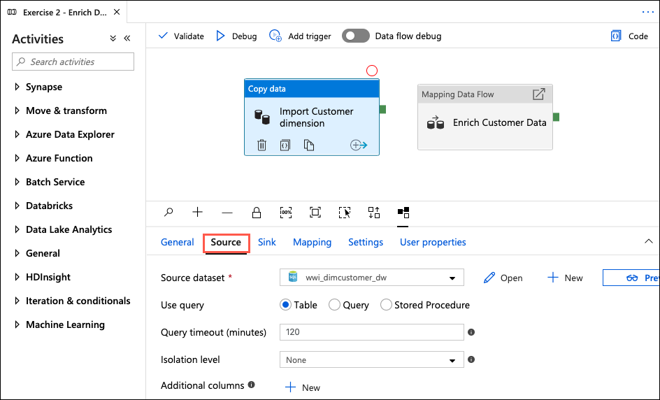

21. Next, select the **Sink** tab. The sink specifies where the copied data will be written. Like the Source, the sink uses a dataset to define a pointer to the target data store.

    > Reviewing the fields on this tab, you will notice that it is possible to define the copy method, table options, and to provide pre-copy scripts to execute. Also, take special note of the sink dataset, `wwi_staging_dimcustomer_asa`. The dataset requires a parameter named `UniqueId`, which is populated using a substring of the Pipeline Run Id. This dataset points to the `wwi_staging.DimCustomer_UniqueId` table in Synapse Analytics, which is one of the data sources for the Mapping Data Flow. We will need to ensure that the copy activity successfully populates this table before running the data flow.

    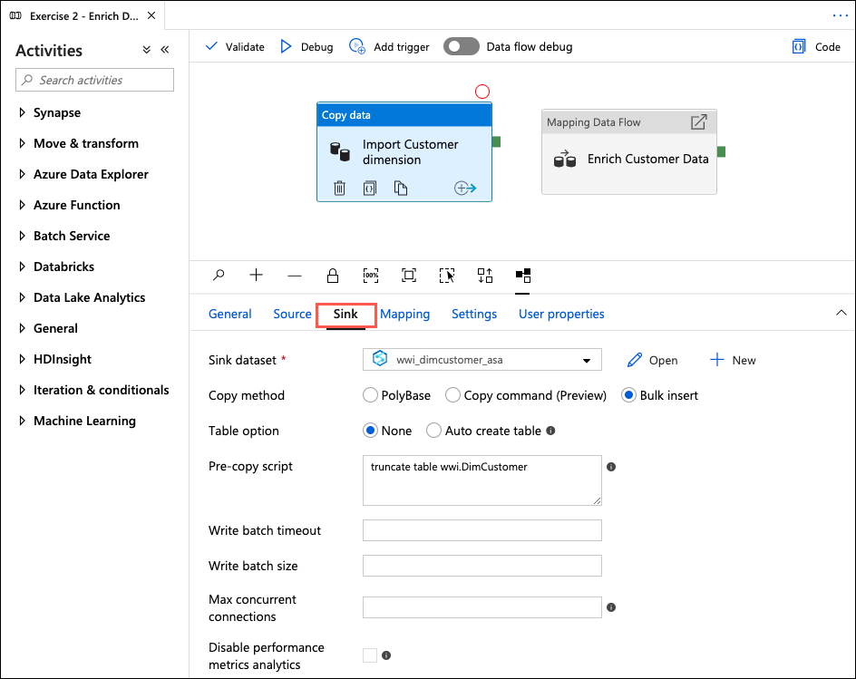

22. Finally, select the **Mapping** tab. On this tab, you can review and set the column mappings. As you can see on this tab, the spaces are being removed from the column names in the sink.

    

23. As you did previously, switch to the **Mapping Data Flow** activity by selecting the `Enrich Customer Data` Mapping Data Flow activity in the graph.

    > Take a minute to look at the options available on the various tabs in the configuration panel. You will notice the properties here define how the data flow operates within the pipeline.

    

24. Now, let us take a look at the definition of the data flow the Mapping Data Flow activity references. Double-click the **Mapping Data Flow** activity on the pipeline canvas to open the underlying Data Flow in a new tab. This will open your cloned version of the data flow.

    > **Important**: Typically, when working with Data Flows, you would want to enable **Data flow debug**. [Debug mode](https://docs.microsoft.com/azure/data-factory/concepts-data-flow-debug-mode) creates a Spark cluster to use for interactively testing each step of the data flow and allows you to validate the output prior to saving and running the data flow. Enabling a debugging session can take up to 10 minutes, so you will not enable this for the purposes of this workshop. Screenshots will be used to provide details that would otherwise require a debug session to view.

    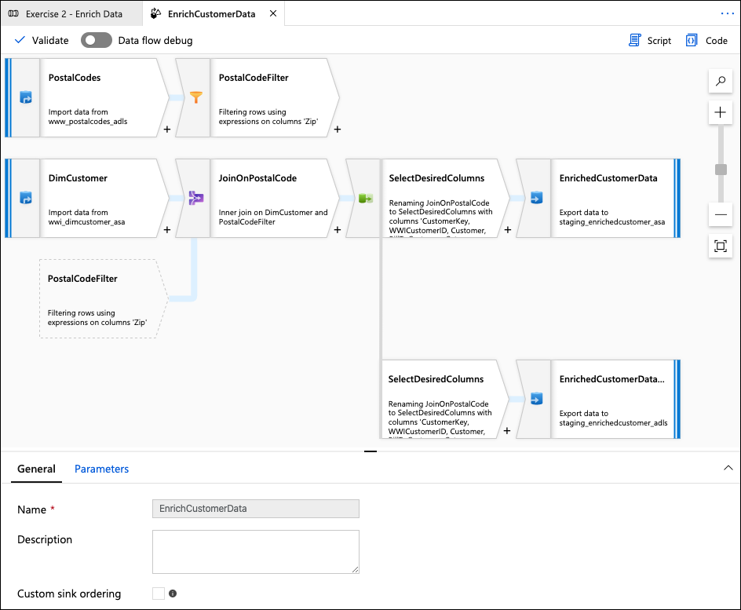

25. The [Data Flow canvas](https://docs.microsoft.com/azure/data-factory/concepts-data-flow-overview#data-flow-canvas) allows you to see the construction of the data flow, and each component contained within it in greater detail.

    > From a high level, the `EnrichCustomerData` data flow is composed of two data sources, multiple transformations, and two sinks. The data source components, `PostalCodes` and `DimCustomer`, ingest data into the data flow. The `EnrichedCustomerData` and `EnrichedCustomerDataAdls` components on the right are sinks, used to write data to data stores. The remaining components between the sources and sinks are transformation steps, which can perform filtering, joins, select, and other transformational actions on the ingested data.

    

26. To better understand how a data flow functions, let us inspect the various components. Select the `PostalCodes` data source on the data flow canvas.

    > On the **Source settings** tab, we see properties similar to what we saw on the pipeline activities property tabs. The name of the component can be defined, along with the source dataset and a few other properties. The `PostalCodes` dataset points to a CSV file stored in an Azure Data Lake Storage Gen2 account.

    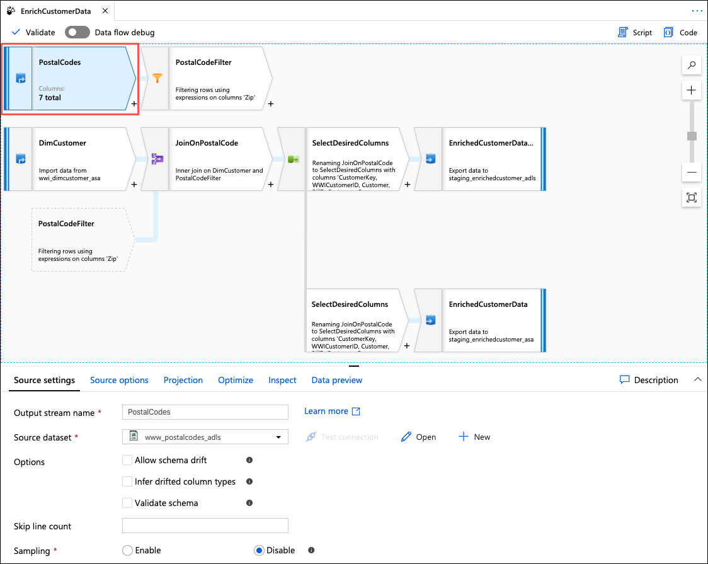

27. Select the **Projection** tab.

    > The **Projections** tab allows you to define the schema of the data being ingested from a data source. A schema is required for each data source in a data flow to allow downstream transformations to perform actions against the fields in the data source. Note that selecting **Import schema** requires an active debug session to retrieve the schema data from the underlying data source, as it uses the Spark cluster to read the schema. In the screenshot above, notice the `Zip` column is highlighted. The schema inferred by the import process set the column type to `integer`. For US zip code data, the data type was changed to `string` so leading zeros are not discarded from the five-digit zip codes. It is important to review the schema to ensure the correct types are set, both for working with the data and to ensure it is displayed and stored correctly in the data sink.

    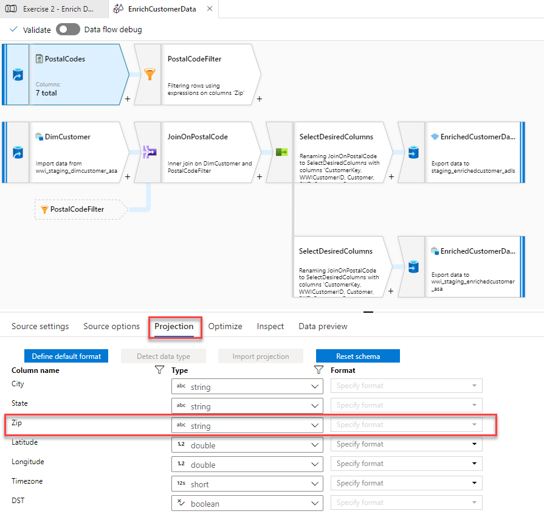

28. The **Data preview** tab allows you to ingest a small subset of data and view it on the canvas. This functionality requires an active debug session, so for this workshop, a screenshot that displays the execution results for that tab is provided below.

    > The `Zip` column is highlighted on the Data preview tab to show a sample of the values contained within that field. Below, you will filter the list of zip codes down to those that appear in the customer dataset.

    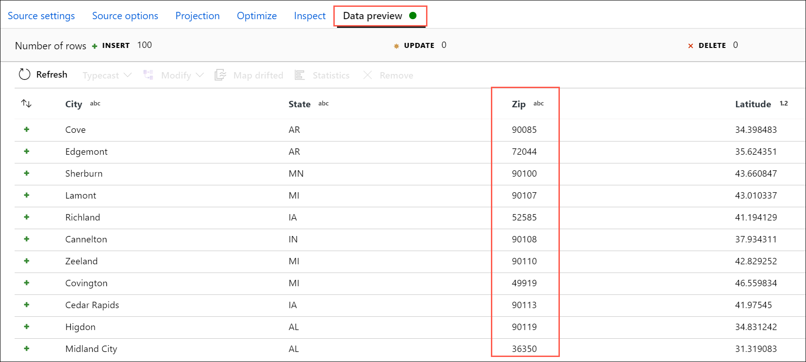

29. Before looking at the `PostalCodeFilter`, quickly select the `+` button to the right of the `PostalCodes` data source to display a list of available transformations.

    > Take a moment to browse the list of transformations available in Mapping Data Flows. From this list, you get an idea of the types of transformations that are possible using data flows. Transformations are broken down into three categories, **multiple inputs/outputs**, **schema modifiers**, and **row modifiers**. You can learn about each transformation in the docs by reading the [Mapping data flow transformation overview](https://docs.microsoft.com/azure/data-factory/data-flow-transformation-overview) article.

    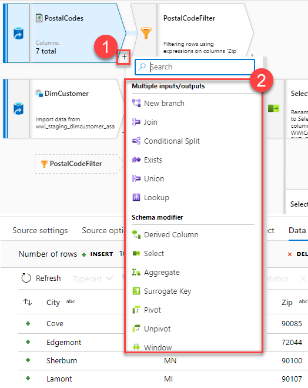

30. Next, select the `PostalCodeFilter` transformation in the graph on the data flow canvas.

    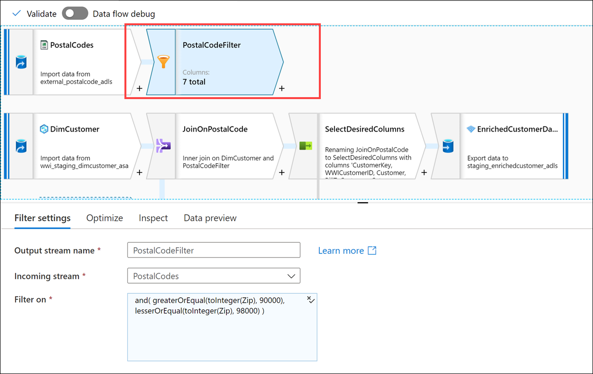

31. In the **Filter settings** tab of the configuration panel, click anywhere inside the **Filter on** box.

    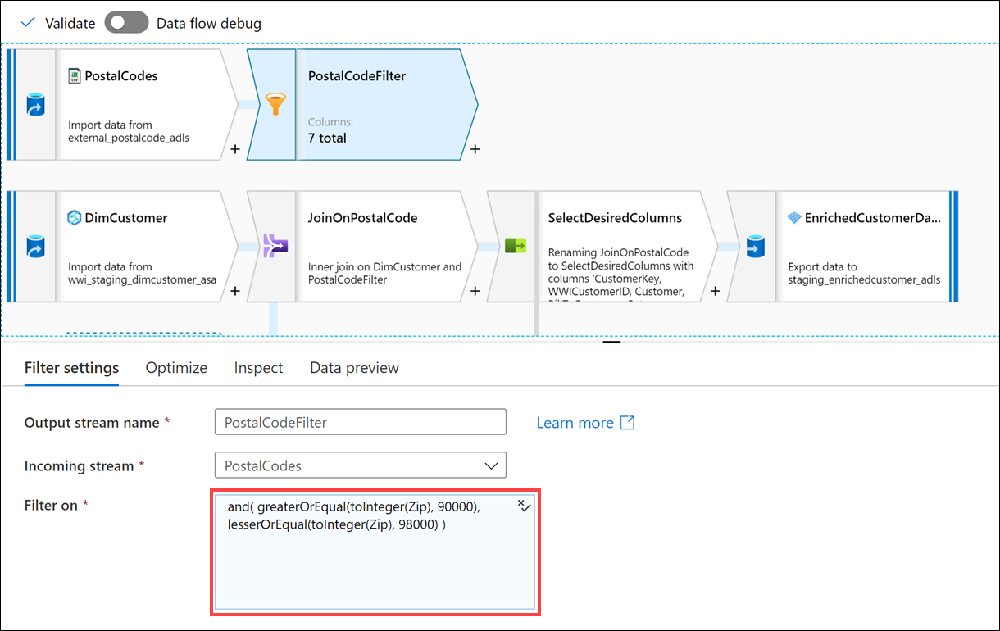

32. This will open the Visual expression builder.

    > In mapping data flows, many transformation properties are entered as expressions. These expressions are composed of column values, parameters, functions, operators, and literals that evaluate to a Spark data type at run time. To learn more, visit the [Build expressions in mapping data flow](https://docs.microsoft.com/azure/data-factory/concepts-data-flow-expression-builder) page in the documentation.

    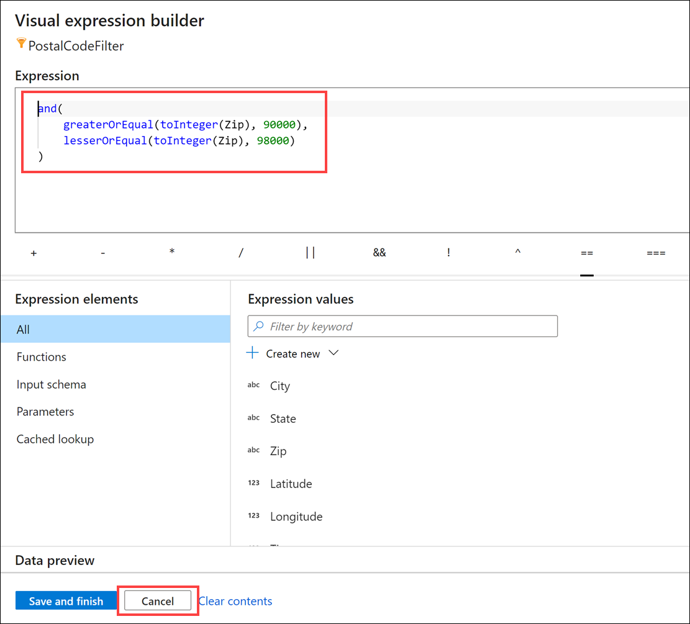

33. The filter currently applied ensures all zip codes are between 00001 and 99999. To reduce this list to only zip codes that appear in our customer data, you are going to update the filter. Our customer data has postal codes that fall within the range of 90000 to 98000.

    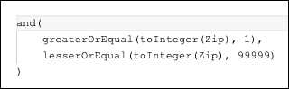

34. To update the filter and reduce the incoming zip codes to those found in our customer data, do the following:

    - Edit the `greaterOrEqual()` function by changing the `1` to `90000`.
    - Change the `99999` in the `lesserOrEqual()` function to `98000`.

35. Your updated expression should look like the code below.

    ```sql
    and(
       greaterOrEqual(toInteger(Zip), 90000),
       lesserOrEqual(toInteger(Zip), 98000)
    )
    ```

36. Select **Save and finish**.

    > If a debug session were enabled, you would be able to select the **Data preview** tab and see the result of this change. A screenshot of what this would look like is included below.

    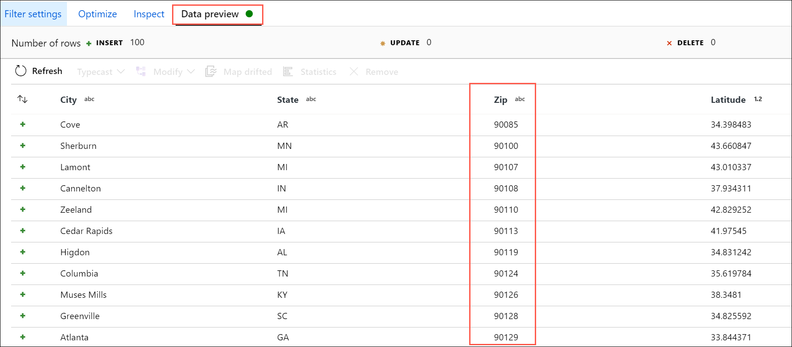

37. Select the `DimCustomer` data source on the data flow canvas graph.

    > Take a few minutes to review the various tabs in the configuration panel for this data source to get a better understanding of how it is configured, as you did above. Note that this data source relies on the `wwi_staging.DimCustomer_UniqueId` table from Azure Synapse Analytics for its data. `UniqueId` is supplied by a parameter to the data flow, which contains a substring of the Pipeline Run Id. Before running the pipeline, you will add a dependency to the Mapping Data Flow activity to ensure the Copy activity has populated the `wwi_staging.DimCustomer_UniqueId` in Azure Synapse Analytics before allowing the data flow to execute.

    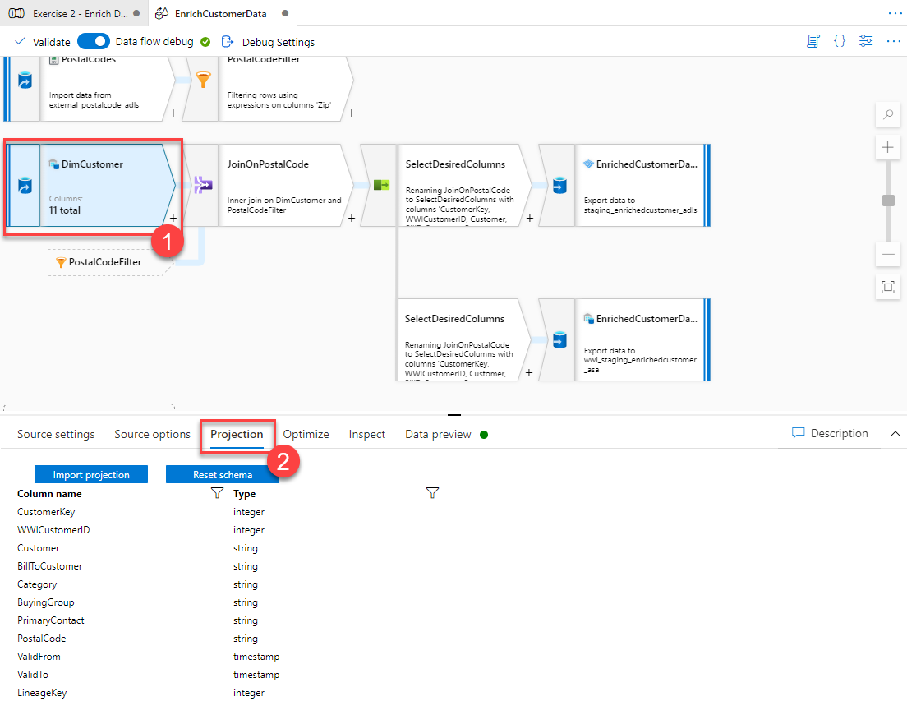

38. Next, select the `JoinOnPostalCode` transformation and ensure the **Join settings** tab is selected to see how you can join datasets using a simple and intuitive graphical interface.

    > The **Join settings** tab allows you to specify the data sources being joined and the join types and conditions. Notice the **Right stream** points to the `PostalCodeFilter` and not the `PostalCodes` data source directly. By referencing the filtered dataset, the join works with a smaller set of postal codes. For extensive datasets, this can provide performance benefits.

    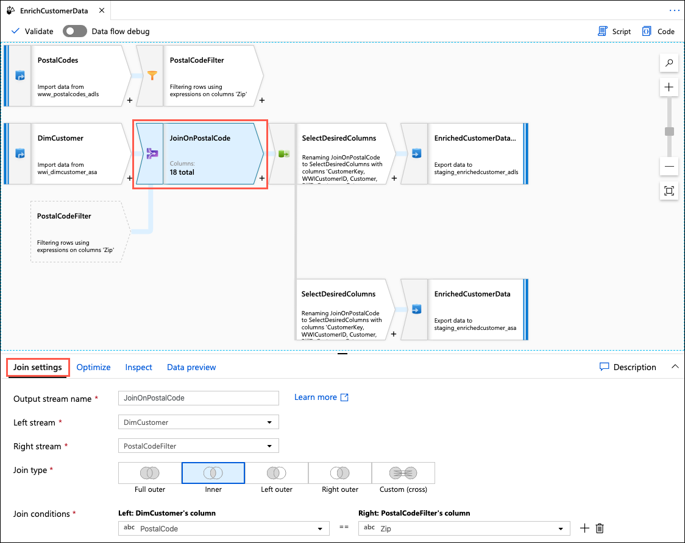

39. Moving on to the next transformation, the `SelectDesiredColumns` transformation uses a **Select** schema modifier to allow choosing what columns to include.

    > You have probably noticed that the `SelectDesiredColumns` transformation appears twice in the graph. To enable writing the resulting dataset to two different sinks, Azure Synapse Analytics and Azure Data Lake Storage Gen2, a **Conditional split** multiple outputs transformation is required. This split is displayed in the graph as a repeat of the split item.

    

40. The last two items in the data flow are the defined sinks. These provide the connection settings necessary to write the transformed data into the desired data sink. Select the `EnrichCustomerData` sink and inspect the settings on the **Sink** tab.

    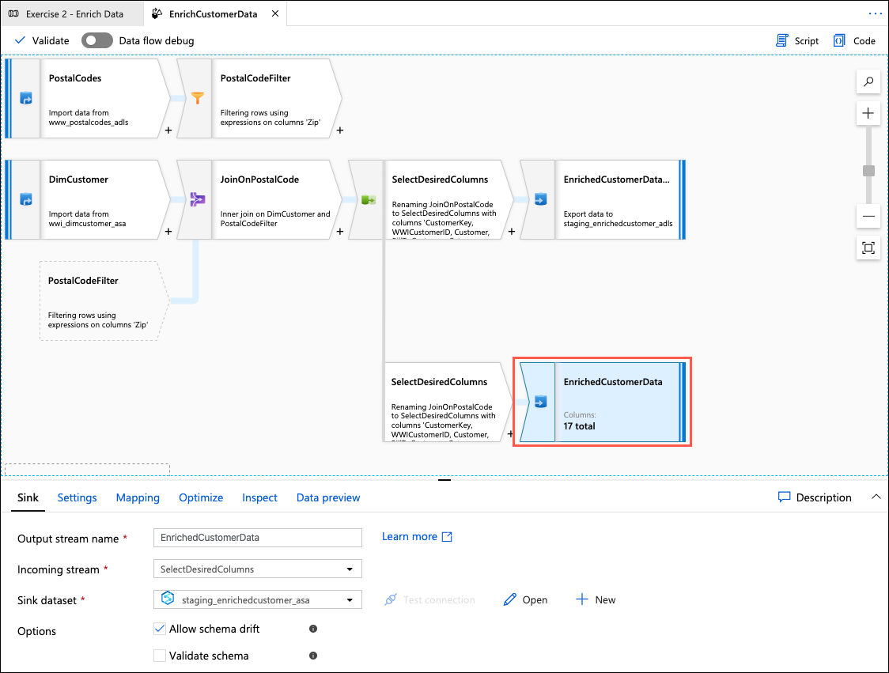

41. Next, select the **Settings** tab and observe the properties set there.

    > The **Settings** tab defines how data is written into the target table in Azure Synapse Analytics. The Update method has been set only to allow inserts, and the table action is set to recreate the table whenever the data flow runs.

    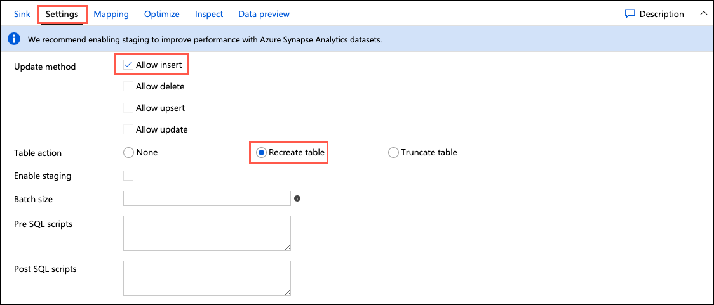

42. Now that you have taken the time to review the data flow, let us return to your cloned copy of the pipeline. On the canvas, select the **Exercise 2 - Enrich Data_UNIQUEID** tab, where _UNIQUEID_ is the unique identifier you retrieved from your username (e.g., `A03`).

    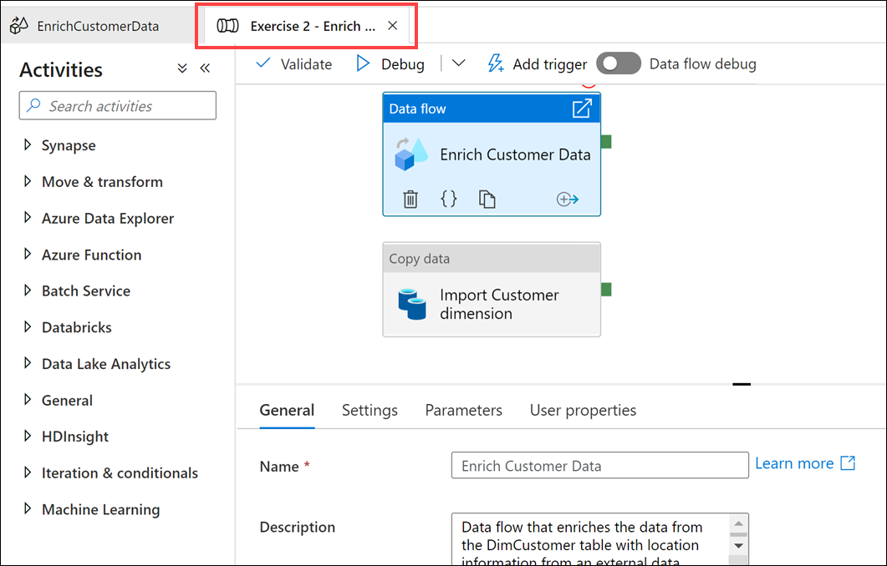

43. Before running the pipeline there is one more change we need to make. As mentioned above, the data flow depends on the data written by the copy activity, so you will add a dependency between the two activities.

44. In the data flow canvas graph, select the green box on the right-hand side of the **Copy data** activity and drag the resulting arrow up onto the **Mapping Data Flow** activity.

    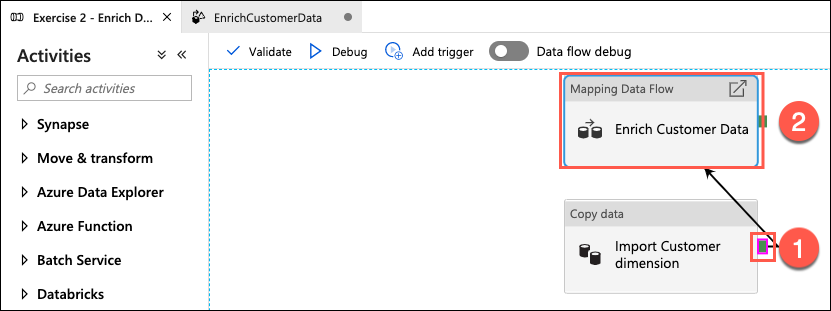

45. This creates a requirement that the **Copy data** activity completes successfully before the **Mapping Data Flow** can execute, and enforces our requirement of the Synapse Analytics table being populated before running the data flow.

    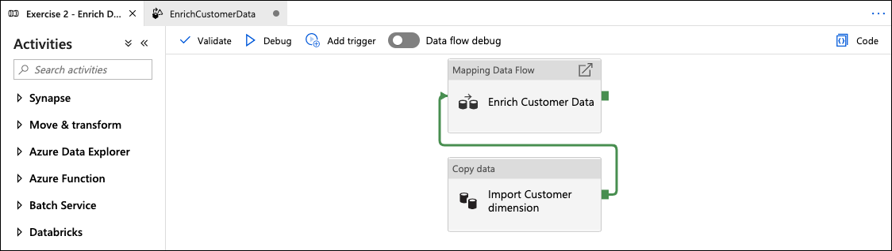

46. The last step before running the pipeline is to publish the changes you have made. Select **Publish all** on the toolbar.

    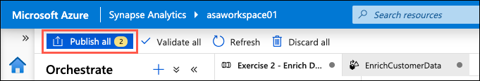

47. On the **Publish all** dialog, select **Publish**.

    > This Publish all dialog allows you to review the changes that will be saved. In the dialog, you should see two pending changes. The first is for your cloned pipeline and the second for your cloned data flow. **Important**: Be sure the only changes you see are your cloned pipeline and data flow. If any other changes appear, cancel the publish and close any other open tabs, choosing to discard changes when prompted. Then, select **Publish all** again.

    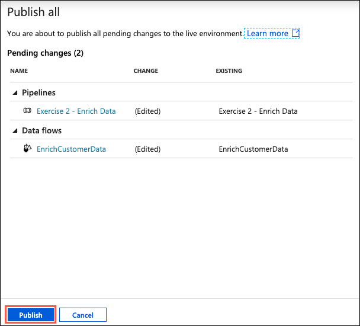

48. Within a few seconds, you will receive a notification that the publish completed. Select **Dismiss** in the notification.

    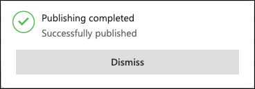

49. Your pipeline is now ready to run. Select **Add trigger** then **Trigger now** on the toolbar for the pipeline.

    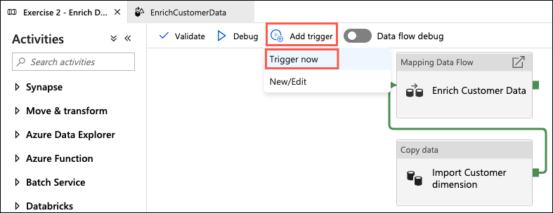

50. Select **OK** on the Pipeline run dialog to start the pipeline run.

    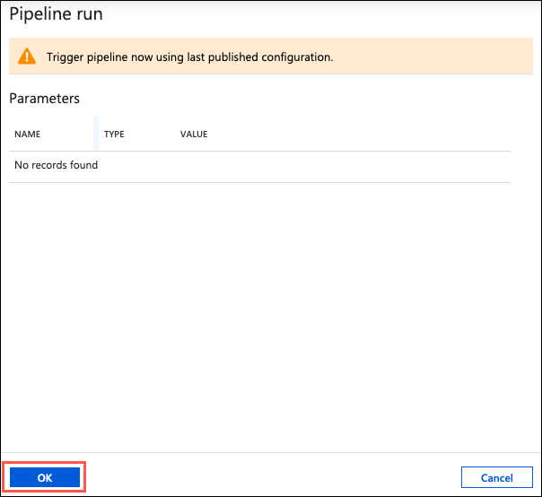

51. To monitor the pipeline run, move on to the next task.

## Task 3 - Monitor pipelines

After you finish building and debugging your data flow and its associated pipeline, you will want to be able to monitor the execution of the pipeline and all of the activities contained within it, including the Data Flow activity. In this task, you review the [pipeline monitoring functionality in Azure Synapse Analytics](https://docs.microsoft.com/azure/data-factory/concepts-data-flow-monitoring) using the pipeline run you initiated at the end of the previous task.

1. In Synapse Analytics Studio, select **Monitor** from the left-hand menu.

   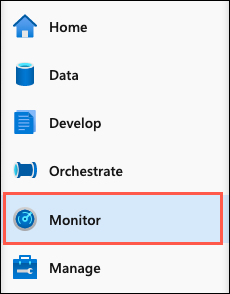

2. Under Orchestration, select **Pipeline runs**.

   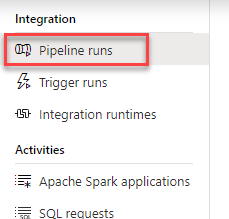

3. Select the pipeline whose name includes your _UNIQUEID_ from the list (e.g., `Exercise 2 - Enrich Data_A03`). This will have a status of `In progress`.

   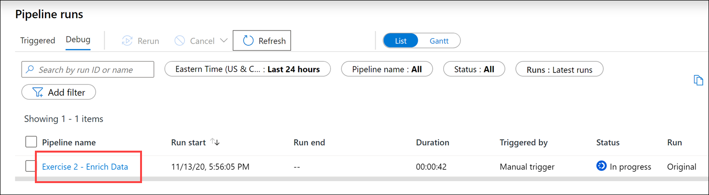

4. On the pipeline run details screen, you will see a graphical representation of the activities within the pipeline, as well as a list of the individual activity runs. Both provide status indicators for each activity.

   > This view allows you to monitor the overall status of the pipeline run, and observe the status of each activity contained within the pipeline. The screen will auto-refresh for five minutes. If auto-refresh does not occur or your pipeline run takes longer than five minutes, you can get updates by selecting the Refresh button on the canvas toolbar.

   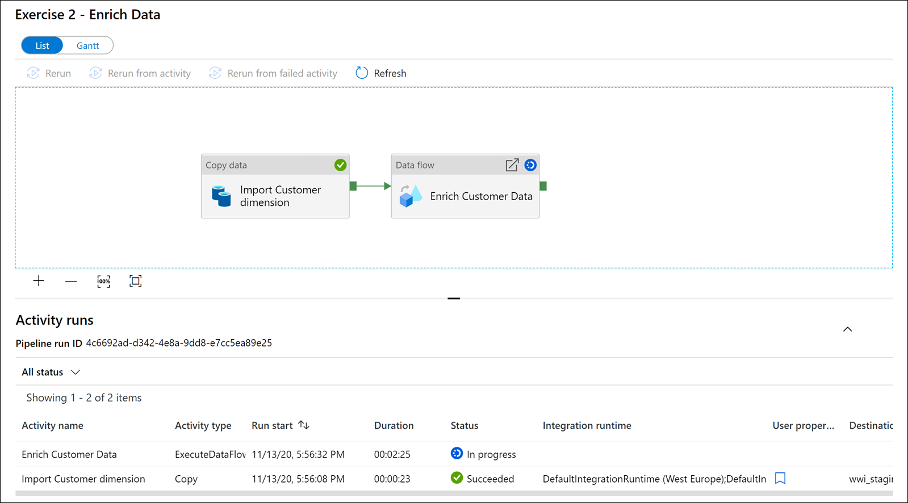

5. To get a better understanding of the types of information, you can get from the monitoring capabilities, let us explore what information is available for each of the activities in the Activity runs list. Start by hovering your mouse cursor over the **Import Customer dimension** activity and select the **Output** icon that appears.

   

6. In the **Output** dialog, you will see details about the size of data read and written, the number of rows read and copied, the duration of the copy activity, and other information relating to the copy activity run. This information can be used for things like troubleshooting. For example, you could compare the copy run to data, such as the number of rows read and written, to expected numbers from the source and sink.

   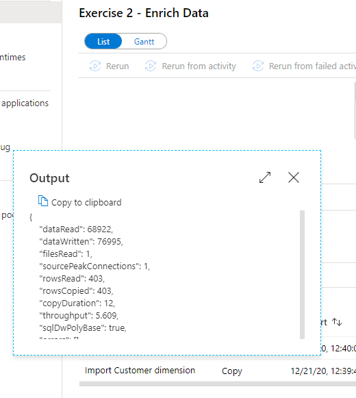

7. Close the Output dialog.

8. Next, hover your mouse cursor over the **Import Customer dimension** activity again, this time selecting the **Details** icon that appears.

   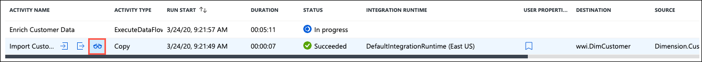

9. The **Details** dialog provides the data found on the Output dialog examine above, but expands on that to include graphics for the source and sink and a more detailed look at the activity run.

   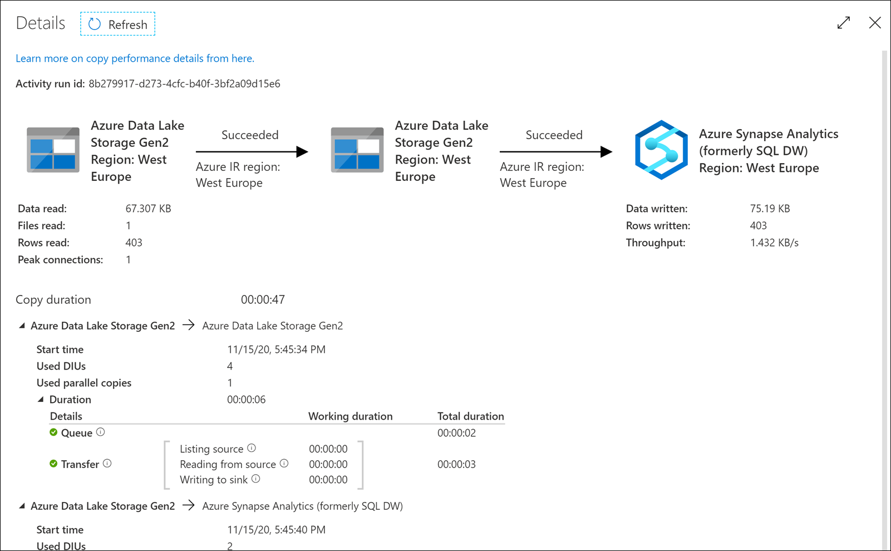

10. Close the Details dialog.

11. When the pipeline execution completes, all activity runs will reflect a status of Succeeded.

    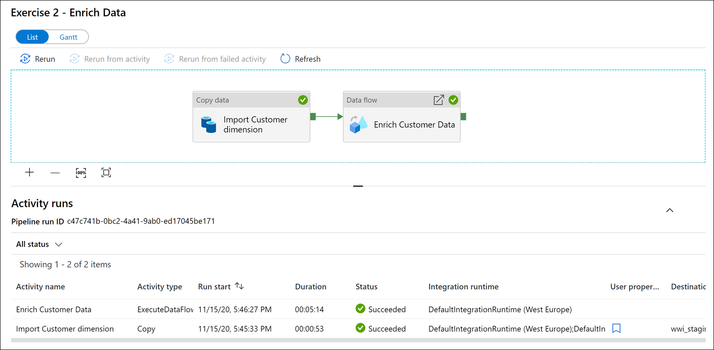

12. When the **Enrich Customer Data** activity has a status of **Complete**, hover your mouse cursor over the **Enrich Customer Data** activity and select the **Details** icon that appears.

    > **Note**: It can take 7-8 minutes for the **Enrich Customer Data** activity to complete. You may need to select **Refresh** on the Monitoring toolbar to see the status update if your pipeline run takes longer than five minutes.

    

13. The Details dialog for data flow details takes you to a full-screen view of your data flow.

    > The initial view provides a details panel containing statistics for the sinks defined within the data flow. The information for these includes the number of rows written and the processing times for writing to each sink.

    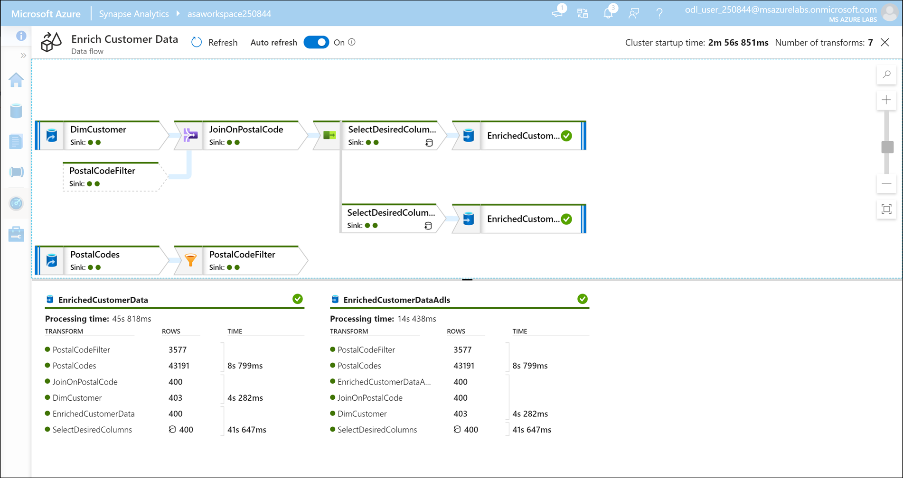

14. Select the **SelectDesiredColumns** transformation step of the data flow.

    > Selecting any component of the data flow opens a new panel with details related to the processing that occurred for that component.

    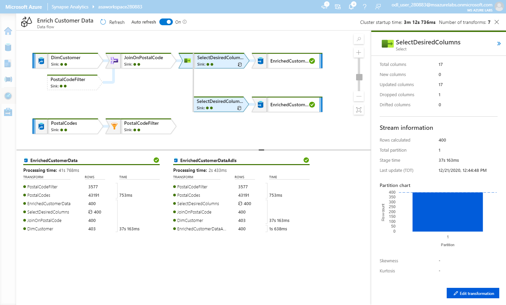

15. Try selecting another component, such as the **EnrichCustomerData** sink, and view the information available.

    

16. Close the data flow activity Details dialog by selecting the **X** on the right-hand side of the toolbar.

    

17. Back on Exercise 2 - Enrich Data pipeline run screen, switch to the Gantt view. This view provides a graphical representation of the run times of the various activities within the pipeline.

    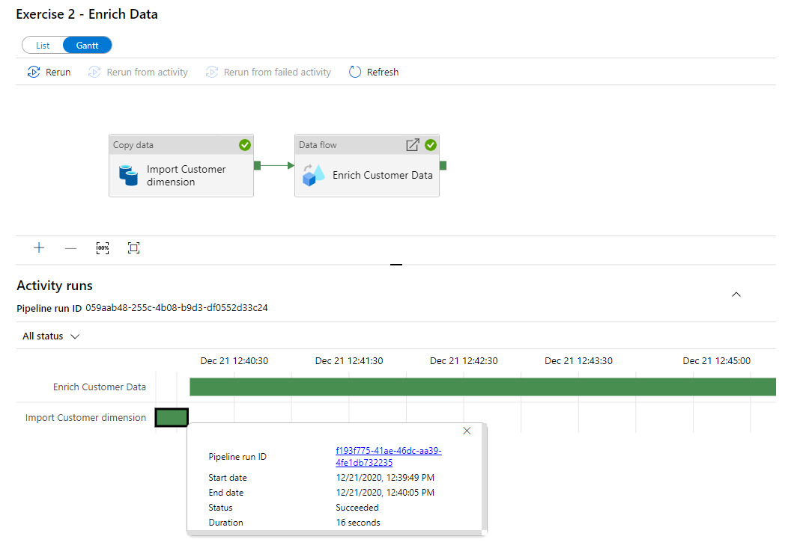

## Task 4 - Monitor Spark applications

In this task, you examine the Apache Spark application monitoring capabilities built into Azure Synapse Analytics. The Spark application monitoring screens provide a view into the logs for the Spark application, including a graphical view of those logs.

1. As you did in the previous task, select **Monitor** from the left-hand menu.

   

2. Next, select **Apache Spark applications** under Activities.

   

3. On the Apache Spark applications page, select the **Submit time** value and observe the available options for limiting the time range for Spark applications that are displayed in the list. In this case, you are looking at the current run, so ensure **Last 24 hours** is selected and then select **OK**.

   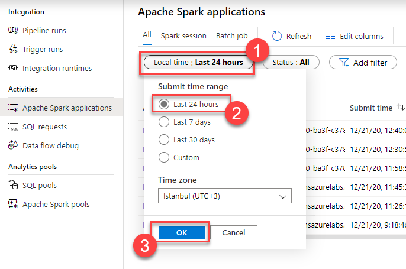

4. From the list of Spark applications, select the first job, which should have a status of `In progress`.

   > **Note**: You may see a status of `Cancelled`, and this does not prevent you from completing the following steps. Azure Synapse Analytics is still in preview, and the status gets set to `Cancelled` when the Spark pool used to run the Spark application times out.

   

5. On the **Log query** screen, you will see a detailed view of the job, broken into three different sections.

   - The first section is a graphical representation of the stages that make up the Spark application.
   - The second section is a summary of the Spark application.
   - The third section displays the logs associated with the Spark application.

   

6. In the graph section, the initial graph displayed is that of the overall job progress. Here, you can see the progress of each stage.

   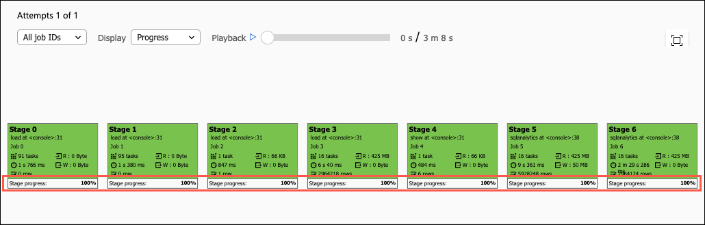

7. Selecting any individual stage from the graph opens a new browser window showing the selected stage in the Spark UI, where you can dive deeper into the tasks that make up each stage. Select **Stage 5** and observe the information displayed in Spark UI.

   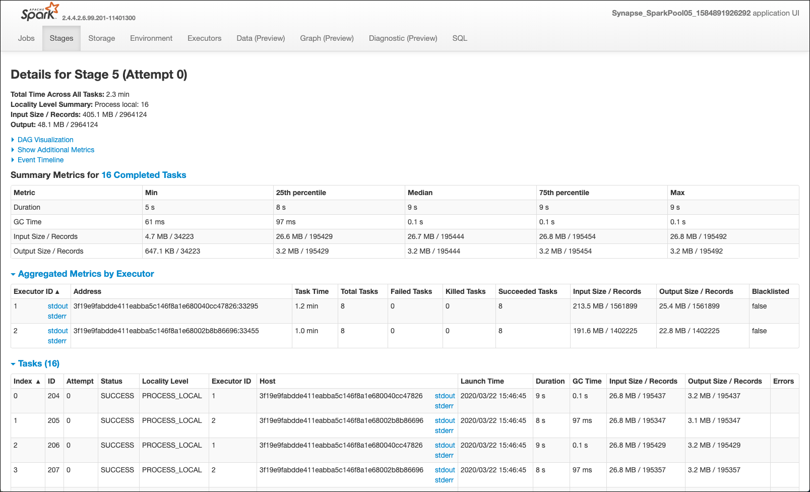

8. Return to the Synapse Analytics Monitoring page for your Spark application.

9. To look closer at any individual stage, you can use the **Job IDs** drop-down to select the stage number. 

   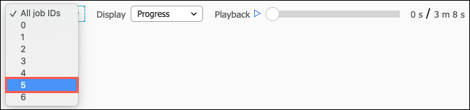

10. This view isolates the specific stage within the graphical view.

    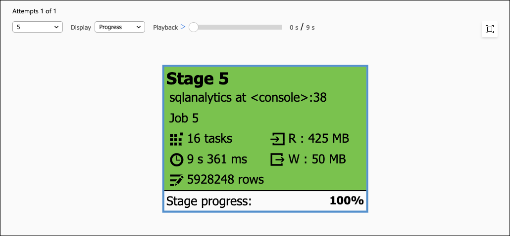

11. Return the view to all stages by selecting **All job IDs** in the job ID drop-down list.

    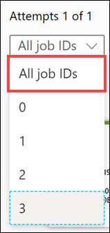

12. Within the graph section, you also have the ability to **Playback** the Spark application.

    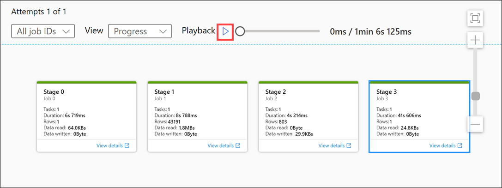

    > **Note**: Playback functionality is not available until the job status changes out of the `In progress` status. The job's status will remain listed as `In progress` until the underlying Spark resources are cleaned up by Azure Synapse Analytics, which can take some time.

13. Running a Playback allows you to observe the time required to complete each stage, as well as review the rows read or written as the job progresses.

    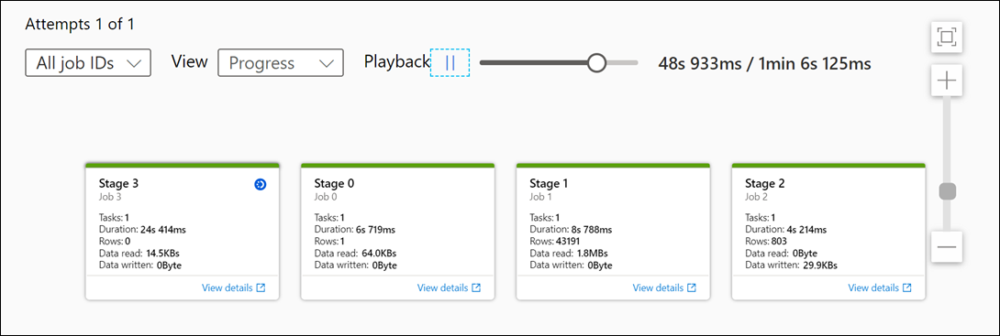

14. You can also perform a playback on an individual stage. Returning to a view of only Stage 5, the **Playback** button shows the rows written at this stage, and the progress of reads and writes.

    

15. You can also change the view to see which stages were involved in read and write activities. In the **Display** drop-down, select **Read**.

    

16. In the read graph, stages that involved read tasks are highlighted in orange.

    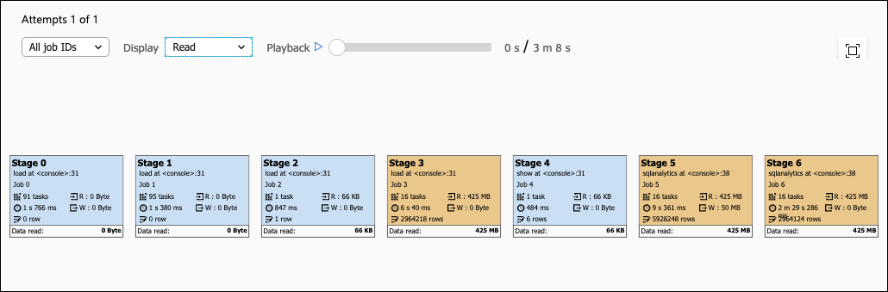

17. Next, select **Written** from the Display drop-down list, and observe the stages where data was written.

    
