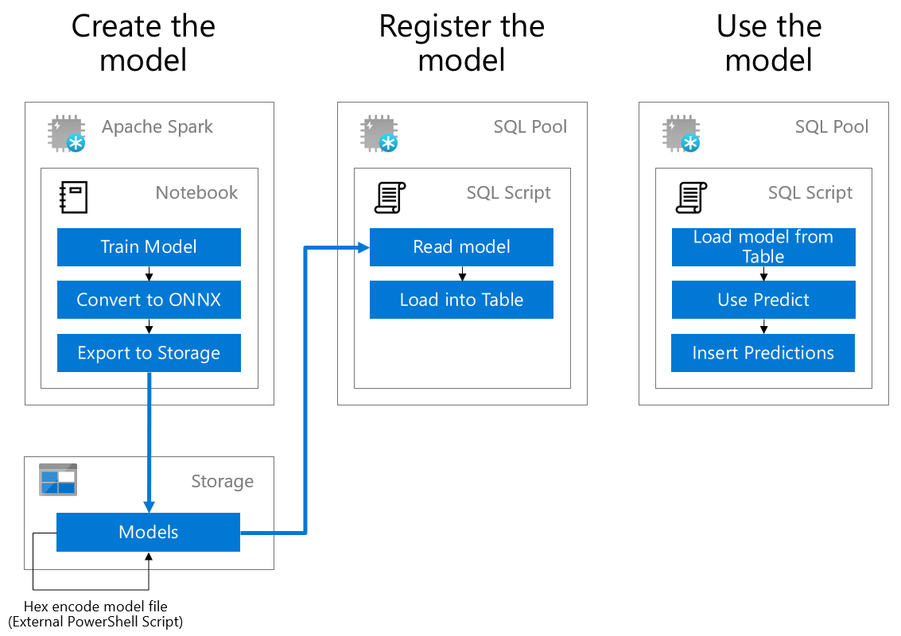
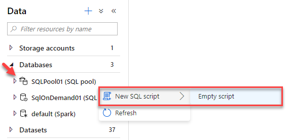
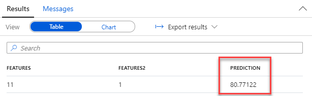

# Exercise 5 - Data Science with Azure Synapse Spark

> **Note**: The following Exercise 5 is for future functionality only outside of the AIAD program and therefore provided as educational reading only. This repo documentation will be updated once exercise 5 is available for use.

Azure Synapse Analytics provides a unified environment for both data science and data engineering. What this means in practice, is that your data scientists can train and deploy models using Azure Synapse Analytics and your data engineers can write T-SQL queries that use those models to make predictions against tabular data stored in a SQL Pool database table.

In this exercise, you will leverage a previously trained model to make predictions using the T-SQL `Predict` statement.

For context, the following are the high-level steps taken to create a Spark ML based model and deploy it, so it is ready for use from T-SQL.



All of the steps are performed within your Azure Synapse Analytics Studio.

- Within a notebook, a data scientist will:

  a. Train a model using Spark ML; the machine learning library included with Apache Spark. Models can also be trained using other approaches, including by using Azure Machine Learning automated ML. The main requirement is that the model format must be supported by ONNX.

  b. Convert the model to the ONNX format using the `onnxml` tools.

  c. Save a hexadecimal encoded version of the ONNX model to a table in the SQL Pool database. This is an interim step while this feature is in preview.

- To use the model for making predictions, in a SQL Script, a data engineer will:

  a. Read the model into a binary variable by querying it from the table in which it was stored.

  b. Execute a query using the `FROM PREDICT` statement as you would a table. This statement defines both the model to use and the query to execute that will provide the data used for prediction. You can then take these predictions and insert them into a table for use by downstream analytics applications.

> What is ONNX? [ONNX](https://onnx.ai/) is an acronym for the Open Neural Network eXchange and is an open format built to represent machine learning models, regardless of what frameworks were used to create the model. This enables model portability, as models in the ONNX format can be run using a wide variety of frameworks, tools, runtimes, and platforms. Think of it as a universal file format for machine learning models.

In this exercise, you will focus on step (2) from the above. The tasks you will perform are:

- Exercise 5 - Data Science with Spark
  - Task 1 - Making predictions with a trained model
  - Task 2 - Examining the model training and registration process (Optional)

## Task 1 - Making predictions with a trained model

In this task, you will author a T-SQL query that uses a pre-trained model to make predictions.

1. Open Synapse Analytics Studio, and then navigate to the `Data` hub.

2. Expand the Databases listing, right-click your SQL Pool and then select `New SQL Script`, and then `Empty script`.

   

3. Replace the contents of this script with following:

   ```sql
   -- Retrieve the latest hex encoded ONNX model from the table
   DECLARE @model varbinary(max) = (SELECT Model FROM [wwi_ml].[MLModel] WHERE Id = (SELECT Top(1) max(ID) FROM [wwi_ml].[MLModel]));

   -- Run a prediction query
   SELECT d.*, p.*
   FROM PREDICT(MODEL = @model, DATA = [wwi_ml].[SampleData] AS d) WITH (prediction real) AS p;
   ```

4. Select **Run** from the menubar.

   

5. View the results, notice that the `Prediction` column is the model's prediction of how many items of the kind represented by `StockItemKey` that the customer identified by `CustomerKey` will purchase.

   

## Task 2 - Examining the model training and registration process (Optional)

You can see the notebook and SQL scripts that were used to train and register this model if you are curious. To do so, follow these steps:

1. Open Synapse Analytics Studio, and then navigate to the `Develop` hub.

2. Under **Notebooks**, select the notebook called `Exercise 5 - Model Training`.

3. This notebook handles training the model, converting the model to ONNX, and uploading the ONNX model to Azure Storage.

4. Feel free to read through the notebook, but **do not execute it**. The results of executing each cell in the notebook have been saved with the notebook so that you can see results without running it.

5. One step that is not shown by the notebook is an offline step that converts the ONNX model to hexadecimal. The resulting hex-encoded model is also uploaded to Azure Storage. This conversion is currently performed with [this PowerShell script](./artifacts/00/ml/convert-to-hex.ps1), but could be automated using any scripting platform.

6. Once you have read through the notebook, return to the `Develop` hub, expand **SQL scripts** and select `Exercise 5 - Register model`. View, but **do not run this script**.

7. This script uses PolyBase to load the hex-encoded model from Azure Storage into a table within the SQL Pool database. Once the model is inserted into the table in this way, it is available for use by the Predict statement as was shown in Task 1.
