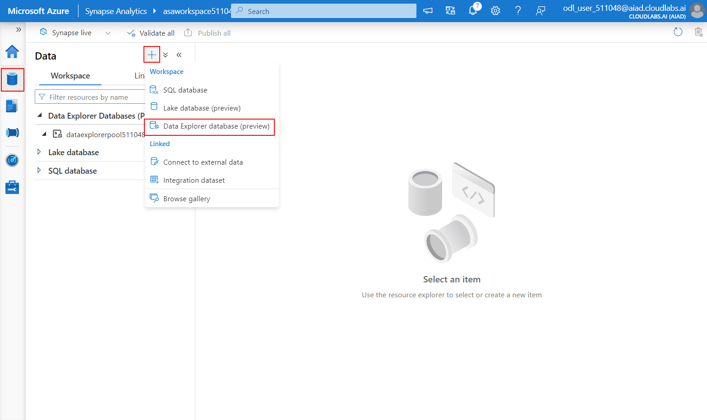
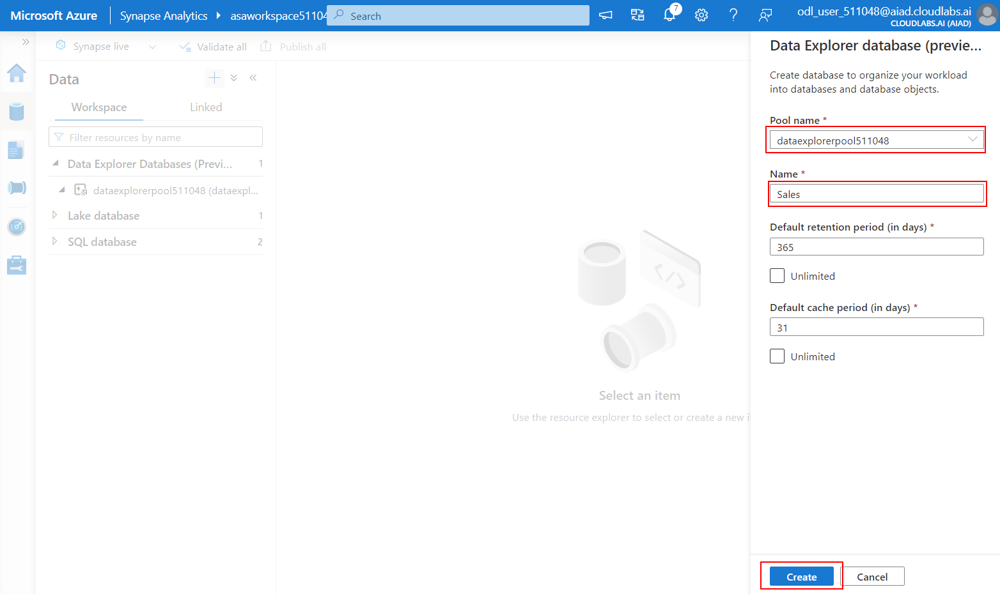
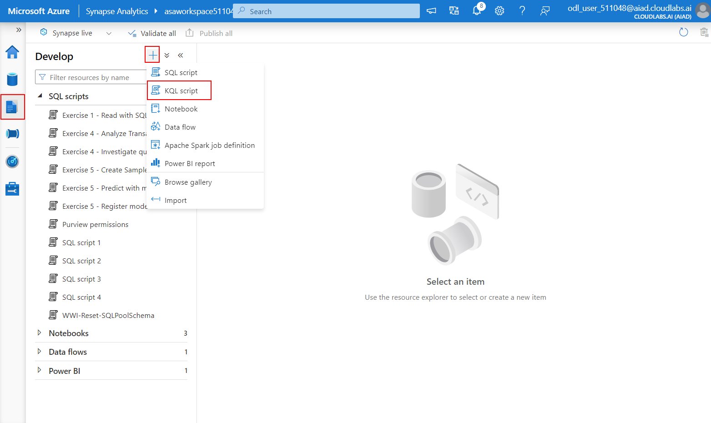
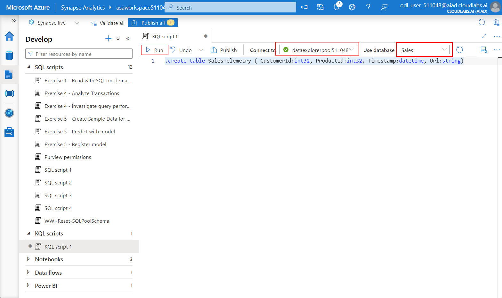
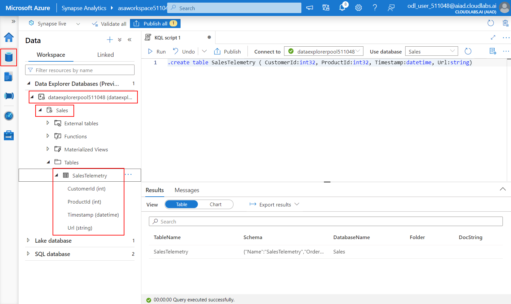
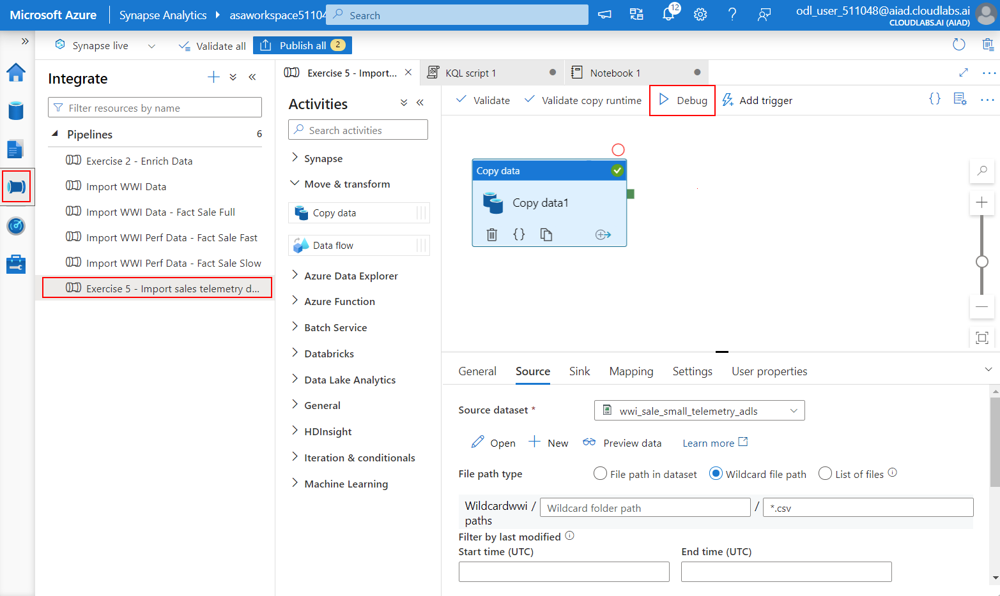
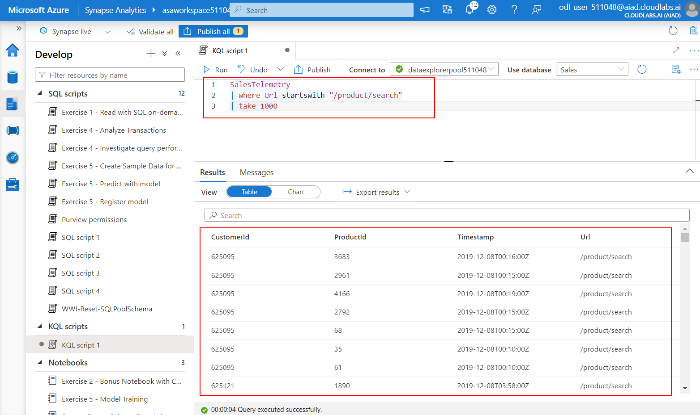
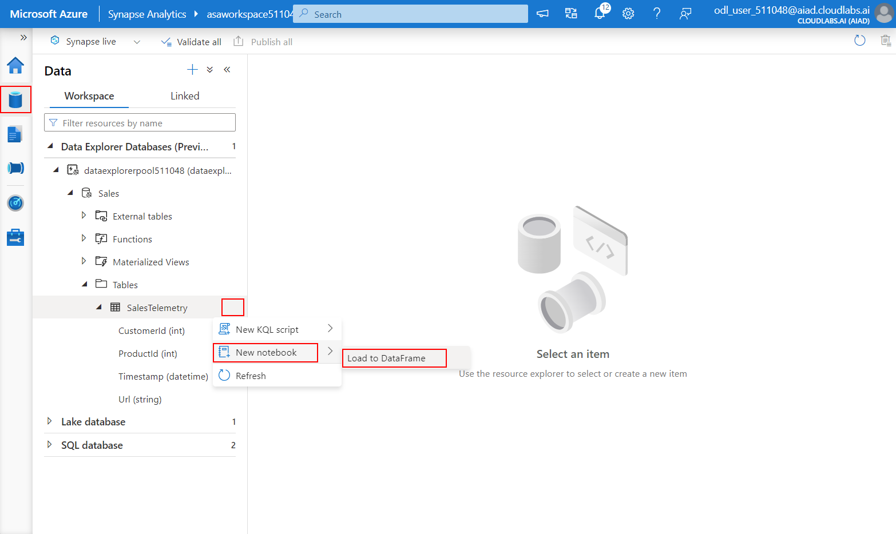
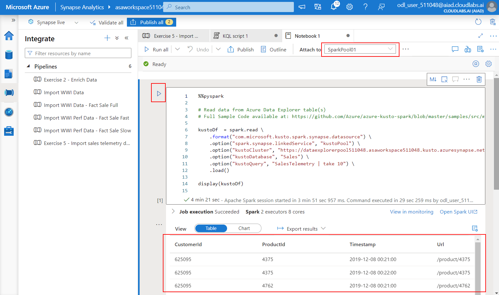
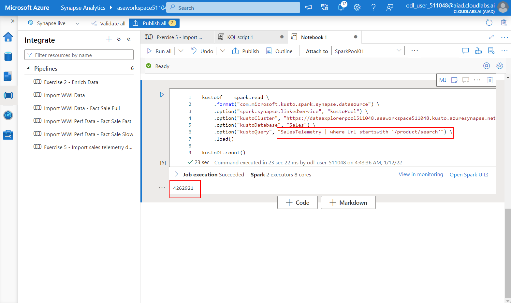

# Exercise 5 - Log and telemetry analytics

In this exercise you will explore the capabilities of the newly integrared Data Explorer runtime in Synapse Analytics.

Azure Synapse data explorer provides you with a dedicated query engine optimized and built for log and time series data workloads. With this new capability now part of Azure Synapse's unified analytics platform, you can easily access your machine and user data to surface insights that can directly improve business decisions. To complement the existing SQL and Apache Spark analytical runtimes, Azure Synapse data explorer is optimized for efficient log analytics, using powerful indexing technology to automatically index structured, semi-structured, and free-text data commonly found in telemetry data.

The tasks you will perform in this exercise are:

- Exercise 5 - Log and telemetry analytics
  - Task 1 - Create a Data Explorer database and a table for data ingestion
  - Task 2 - Perform manual data ingestion using a Synapse Pipeline
  - Task 3 - Run KQL queries from Synapse Studio
  - Task 4 - Load Data Explorer data into a Spark dataframe

## Task 1 - Create a Data Explorer database and a table for data ingestion

In this task, you will create a Data Explorer database and a table to ingest sales telemetry data.

1. In Synapse Studio, navigate to the `Data` hub and then select from the `+` dropdown the `Data Explorer database` option.

    

2. Provide the following inputs to configure the database to be created:

     - **Pool name**: select the Data Explorer pool (should be named `dataexplorerpoolNNNNNN`)
     - **Name**: `Sales`

    Leave the other options with default values and select `Create`.

    

3. In Synapse Studio, navigate to the `Develop` hub and then select from the `+` dropdown the `KQL script` option.

   

4. In the `Connect to` dropdown, select the Data Explorer pool (should be `dataexplorerpoolNNNNNN`), and then select the `Sales` database.

   Use the following KQL query and select `Run`:

      ```kql
    .create table SalesTelemetry ( CustomerId:int32, ProductId:int32, Timestamp:datetime, Url:string)
      ```

   

5. In Synapse Studio, navigate to the `Data` hub and check that you have the `SalesTelemetry` table showing up under the `Sales` database in the Data Explorer pool (`dataexplorerpoolNNNNNN`).

   

## Task 2 - Perform manual data ingestion using a Synapse Pipeline

In this task, you will trigger a Synapse Pipeline to peform manual data ingestion into the table created in Task 1.

1. In Synapse Studio, navigate to the `Integrate` hub, select the `Exercise 5 - Import sales telemetry data` pipeline and then select `Debug` to trigger the pipeline.

   

2. With the pipeline debug window open, wait until the pipeline completes (should take around 3 to 4 minutes).

## Task 3 - Run KQL queries from Synapse Studio

In this task, you will query the sales telemetry data using a KQL script run from Synapse Studio.

1. In Synapse Studion, navigate to the `Develop` hub and create a new KQL query with the following content:

    ```kql
    SalesTelemetry
    | where Url startswith "/product/search"
    | take 1000
    ```

    Run the query and observe the results (the first 1000 product searches).

    

>**BONUS EXERCISE**
>
>Change the KQL query to return the most recent 1000 product searches.

## Task 4 - Load Data Explorer data into a Spark dataframe

In this task, you will load data from a Data Explorer table into a Spark dataframe.

1. In Synapse Studio, navigate to the `Data` hub, locate the `SalesTelemetry` table, select the `...` context menu activator, and then select `New notebook > Load to DataFrame`.

   

    This will open a Spark notebook with some PySpark code that loads data from the `SalesTelemetry` table into a Spark dataframe.

2. In the `Attach to` dropdown, select the `SparkPool01` Spark bool and then select the run button to run the notebook.

    

    >**NOTE**
    >
    >It may take up to a few minutes for the Spark pool and the associated Spark session to be created.

3. Add a new cell to the notebook and change the `kustoQuery` option with the following snippet:

    ```kql
    SalesTelemetry | where Url startswith '/product/search'
    ```

    Run the new cell and observe the result (the total number of product searches logged into the telemetry data).

   
