# Exercise 6 - Data governance with Azure Purview

In this exercise you will use several of the capabilities provided by the integration between Azure Synapse Analytics and Azure Purview workspaces.

Azure Purview is a unified data governance solution that helps you manage and govern your on-premises, multicloud, and software-as-a-service (SaaS) data. Purview enables you to easily create a holistic, up-to-date map of your data landscape with automated data discovery, sensitive data classification, and end-to-end data lineage. It also enables data consumers to find valuable, trustworthy data.

Azure Synapse Analytics and Azure Purview workspaces are tightly integrated, enabling seamless data discovery and lineage.

The tasks you will perform in this exercise are:

- Exercise 6 - Data governance with Azure Purview
  - Task 1 - Explore the integration of Azure Purview into the Azure Synapse Analytics workspace
  - Task 2 - Trigger automatic data lineage tracking when executing a Synapse Pipeline
  - Task 3 - Discover data assets using Azure Purview powered search
  - Task 4 - Explore the results of scaning an Azure Synapse Analytics workspace from Azure Purview
  - Task 5 - Explore the results of data lineage tracking for Synapse Pipelines

## Task 1 - Explore the integration of Azure Purview into the Azure Synapse Analytics workspace

In this task, you will explore the connection between a Synapse Analytics and a Purview workspace.

1. Open Synapse Analytics Studio, and then navigate to the `Manage` hub.
2. Select `Azure Purview` to view the details of the connected Azure Purview workspace

    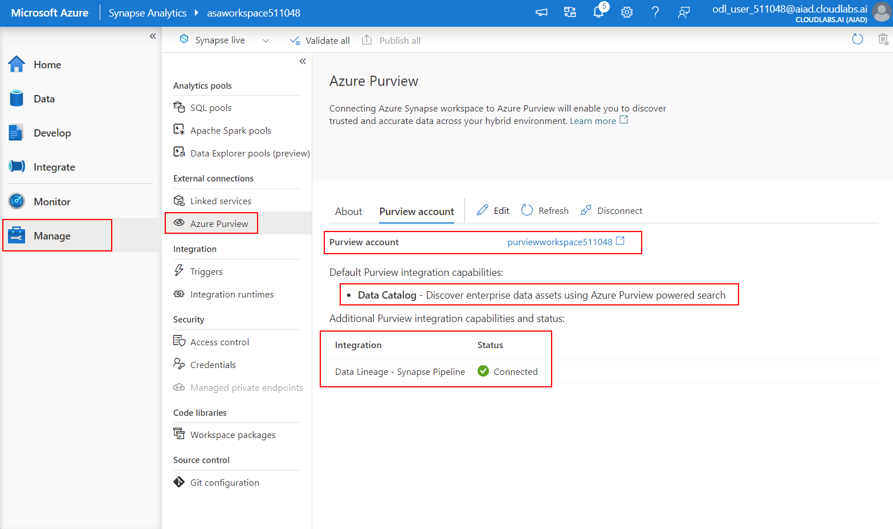

3. Notice the Azure Purview workspace that is already connected to the the Azure Synapse Analytics workspace.

    This connection enables two categories for functionalities:

   - Data Catalog integration which allows the discovery of assets using Purview powered search
   - Data Lineage integration which allows automatic data lineage collection for Synapse Pipelines

## Task 2 - Trigger automatic data lineage tracking when executing a Synapse Pipeline

In this task, you will trigger the execution of a Synapse Pipeline to generate data lineage information in the Purview workspace.

1. Open Synapse Analytics Studio, and then navigate to the `Integrate` hub.

2. In the list of pipelines, select the `Import WWI Data - Fact Sale Full` pipeline

    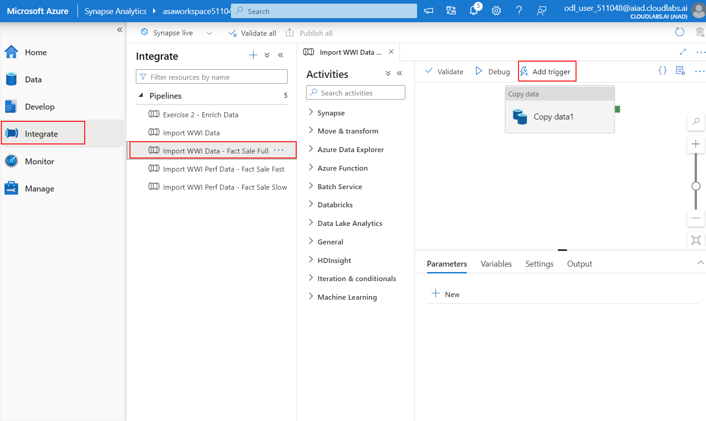

    This pipeline will re-import the contents of the `wwi.FactSale` data from the dedicated SQL pool `SQLPool01`. Next, you will trigger the execution of the pipeline to generate lineage information in Purview.

3. Select `Add trigger` and then select `Trigger now` to initiate the execution of the pipeline. Select `OK` in the `Pipeline run` popup to activate the trigger.

    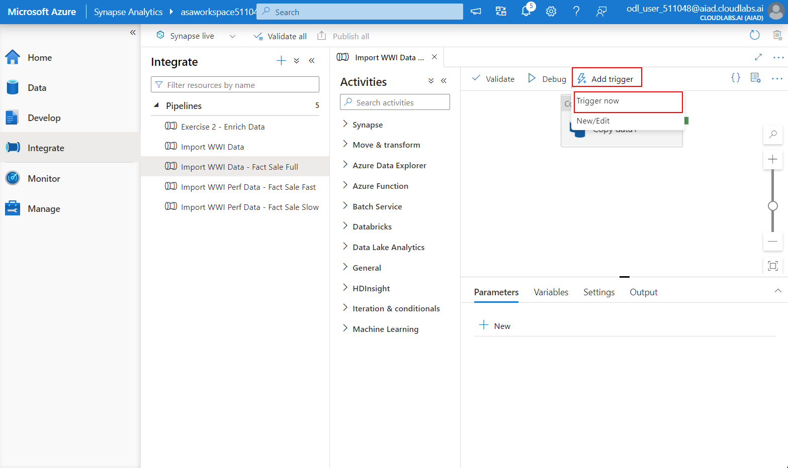

4. In Synapse Studio, navigate to the `Monitor` hub and then select `Pipeline runs`. The `Import WWI Data - Fact Sale Full` pipeline should appear with a status of `In progress`.

    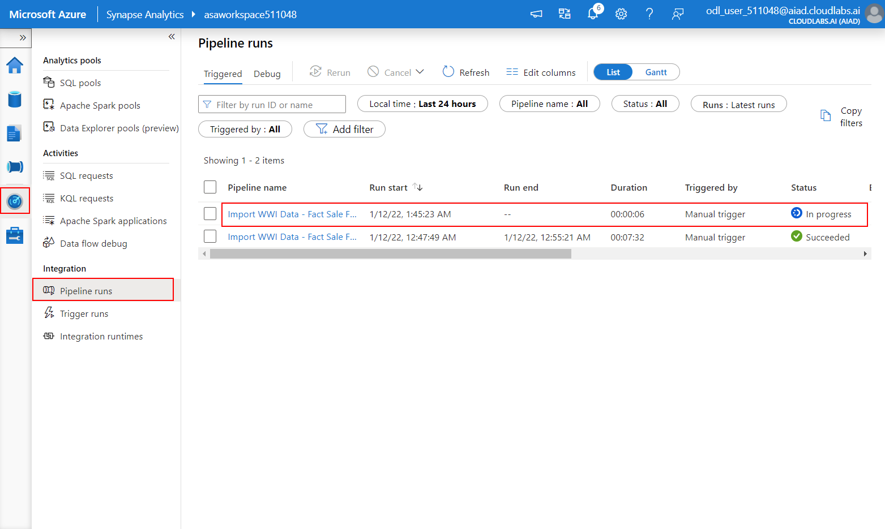

    The pipeline will take up to 10 minutes to complete. You will proceed to the next tasks and come back later to check the lineage data generated by the execution of the pipeline.

## Task 3 - Discover data assets using Azure Purview powered search

In this task you will discover Synapse Analytics assets using Purview search.

1. Open Synapse Analytics Studio, and then navigate to the `Data` hub.

2. Select the search bar at the top and make sure `Purview` is selected as the search provider. Enter `fact` in the search box and notice the asset suggestions returned. Select `View search results` to view the results of the Purview-powered search.

    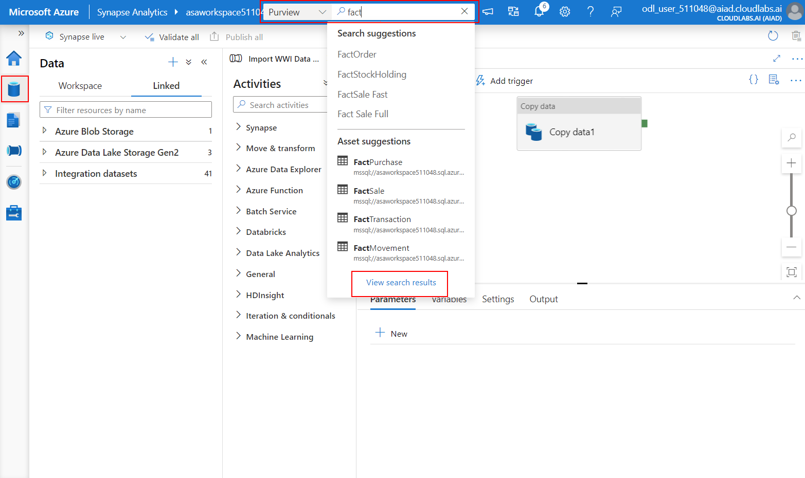

3. Explore the results of the search. Select the `FactSale` asset.

    

4. Explore the properties of the `FactSale` asset.

    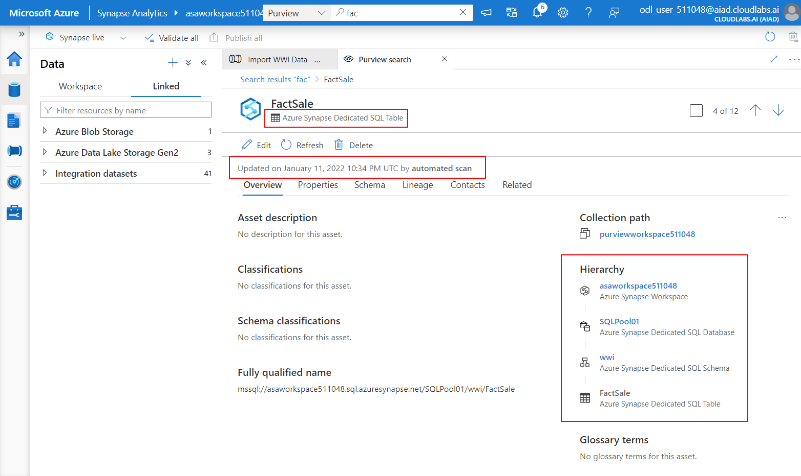

    Note the following:

    - The type of the asset is `Azure Synapse Dedicated SQL Table`
    - The information about the asset was last updated by an automated scan run from the Purview workspace
    - The hierarchy the asset belongs to

## Task 4 - Explore the results of scaning an Azure Synapse Analytics workspace from Azure Purview

In this task, you will explore the results of scanning the Synapse Analytics workspace from the Purview workspace.

1. In the Azure Portal, navigate to the resource group that contains your Synapse Analytics workspace. Select the Purview workspace object (which should be named `purviewworkspaceNNNNNN`) and then select `Open Purview Studio`.

    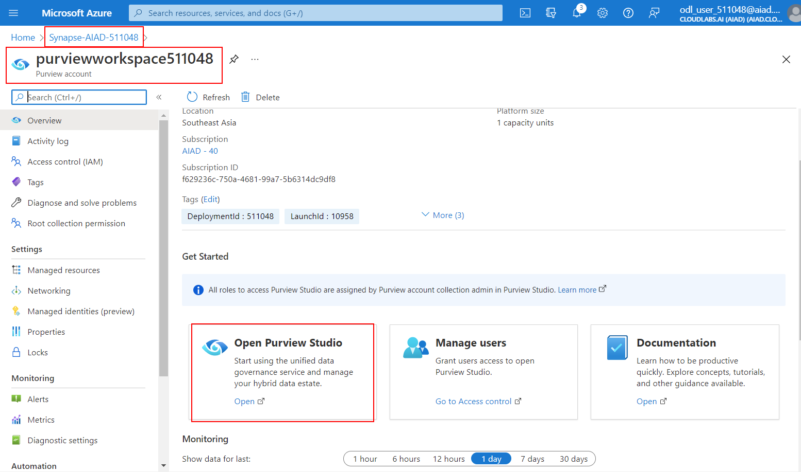

    This will open Purivew Studio where you will perform the rest of the steps in this task.

2. In Purview Studio, navigate to the `Data map` hub, select `Sources` and then locate the Synapse Analytics source which is your Synapse Analytics workspace. Select `View details` to explore the configuration of the source.

    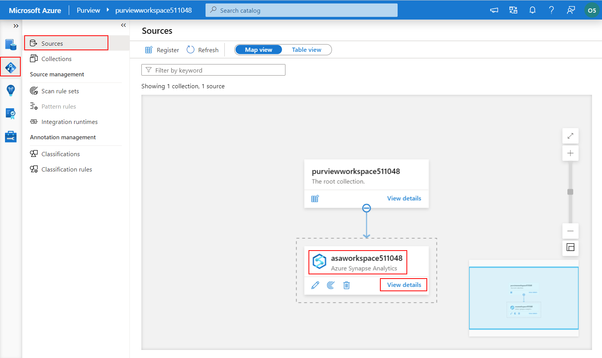

3. Note the details of the source:

    - The number of discovered assets
    - The number of classified assets
    - The scans that have been performed so far on the source

    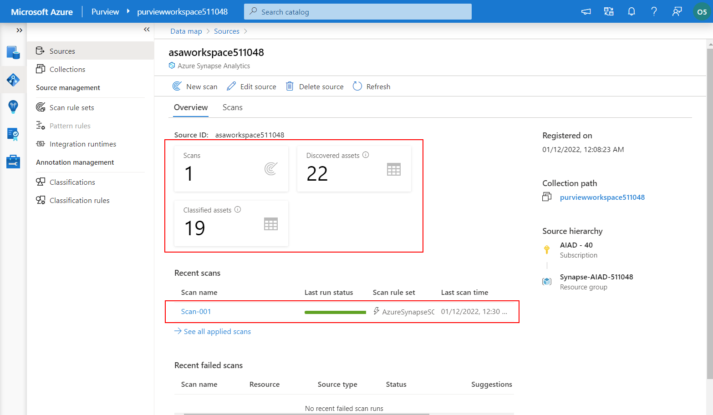

4. Select `Edit source` to view the details of the connection to the Synapse Analytics workspace.

    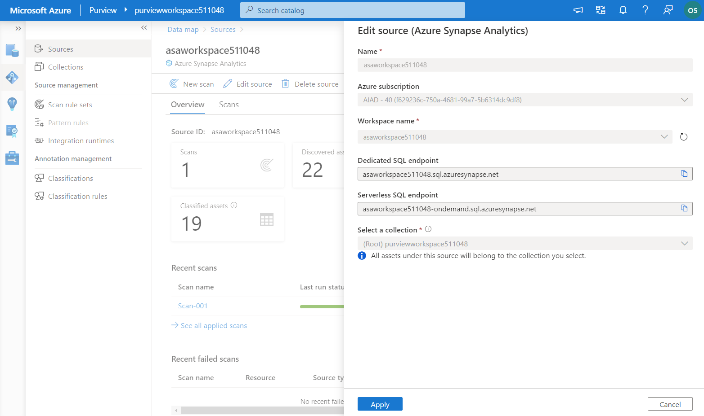

    Make sure you select `Cancel` next to avoid updating the source connection properties.

5. In Purview Studio, navigate to the `Data map` hub, select `Collections` and then select the root collection (which should be named `purviewworkspaceNNNNNN` just like the Purview workspace). Select `Assets` to explore the list of assets available in the collection.

    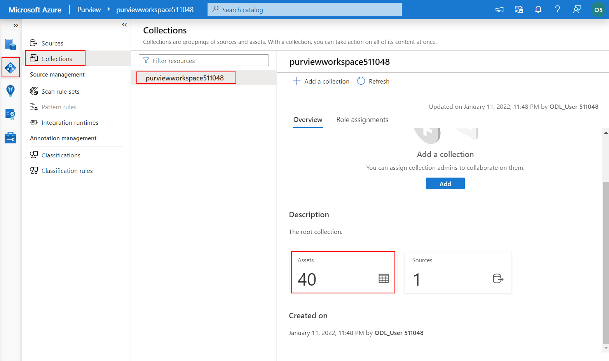

6. Observe the list of assets in the collection and their source types.

    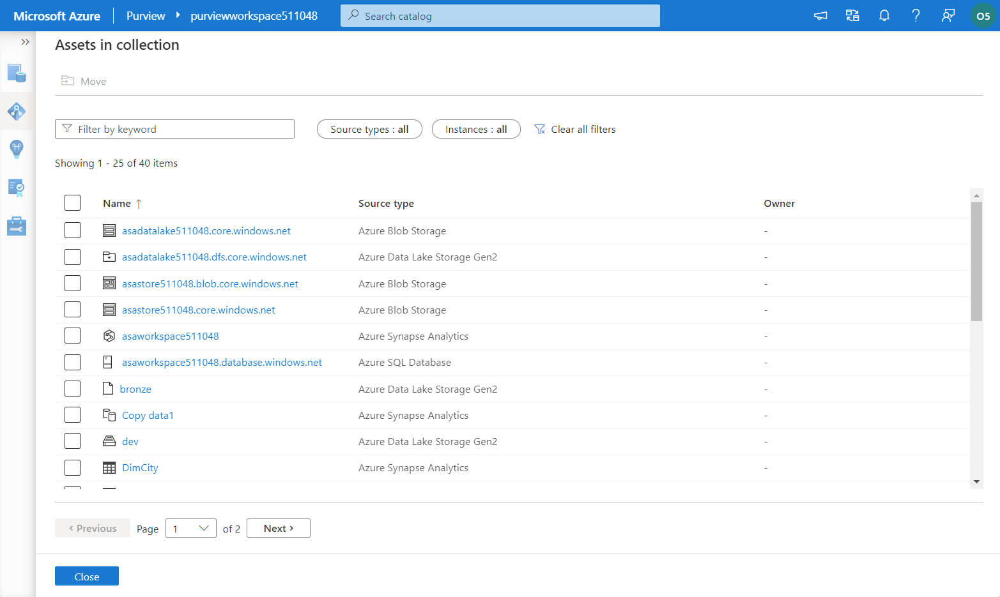

    Keep the list of collection assets open as this will be starting point for the next task.

## Task 5 - Explore the results of data lineage tracking for Synapse Pipelines

1. In the list of Purview collection assets, note the `Copy data1` asset of type Azure Synapse Analytics.

    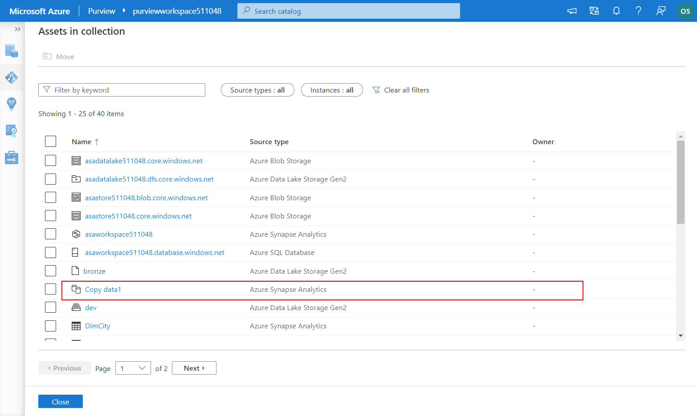

2. Select the asset named `Copy data1` to view its details.

    Note the following properties:

    - Fully qualified name
    - Updated on (notice how the update was performed by `Synapse`; the time of the update should approximately match the finish time of the Synapse pipeline you trigered in Task 2)
    - Hierarchy

    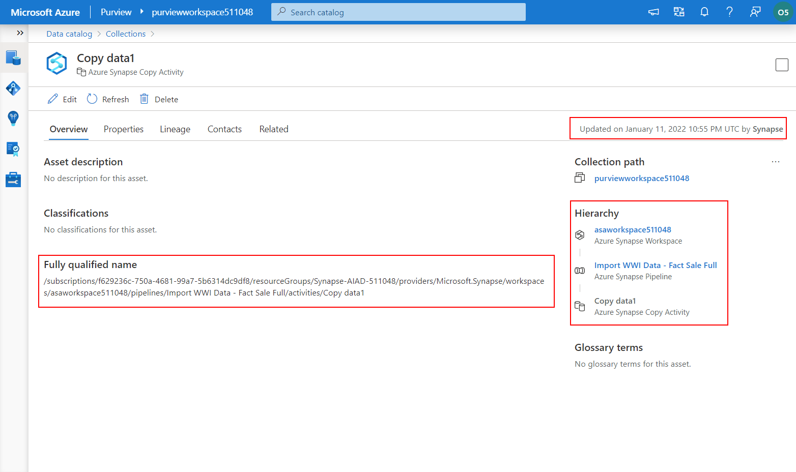

3. Select the `Lineage` tab to view the detailed lineage data.

    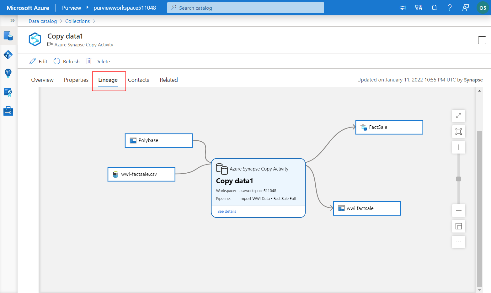

This exercise demonstrated the integration between Azure Synapse Analytics and Azure Purview. You explored how Purview can scan Synapse Analytics workspaces and also how Synapse Pipelines automatically generate lineage data in the Purview workspace.

## Technical references

- [Connect to and manage Azure Synapse Analytics workspaces in Azure Purview](https://docs.microsoft.com/en-us/azure/purview/register-scan-synapse-workspace)
- [Connect a Synapse workspace to an Azure Purview account](https://docs.microsoft.com/en-us/azure/synapse-analytics/catalog-and-governance/quickstart-connect-azure-purview)