# Exercise 7.1 - Develop a Power BI Model

In this exercise, you are working in the role of a **data architect** or **BI developer**.
You will use Power BI Desktop to develop a data model over your Azure Synapse Wide World Importers (WWI) data warehouse. The data model will allow you to publish a semantic layer over the data warehouse. Comprising six tables, it will define relationships, hierarchies, calculations, and friendly and consistent names. The data model will become an intuitive and high performance source for Power BI reports.

---

**Important**:

You must use the lab Azure credentials to connect to Azure Synapse and to publish content to Power BI.

---

## **Task 1: Create the Model**

In this exercise, you will create a DirectQuery model to support Power BI analysis and reporting of the data warehouse sale subject.

### **Subtask 1: Prepare Your Environment**

In this task, you will prepare your environment.

1. Open Power BI Desktop.

2. At the top-right corner, verify that you are signed in using the lab Azure credentials.

3. If you are not signed in using the lab Azure credentials, you must now sign in with those credentials.

4. Close Power BI Desktop.

5. Open a new web browser session, and then navigate to *<https://powerbi.com>*.

6. If you are not signed in automatically, click **Sign In**, and then sign in using the lab Azure credentials.

### **Subtask 2: Download a Dataset File**

In this task, you will download a Power BI data source file from Synapse Studio.

1. In the Azure Synapse web browser session (opened in your previous exercise), navigate to **Synapse Studio**.

2. At the left, select the **Develop** hub.

   

3. In the **Develop** pane, expand the **Power BI** group, and then select **Power BI Datasets**.

   

4. In the **Power BI Datasets** pane, click **New Power BI Dataset**.

   

5. Click **Start**.

6. Select your SQL pool, and then click **Continue**.

7. Click the link to **download** the .pbids file.

    *A .pbids file contains a connection to your SQL pool. It’s a convenient way to start your project. When opened, it’ll create a new Power BI Desktop solution that already stores the connection details to your SQL pool*.

8. When the .pbids file has downloaded, open it.

    *When the file opens, it’ll prompt you to create queries using the connection. You’ll define those queries in the next task*.

### **Subtask 3: Create Model Queries**

In this task, you will create six Power Query queries that will each load as a table to your model.

   *Power Query is a Microsoft technology used to connect to data stores, profile data, and transform data. You’ll define query for each table your model.*

1. In Power BI Desktop, in the **SQL Server Database** window, at the left, select **Microsoft Account**.

   

2. Click **Sign In**.

3. Sign in using the lab Azure credentials.

4. Click **Connect**.

   

5. In Power BI Desktop, in the **Navigator** window, select (don’t check) the **wwi.DimCity** table.

6. In the right pane, notice the preview result, which shows a subset of the table rows.

7. To create queries (which will become model tables), check the following six tables:

   - wwi.DimCity
   - wwi.DimCustomer
   - wwi.DimDate
   - wwi.DimEmployee
   - wwi.DimStockItem
   - wwi.FactSale

   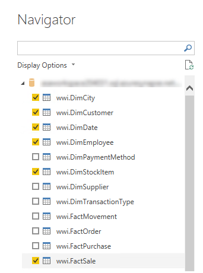

8. To apply transformations to the queries, at the bottom-right, click **Transform Data**.

   

   *Transforming the data allows you to define what data will be available in your model.*

9. In the **Connection Settings** window, select the **DirectQuery** option.

   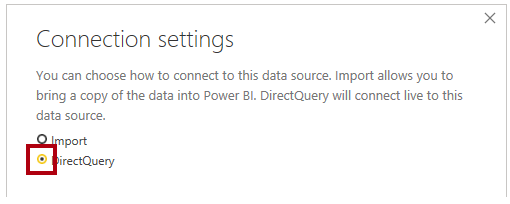

   *This decision is important. DirectQuery is a storage mode. A model table that uses DirectQuery storage mode doesn’t store data. So, when a Power BI report visual queries a DirectQuery table, Power BI sends a native query to the data source. This storage mode is often used for large data stores like Azure Synapse Analytics (because it’s impractical or uneconomic to import large data volumes) or when near real-time results are required.*

10. Click **OK**.

    

11. In the **Power Query Editor** window, in the **Queries** pane (located at the left), notice there is one query for each table you requested.

      

      *You’ll now revise the definition of each query. Each query will become a model table when they are applied to the model. So, you’ll now rename them so they’re described in more friendly and concise ways, and apply transformations to deliver the columns required by reports.*

12. Select the **wwi DimCity** query.

    

13. In the **Query Settings** pane (located at the right), to rename the query, in the **Name** box, replace the text with **Geography**, and then press **Enter**.

    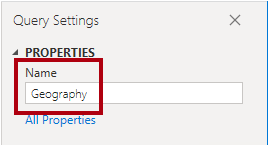

14. On the **Home** ribbon tab, from inside the **Manage Columns** group, click the **Choose Columns** icon.

    

15. In the **Choose Columns** window, to uncheck all checkboxes, uncheck the first checkbox.

    

16. Check the following seven columns.

    - CityKey
    - City
    - StateProvince
    - Country
    - SalesTerritory
    - Region
    - Subregion

    

    *This selection of columns determine what will be available in your model.*

17. Click **OK**.

    

18. In the **Query Settings** pane, in the **Applied Steps** list, notice that a step was added to remove other columns.

    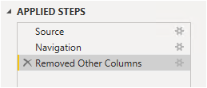

    *Power Query defines steps to achieve the desired structure and data. Each transformation is a step in the query logic.*

19. To rename the **StateProvince** column, double-click the **StateProvince** column header.

20. Insert a hyphen character (-) between the word **State** and the word **Province**, and then press **Enter**.

    

21. Notice that a new applied step is added to the query.

    

22. Rename the **SalesTerritory** column as **Sales Territory** (insert a space between the two words).

23. To validate the query design, in the status bar (located along the bottom of the window), verify that the query has seven columns.

    

    *Important: If the query design does not match, review the lab steps to make any corrections.*

    *The design of the **Geography** query is now complete.*

24. In the **Applied Steps** pane, right-click the last step, and then select **View Native Query**.

    

25. In the **Native Query** window, review the SELECT statement that reflects the query design.

    *This concept is important. A native query is what Power BI uses to query the data source. To ensure best performance, the database developer should ensure this query is optimized by creating appropriate indexes, etc.*

26. To close the **Native Query** window, click **OK**.

    

27. Select the **wwi DimCustomer** query.

    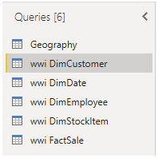

28. Rename the query as **Customer**.

29. Remove all columns, except:

    - CustomerKey
    - Customer
    - Category
    - BuyingGroup

    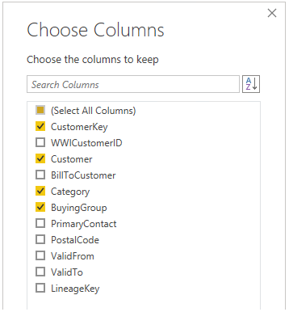

30. Rename the **BuyingGroup** column as **Buying Group** (insert a space between the two words).

31. Verify that the query has four columns.

    *The design of the **Customer** query is now complete.*

32. Select the **wwi DimDate** query.

    

33. Rename the query as **Date**.

34. Remove all columns, except:

    - Date
    - CalendarMonthNumber
    - CalendarMonthLabel
    - CalendarYear
    - CalendarYearLabel

    

35. Rename the following columns:

    - **CalendarMonthLabel** as **Month**
    - **CalendarYearLabel** as **Year**

36. To add a computed column, on the **Add Column** ribbon tab, from inside the **General** group, click **Custom Column**.

    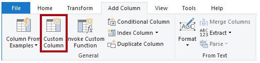

37. In the **Custom Column** window, in the **New Column Name** box, replace the text with **MonthKey**.

    

38. In the Custom Column Formula box, enter the following formula:

    ```pbi
    ([CalendarYear] * 100) +[CalendarMonthNumber]
    
    ```

    *Tip: To add the column references to the formula, in the **Available Columns** list, simply double-click a column.

    *The formula produces a unique key value for each month of a calendar year. It’s required to ensure that the calendar month labels sort in chronologic order. You’ll use this column in the next exercise when you configure the **Month** column sort order.*

39. Click **OK**.

    

40. Remove the **CalendarMonthNumber** and **CalendarYear** columns.

    *Tip: You can remove the columns using one of three techniques. First, you can open the Choose Columns window, and then uncheck those columns. Second, you can multi-select the columns and use the ribbon Remove Columns commands. Or, third, you can multi-select the columns, right-click the selection, and then select the context menu to Remove Columns options.*

41. Review the native query, and notice the SQL expression used to compute the **MonthKey** column.

    *This design isn’t optimal. In a real world solution, query performance would be better if the **MonthKey** column values are stored in the **wwi.DimDate** table (or a materialized view).*

42. Verify that the query has four columns.

    *The design of the **Date** query is now complete.*

43. Select the **wwi DimEmployee** query.

    

44. Rename the query as **Salesperson**.

45. To filter the table rows, in the **IsSalesperson** column header, click the down arrow, and then uncheck the **FALSE** item.

    

46. Click **OK**.

47. Remove all columns, except:

    - EmployeeKey
    - Employee

    

48. Rename the **Employee** column as **Salesperson**.

49. Review the native query, and notice the WHERE clause that filters the table.

50. Verify that the query has two columns.

    *The design of the **Salesperson** query is now complete*.

51. Select the **wwi DimStockItem** query.

    

52. Rename the query as **Product**.

53. Remove all columns, except:

    - StockItemKey
    - Stock Item
    - Color

54. Rename the **Stock Item** column as **Product**.

55. Verify that the query has three columns.

    *The design of the **Product** query is now complete.*

56. Select the **wwi FactSale** query.

    

57. Rename the query as **Sale**.

58. Remove all columns, except:

    - CityKey
    - CustomerKey
    - StockItemKey
    - InvoiceDateKey
    - SalespersonKey
    - Quantity
    - UnitPrice
    - Profit

    

59. Rename the following columns:

    - **UnitPrice** as **Unit Price**
    - **Profit** as **Profit Amount**

60. Add a computed column using the following formula to create the **Sale Amount** column.

      ```sql
         [Quantity] * [Unit Price]
      ```

61. To modify the **Sale Amount** column data type, in the column header, click the **ABC123** icon, and then select **Decimal Number**.

    

62. Verify that the query has nine columns.

    *The design of the **Sale** query is now complete.*

63. To apply the queries, on the **Home** ribbon tab, from inside the **Close** group, click the **Close & Apply** icon.

    

    *Each query is applied to create a model table. Because the data connection is using DirectQuery storage mode, only the model structure is created. No data is imported. The model now consists of one table for each query.*

64. In Power BI Desktop, when the queries have been applied, at the bottom-left corner in thes status bar, notice that the model storage mode is DirectQuery.

    

65. In Power BI Desktop, at the left, switch to Model view.

    

     *Model view allows you to see all tables in the model diagram. It also allows you to configure many model properties. You’ll configure model properties in the next exercise.*

66. To upgrade to the new model view, in the banner across the top of the diagram, click Upgrade Now.

    

67. In the model diagram, notice that there are six tables (some may be out of view—scroll horizontally to see them all).

68. Hover the cursor over any table header to reveal a tooltip, and then review the information presented.

69. To save the Power BI Desktop solution, on the **File** tab (backstage view), select **Save**.

70. Save the file as **Sale Analysis** to an easy-to-remember location in your file system.

71. Open File Explorer, and navigate to the file system location.

72. Notice the file size that is very small (~24 KB).

    *The Power Query queries have been loaded to create model tables. In the next exercise, you’ll complete the design of the model by creating relationships and applying model configurations.*

## **Task 2: Develop the Model**

In this exercise, you will develop the model by creating relationships, setting table and column properties, and creating measures.

### **Subtask 1: Create Relationships**

In this task, you will create relationships between all model tables. Each relationship with relate the **Sale** fact table to a dimension table.

1. In Power BI Desktop, in the model diagram, organize the tables as follows:

   - Position the **Sale** table at the center of the diagram, and then surround it with the five dimension tables
   - Ensure that the **Date** and **Geography** tables are next to each other

   

2. To create the first relationship, from the **Sale** table, drag the **CityKey** column, and then drop it on the **Geography** table **CityKey** column.

   *Sometimes this technique doesn’t work properly. In this case, deselect the column you want to drag by selecting a different column, and then start the drag operation again.*

   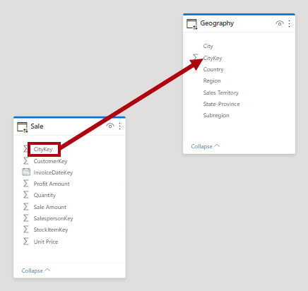

3. In the **Create Relationship** window, at the bottom-left, check the **Assume Referential Integrity** checkbox.

   

   *When referential integrity is assumed, Power BI will join tables by using a more efficient INNER join (instead of an OUTER join). However, it’s important that there are matching values on both sides of the join, because an INNER join will eliminate rows from the query result when values don’t match. At design time, sometimes Power BI Desktop will attempt to validate that data integrity is in place. If the validation takes too long, when prompted, you can skip validation process.*

4. Click **OK**.

   

5. In the diagram, notice the relationship is a connector between tables..

   

   *Model relationships propagate filters between tables. So, for example, if a report filters by **State-Province** column by **California**, a filter propagates to the **Sale** table to ensure rows for that state are queried.*

6. Notice there is a one-side (1) and many-side (*) to the relationship.

    *Dimension tables, like **Geography**, are always the one-side of the relationship. These tables include a unique column (dimension key column). Filters always propagate from the one-side to the many-side. In more advanced scenarios, filters can propagate in both directions. In this lab, you won’t configure bi-directional relationships. For more information about relationships*, [***see Model relationships in Power BI Desktop.***](https://docs.microsoft.com/en-us/power-bi/transform-model/desktop-relationships-understand)

7. Create four additional relationships and configure each to assume referential integrity:

   - Relate the **Sale** table **CustomerKey** column to the **Customer** table **CustomerKey** column
   - Relate the **Sale** table **InvoiceDateKey** column to the **Date** table **Date** column
   - Relate the **Sale** table **SalespersonKey** column to the **Salesperson** table **EmployeeKey** column
   - Relate the **Sale** table **StockItemKey** column to the **Product** table **StockItemKey** column

8. Verify that all tables are now related.

   

9. Verify that the one-side of each relationship is on the dimension table side.

   *If a relationship is configured to filter in the wrong direction, double-click the relationship, and then modify the **Cardinality** property.*

10. Save the Power BI Desktop solution.

## **Subtask 2: Configure the Geography Table**

In this task, you will add two hierarchies to the **Geography** table and configure data categorization for three columns.

1. In the model diagram, in the **Geography** table, right-click the **Region** column, and then select **Create Hierarchy**.

   

   *Hierarchies provide ease of navigation across the model data, allowing drill down and drill up operations. Always create a hierarchy using the column that’s to become the first (top) level of the hierarchy.*

2. In the Properties pane (located at the right of the model diagram), in the **Name** box, replace the text with **Sales Organization**.

   

3. In the **Properties** pane, in the Hierarchy dropdown list (select a column to add a level), select the **Subregion** column.

4. Notice that the column was added as the next level in the hierarchy.

   

5. Add the following three additional columns to the hierarchy, in this order:

   - Sales Territory
   - State-Province
   - City

6. To complete the hierarchy configuration, click **Apply Level Changes**.

   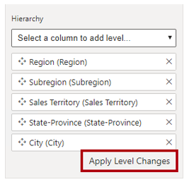

7. Create a second hierarchy in the **Geography** table named **Geography**, with the following levels:

   - Country
   - State-Province
   - City

   

8. In the **Geography** table, select the **Country** column.

9. In the **Properties** pane, expand the **Advanced** section, and then in the **Data Category** dropdown, select **Country/Region**.

   

   *Data categorization defines additional metadata. In this case, the column is categorized as a spatial column, and as such Power BI will—by default—visualize it by using map visuals.*

10. Set the following additional column data categorizations:

- Categorize the **State-Province** column as **State or Province**
- Categorize the **City** column as **City**

   *Configuration of the **Geography** table is now complete.*

### **Subtask 3: Configure the Date Table**

In this task, you will add a hierarchy to the Date table and configure the Month column sort order.

1. In the **Date** table, create a hierarchy named **Calendar**, with the following levels:

   - Year
   - Month
   - Date

2. In the **Date** table, select the **Month** column.

3. In the **Properties** pane, in the **Advanced** section, in the **Sort by Column** dropdown list, select **MonthKey**.

   

   *The alphabetic **Month** column values will now sort by the chronologic **MonthKey** column values.*

   *Configuration of the **Date** table is now complete.*

### **Subtask 4: Configure the Sale Table**

In this task, you will configure the **Sale** table columns.

1. In the **Sale** table, select the **Quantity** column.

2. In the **Properties** pane, in the **Formatting** section, set the **Thousands Separator** property to **Yes**.

   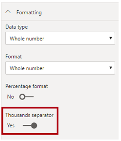

   *Formatting columns ensures appropriate and consistent formatted values in report visuals.*

3. To multi-select columns, first press the **Ctrl** key, and then select the following three columns:

   - Profit Amount
   - Sale Amount
   - Unit Price

4. In the **Properties** pane, in the **Formatting** section, in the **Format** dropdown list, select **Currency**.

   

5. In the Decimal Places box, enter 2.

6. Select the **Unit Price** column (you might need to first de-select the multi-selection of columns, and then select this single column).

7. In the **Properties** pane, in the **Advanced** section, in the **Summarize by** dropdown list, select **Average**.

   *By default, numeric column will be aggregated by using the sum function. In this case, it doesn’t make sense to sum unit price values together. The default summarization for this column now averages unit prices.*

 

   *Configuration of the **Sale** table is now complete.*

### **Subtask 5: Hide Columns**

In this task, you will hide columns that are not appropriate for reporting.

*Typically, you hide key columns that are used to relate tables or sort columns.*

1. Multi-select the following 10 columns:

   - **Geography** table **CityKey** column
   - **Date** table **MonthKey** column
   - **Customer** table **CustomerKey** column
   - **Salesperson** table **EmployeeKey** column
   - **Product** table **StockItemKey** column
   - **Sale** table **CityKey**, **CustomerKey**, **InvoiceDateKey**, **SalespersonKey**, and **StockItemKey** columns

2. In the **Properties** pane, set the **Is Hidden** property to **Yes**.

 

### **Subtask 6: Mark the Date Table**

In this task, you will mark the **Date** table.

*Marking a date table is required to ensure the Data Analysis Expressions (DAX) time intelligence functions work correctly. You’ll create a measure and define a time intelligence calculation in the next task.*

1. Switch to Report view.

   

   *Marking a date table cannot be done in Model view.*

2. In the **Fields** pane (located at the right), select the **Date** table.

3. On the **Table Tools** contextual ribbon tab, from inside the **Calendars** group, click **Mark as Date Table**, and then select **Mark as Date Table**.

   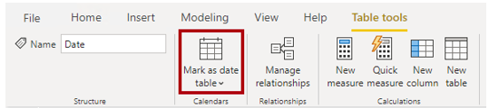

4. In the **Mark as Date Table** window, in the **Date Column** dropdown list, select **Date**.

   

5. When validation has succeeded, click **OK**.

   

   *Validation ensures the column contains unique dates, no missing dates, and no gaps between dates. These conditions are a prerequisite to ensure the DAX time intelligence filters work correctly.*

### **Subtask 7: Create Measures**

In this task, you will create two measures. Measures are expressions that summarize model data.

1. In the **Fields** pane, right-click the **Sale** table, and then select **New Measure**.

   

2. In the formula bar (located directly beneath the ribbon), replace the text with the following measure definition, and then press **Enter**.

   *Tip: When entering the formula, to enter a carriage return, press **Shift+Enter**.*

   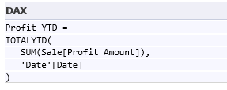

   *This formula uses a built-in DAX time intelligence function to accumulate the sum of the **Sale** table **Profit Amount** column values within the year to produce a year-to-date (YTD) result.*

3. In the **Fields** pane, notice the addition of the measure.

   

   *Measures are identified by the calculator icon.*

4. To configure formatting, in the **Fields** pane, ensure the measure is selected (not checked).

5. On the **Measure Tools** contextual ribbon, from inside the **Formatting** group, in the dropdown list, select **Currency**, and set the decimal places to **2**.

   

6. Add a second measure to the Sale table using the following formula:

   

   ```dax
   Profit % All Geography =
   DIVIDE(
    SUM(Sale[Profit Amount]),
    CALCULATE(
        SUM(Sale[Profit Amount]),
        REMOVEFILTERS(geography)
    )
   )
   ```

   *This formula divides the sum of the **Sale** table **Profit Amount** column by the same expression, but by using a different filter context. The denominator removes any filters applied to the **Geography** table.*

7. Format the **Profit % All Geography** measure as a percentage.

   

8. Save the Power BI Desktop solution.

   *All model configurations have now been made. In the next exercise, you’ll create a test report and measure query performance.*

## **Task 3: Test the Model**

In this exercise, you will create a test report. You will then use Performance Analyzer to measure query performance.

### **Subtask 1: Create a Test Report**

In this task, you will design a simple report to test query performance.

1. In Power BI Desktop, in Report view, to add a slicer to the report canvas, in the **Visualizations** pane, click the slicer icon.

   

2. In the Fields pane, from the Date table, drag the Calendar hierarchy to the slicer.

3. In the Visualizations pane, in the Field well, to remove the Date hierarchy level, click X.

   

4. Filter the slicer by **CY2012**.

   

5. To create a new visual, first select an empty area of the report canvas.

   *Selecting the report canvas de-selects the slicer visual*.

6. To add a table visual to the report canvas, in the **Visualizations** pane, click the table visual icon.

   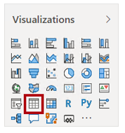

7. Position the table visual to the right of the slicer, and then resize it as large as possible.

8. Drag and drop the following visuals into the table visual:

   - **Date** table **Month** field (not the **Month** hierarchy level)
   - **Sale** table **Profit Amount** field
   - **Sale** table **Profit YTD** field

   

   *Performance is likely to be slow, as the model hasn’t yet been optimized. You’ll be optimizing the model with aggregations in **Exercise 07**.*

9. In the **Visualizations** pane, in the **Values** well, to remove the fields, click **X** next to each field.

   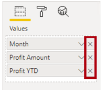

10. Drag and drop the following fields into the table visual:

- **Geography** table **State-Province** field (it is second from the bottom—do not use the **State-Province** hierarchy level)
- **Sale** table **Profit Amount** field
- **Sale** table **Profit %** **Total Geography** field

   

### **Subtask 2: Measure Query Performance**

In this task, you will use Performance Analyzer to measure query performance.

1. On the **View** ribbon tab, from inside **Show Panes** group, select **Performance Analyzer**.

   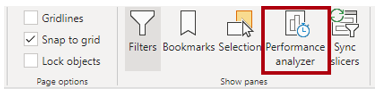

2. In the **Performance Analyzer** pane, click **Start Recording**.

   

   *When recording, Performance Analyzer captures statistics when visual query data.*

3. In the **Performance Analyzer** pane, click **Refresh Visuals**.

   

4. In the list, notice the duration statistics, which are recorded in milliseconds.

5. Expand the **Table** node.

6. Notice that it is possible to determine the duration of the DirectQuery process, and that presently it is several seconds.

    *Report users demand fast responses. Usually, they’re very happy when visuals refresh in less than one second, but are still happy when it takes no more than about five seconds.*

7. To copy the SQL query to the clipboard, click the **Copy Query**.

   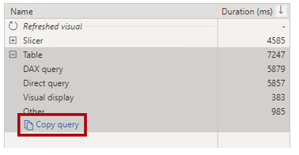

8. Open a text editor, like Notepad, and paste in the query.

9. Review the query.

   *The query statement provides you with insight into how Power BI queries Azure Synapse Analytics. It can lead to you to apply specific optimizations in the data source, like indexes or materialized views, to improve query performance.*

10. Close the text editor, without saving changes.

11. In the **Performance Analyzer** pane, click **Stop**.

    

12. Save the Power BI Desktop solution.

    *The lab is now complete. Leave your Power BI Desktop solution open ready to start the next lab (when instructed to do so)*.

    *In **Exercise 07**, you’ll improve query performance by creating an aggregation table*.

### Summary

In this exercise, you used Power BI Desktop to develop a data model over your Azure Synapse Wide World Importers (WWI) data warehouse. The data model allowed you to publish a semantic layer over the data warehouse. Comprising six tables, it defines relationships, hierarchies, calculations, and friendly and consistent names. The data model is an intuitive and high performance source for Power BI reports.
