# Exercise 7: Optimize a Power BI Model

In this Exercise, you are continuing to work in the role of a **Data architect** or **BI developer**.

You will use Power BI Desktop to configure dimension table storage as dual. You will then add an aggregation table to accelerate query performance. The model storage will be switched to mixed mode: Some tables will cache data to further boost query performance. You will finalize the lab by deploying the model to the Power BI service, so it is ready for reporting in Exercise 8.

---

**Important**

It’s a prerequisite that you successfully complete Exercise 6 before commencing this lab.

---

## **Task 1: Add an Aggregation Table**

In this exercise, you will configure dimension tables as dual storage mode table. You will then create an aggregation table to boost Power BI query performance for date, geography, and profit reporting.

### **Subtask 1: Configure Dual Storage**

In this task, you will configure dual storage for all dimension tables.

1. Switch to the Power BI Desktop solution you developed in **Exercise 6**.

2.	Switch to Model view.

3.	While pressing the **Ctrl** key, multi-select each of the five dimension tables:

   -	Customer
   -	Date
   -	Geography
   -	Product
   -	Salesperson

4. In the **Properties** pane, from within the **Advanced** section, in the **Storage Mode** dropdown list, select **Dual**.

   
 
   *It’s common to set dimension tables to use dual storage mode. This way, when used by report slicers, they deliver fast performance. If these dimension tables will be queried at the same time as other imported tables, it can avoid the need for Power BI to query the data source.*.
   
   
5. When prompted to set the storage mode, click **OK**.
   
   
  
6. When the refresh completes, notice that the dual storage tables are indicated by a dashed header line.

   

7. Save the Power BI Desktop solution.

   *The data model is now in mixed mode. It’s a composite model consisting of DirectQuery storage mode tables and import storage mode tables.*
   
8. In File Explorer, notice the file size has grown as a result of the imported data for the dimension tables.

   *When the model stores data, you need to ensure the cached data current. The model must be refreshed on a frequent basis to ensure import data is in sync with the source data*.
   
9. In Report view, in the status bar, at the bottom-right, notice that the storage mode is now mixed.

   
   
10. In the **Performance Analyzer** pane, start recording, and then refresh visuals.

11. Notice that the query result for the slicer is now sub-second.

12. In the **Performance Analyzer** pane, stop recording.

### **Subtask 2: Create an Aggregation Table**

In this task, you will create an aggregation table to accelerate Power BI report visuals that specifically query by date and geography, and summarize profit.

1. To open the Power Query Editor window, on the **Home** ribbon tab, from inside the **Queries** group, click the **Transform Data** icon.
 
   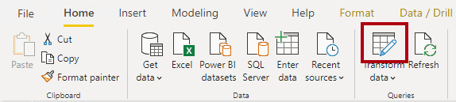
   
2. In the Power Query Editor window, from inside the **Queries** pane, right-click the **Sale** query, and then select **Duplicate**.

   
 
3. In the **Queries** pane, notice the addition of a new query.

   
 
   *You’ll apply a transformation to group by the **CityKey** and **InvoiceDateKey** columns, and aggregate the sum of **Profit Amount** column*.
   
4. Rename the query as **Sale Agg**.
   
   
   
5. On the **Transform** ribbon tab, from inside the **Table** group, click **Group By**.
   
   
    
6. In the **Group By** window, select the **Advanced** option.
   
   
    
   *The advanced option allows grouping by more than one column.*
   
7. In the grouping dropdown list, ensure that **CityKey** is selected.
   
   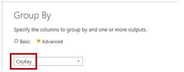
    
8.	Click **Add Grouping**.

9.	In the second grouping dropdown list, select **InvoiceDateKey**.

10. In the **New Column Name** box, replace the text with **Profit Amount**.

11. In the **Operation** dropdown list, select **Sum**.

12. In the **Column** dropdown list, select **Profit Amount**.

    
 
13. Click **OK**.

    
     
14. On the **Home** ribbon tab, from inside the **Close** group, click the **Close & Apply** icon.

    

    *A new table is added to the model*.
    
15. Save the Power BI Desktop solution.

### **Subtask 3: Configure Aggregations**

In this task, you will switch the aggregation table to import data. You will then create model relationships to the aggregation table and manage aggregations.

1.	Switch to Model view.

2.	Position the **Sale Agg** table so that it is near the Geography and **Date** tables.

3.	Set the storage mode for the **Sale Agg** table as **Import**.
   
   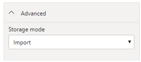
   
4.	If prompted to proceed, click OK.
   
   

5.	When the refresh completes, notice that the import storage table does not include a blue mark across the top (solid or dashed).
   
   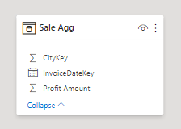
 
6.	Create two model relationships:

   -	Relate the **Sale Agg** table CityKey column to the **Geography** table **CityKey** column
   -	Relate the **Sale Agg** table **InvoiceDateKey** column to the **Date** table **Date** column

   
   
7.	Right-click the **Sale Agg** table, and then select **Manage Aggregations**.
   
   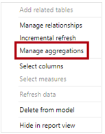
 
8. In the **Manage Aggregations** window, for the **Profit Amount** aggregation column, set the following properties:

    -	Summarization: **Sum**
    -	Detail table: **Sale**
    -	Detail column: **Profit Amount**

   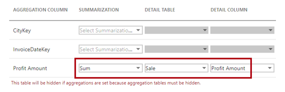
   
9.	Notice the warning that describes the table will be hidden.

   *The table will be hidden in a different way to other hidden model objects (like the key columns you hid in **Exercise 6**). Aggregation tables are always hidden, and they can’t even be referenced in model calculations*.
   
10. Click **Apply All**.

    
   
11. In the model diagram, notice that the **Sale Agg** table is now hidden.

    
 
12. In the model diagram, select the **Sale Agg** table.
    
13. Switch to Report view.

14. In the **Performance Analyzer** pane, start recording, and then refresh visuals.

15. Notice that the query results for the table visual is now sub-second.

    *Because the **Geography** and **Date** tables use dual storage mode, when a report visual queries them at the same time as the aggregation table, Power BI will query the model cache. There’s no need to use DirectQuery to query the data*.

16. In the **Performance Analyzer** pane, stop recording.

## **Task 2: Publish the Model**

In this task, you will publish the model and complete some post-publication tasks.

### **Subtask 1: Publish the Model**

In this task, you will publish the model.

1.	In Power BI Desktop, on the **Home** ribbon tab, from inside the **Share** group, click **Publish**.

   
    
2.	If prompted to save changes, click **Yes**.

3.	In the **Publish to Power BI** window, select the lab workspace (do not use **My Workspace**).

4.	Click **Select**.

   
   
5.	When publication has completed, click **Got It**.

6.	Close Power BI Desktop.

   *You will open a new instance of Power BI Desktop in **Exercise 8** when you create a new composite model.*
   
## **Subtask 2: Complete Post-Publication Tasks**

In this task, you will complete some post-publication tasks.

*You’ll complete the post-publication tasks using the Power BI service because it’s not possible to do them in Synapse Studio.*

1.	In Power BI web browser session, open your lab workspace.

   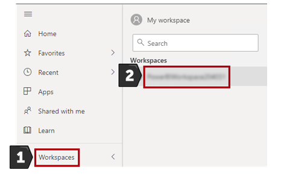
   
2.	In the **Navigation** pane, open the workspace, and then verify that the **Sale Analysis** dataset exists.

   
   
3.	Notice there is also the **Sale Analysis** report.

   *It wasn’t our intention to publish a report, it was published alongside the model. You’ll develop a report in **Exercise 8**. So, we’ll delete this report*.
   
4.	In the **Navigation** pane, hover the cursor over the **Sale Analysis** report, click the vertical ellipsis (…), and then select **Remove**.

   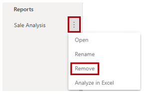
   
5.	When prompted to delete the report, click **Delete**.

   
 
6.	To apply data source credentials, in the **Navigation** pane, hover the cursor over the **Sale Analysis** dataset, click the vertical ellipsis, and then select **Settings**.

   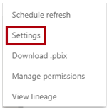
   
7.	Expand the **Data Source Credentials** section.
   *You’ll see an error, and it’s expected. You will address the error in the next step.*
   
    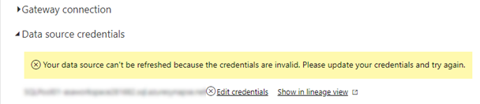
  
8.  To assign credentials, click the **Edit Credentials** link.

9.  In the window, in the **Authentication Method** dropdown list, ensure **OAuth2** is selected.

10. In the **Privacy Level** dropdown list, select **Organizational**.

    *If you need the Power BI report user identity to flow to Azure Synapse (because per-user access permission must be enforced), you can check the checkbox. When the checkbox is left unchecked, the identity you will use to sign in (at the next step) will be used for all connections*.

11. Click **Sign In**.

    
    
12. Use the lab Azure credentials to **sign in**.
 
13. Expand the **Scheduled Refresh** section.

    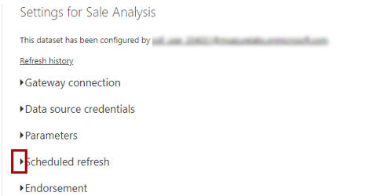

    *In this lab, you won’t schedule data refresh. Because your dataset contains import data (for the dimension tables and the aggregation table), you can schedule data refresh to keep the aggregation and dimension table import data current. It’s possible, too, that your Azure Data Factory pipelines could send refresh commands using the Power BI REST API, once the data warehouse load has completed*.
    
14. Expand the **Endorsement** section.

    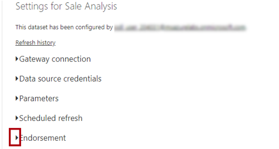
     
15. Select the **Promoted** option.

    *The promoted endorsement communicates that the model is production-ready. In this lab, ideally, you’d select the **Certified** option. A certified dataset is one that’s truly reliable and authoritative, designed for use across the organization. (It’s not available for your trial account.)*
    
16. In the **Description** box, enter: **Lab dataset**

17. Click **Apply**(you may need to scroll down).

    
    
18. Switch to the Azure Synapse web browser session.

19. In the **Develop** hub, select **Power BI Datasets**.

20. Notice that the **Sale Analysis** dataset is listed.

    
 
    *The dataset is published and is configured ready for use. In **Exercise 8**, you’ll perform a live connection to the dataset and create a report*.
    
   ### Summary
   
In this exercise, you used Power BI Desktop to configure dimension table storage as dual. You then added an aggregation table to accelerate query performance. The model storage was switched to mixed mode: Some tables now cache data to further boost query performance. You finalized the exercise by deploying the model to the Power BI service, so it is ready for reporting in **Exercise 08**.

