# Exercise 8: Create a Model Using DQ to Power BI

In this lab, you are working in the role of a **data analyst**.

You will use Power BI Desktop to connect to the **Sale Analysis** dataset published in **Exercise 7**. You will then convert the live connection to a DirectQuery model, allowing you to extend the remote model with a calculated column and a new table of imported data sourced from a web page.

---

**Important**

Important: You must successfully complete Exercise 7 before commencing this lab.

---

## **Task 1: Getting Started**

In this task, you will get started by enabling a preview feature and creating a live connection to the Sale Analysis dataset.


### **Subtask 1: Enable Preview Feature**

In this task, you will enable a preview feature to work with DirectQuery models with Power BI datasets.

1. Open Power BI Desktop.

2. If the getting started window opens, at the top-right of the window, click **X**.

   

3. To enable the preview feature, on the File tab (backstage view), select Options and Settings, and then select Options.

   

4. In the Options window, at the left, select Preview Features.
	
   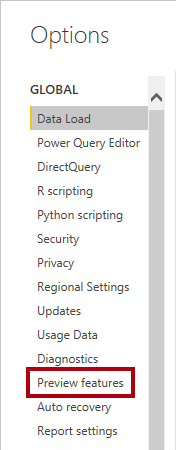

5. Ensure the DirectQuery for Power BI Datasets and Analysis Services feature is checked.
	
   

6. Click OK.

   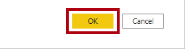

7. When notified that a restart of Power BI Desktop is required, click OK.

8. Close Power BI Desktop.

9. Open Power BI Desktop again, and close the getting started window.
 
10. To save the Power BI Desktop solution, on the **File** tab (backstage view), select **Save**.

11. Save the file as **Sale Report** to an easy-to-remember location in your file system.

### **Subtask 2: Create a Live Connection**

In this task, you will create a live connection to the **Sale Analysis** dataset.

1. On the **Home** ribbon, from inside the **Data** group, click **Get Data**, and then select **Power BI Datasets**.

   
 
2. In the **Select a Dataset** window, notice that the **Sale Analysis** dataset is endorsed as a promoted dataset.
	
   *It was endorsed by the BI developer who published the dataset in Exercise 07.*

3. Select the **Sale Analysis** dataset.

   
 
4. Click **Create**.
   
   
   
5. In the status bar, at the right, notice the live connection status.

   
   
    *Live connections are ideal when creating a report that uses an existing Power BI dataset.*
   
6. Switch to Model view.

7. To upgrade to the new model view, in the banner across the top of the diagram, click Upgrade Now.

   
	
   *While the model is hosted remotely as a Power BI dataset, it’s still possible to review the model design in the diagram.*
	
8. In the model diagram, select any table, and then in the Properties pane, notice that all properties are read-only.

    *A live connection to a Power BI dataset is read-only, unless you convert it to a DirectQuery model. You will convert it to a DirectQuery model in the next section. It will allow you to extend the design of the remote model that the BI developer published in Exercise 07.*
 
9. Save the Power BI Desktop solution.

## **Task 2: Develop a Model Using DQ to Power BI**

In this task, you will develop a new model that uses a DirectQuery connection to a remote Power BI dataset and extends it with new calculations and data. You will then publish the new model to the Power BI service.

### **Subtask 1: Edit the Model**

In this task, you will edit the model.

1. On the Home ribbon tab, from inside the Modeling group, click Make Changes to This Model.
	
   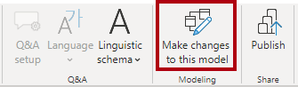

2. To understand the transformation that is about to happen, read the text in the dialog window.

3. Click Add a Local Model.

   

   *The model is now a DirectQuery model. It’s now possible to enhance the model by modifying certain table or column properties, or adding calculated columns. It’s even possible to extend the model with new tables of data that are sourced from other data sources.*
	
	
4. In Report view, in the status bar, at the right, notice that the model is using DirectQuery storage mode.

   
		
   *Your local model is in fact a DirectQuery connection to the Power BI dataset.*
	
5. Switch to Model view.

6. In the diagram, select any table, and then notice it is now possible to modify the properties—but do not modify any properties at this time.

### **Subtask 2: Create a Calculated Column**

In this task, you will create a calculated column to enable a new way of analyzing US state sale amounts.

1. Switch to Report view.

2. In the Fields pane (located at the right), right-click the Geography table, and then select New Column.

   
		
3. In the formula bar (located beneath the ribbon tab), enter the following calculated column definition.

   *Tip: To enter a carriage return, press Shift+Enter. To enter a tab, press Shift +Tab.*
	```
	DAX
	State-Province Type =
	SWITCH(
		TRUE(),
		Geography[State-Province] = "Puerto Rico (US Territory)", "Territory",
		Geography[State-Province] IN {"Alaska", "Hawaii"}, "Non-contiguous",
		Geography[Country] = "United States", "Contiguous",
		"N/A"
	)
	```	
   *The calculated column is named **State-Province Type**. The expression uses the DAX SWITCH function to return a classification for each table row (which represents a city) based on these rules (the first rule match wins):
• If the state name of the city is Puerto Rico (US Territory), it is classified as **Territory**.
• Otherwise, if the state name of the city is Alaska or Hawaii, it is classified as **Non-contiguous**.
• Otherwise, if the country of the city is United States, it is classified as **Contiguous**.
• Otherwise, it is classified as **N/A**.

4. In the Fields pane, in the Geography table, notice the addition of the calculated column (if necessary, widen the pane).

   
		
5. To filter the report, ensure the Filters pane is open.

   
		
6. In the Fields pane, in the Geography table, right-click the Country field, and then select Add to Filters | Report-level Filters.

   
		
7. In the Filters pane, in the Country filter tile, check the United States item.

   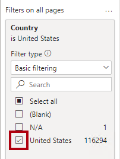
	
   *All report pages now filter by the country United States.*
	
8. To add a matrix visual to the page, in the Visualizations pane, click the Matrix icon.

  
		
9. Position and resize the visual to fill the report page, but be sure to leave about a 0.5 inches (1 cm) of space along the top of the page.

10. In the **Fields** pane, from the **Geography** table, drag the **State-Province Type** field and drop it into the matrix visual.

11. In the matrix visual, verify that you see three rows—one for each state-province classification.
	
    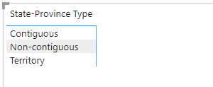
		
12. To add a new level to the matrix visual rows, from the **Geography** table, drag the **State-Province** field into the Rows well (located beneath the **Visualizations** pane), directly beneath the **State-Province Type** field.

    
		
    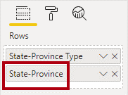
		
13. To add a value to the matrix visual, in the Fields pane, from inside the Sale table, drag the Sale Amount field into the matrix visual.		
		
    
		
14. Notice that it is now possible to analyze sale amounts using the classifications generated by the calculated column added to the Geography table.

15. To expand all levels on the matrix visual rows, at the top-right of the matrix visual, click the Expand All Down One Level In the Hierarchy icon (fork-like icon).

    
		
### **Subtask 3: Create a New Table**

In this task, you will create a new table sourced from a web page to support per capita analysis.

1. On the **Home** ribbon tab, from inside the **Data** group, click **Get Data**, and then select **Web**.

   
		
2. In the **From Web window**, in the **URL** box, enter: **https://aka.ms/USPopulationSynapsePBI**
   *The URL is for a web page that contains US census population data. You will preview the web page in the following steps.*

3. Click **OK**.

   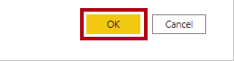

4. In the **Access Web Content** window, notice that anonymous authentication is selected, and then click **Connect**.
		
   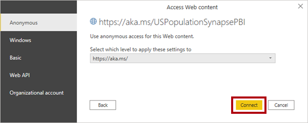
		
5. In the **Navigator** window, in the right pane, select **Web View**.
		
   
		
6. Review the web page design.

   *The page comprises a table listing US states together with their 2009 census population value and a ranking.*

7. Switch back to **Table** view.
		
   
		
8. To preview HTML table data, in the left pane, select (do not check) **Table 2**.
		
   
	
   *This table of data contains the data that’s required by your model to calculate sale per capita. Three transformations, however, will need to be applied: The row for **United States** must be removed, the **Rank** column must be removed, and the **Number** column must be renamed to **Population**.*
	
9. To create a query based on the Table 2 HTML table, check the Table 2 checkbox.			
   
		
10. Click **Transform Data**.
		
    
		
11. In the Power Query Editor window, in the **Query Settings** pane (located at the right), in the **Name** box, replace the text with **US State Population**, and then press **Enter**.
			
    
		
12. To remove the United States row, in the State column header, click the down-arrow, and then uncheck the United States item (scroll to the bottom of the list).
		
    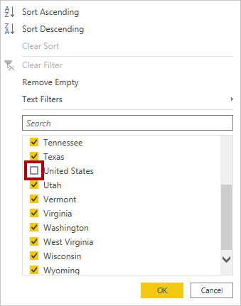
		
13. Click **OK**.

14. To remove the **Rank** column, right-click the **Rank** column header, and then select **Remove**.
		
    

15. To rename the Number column, double-click the Number column header, replace the text with Population, and then press Enter.
 
16. Verify that the query has two columns and 51 rows.

*Tip: The query column and row counts are displayed at the left of the status bar.*	
    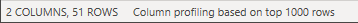
		
17. To apply the query, on the **Home** ribbon tab, from inside the **Close** group, click the **Close & Apply** icon.
		
    
		
18. When prompted about a potential security risk, read the notification, and then click OK.

*The warning is irrelevant in your model design because Power Query isn’t merging queries that connect to different data sources.*


		
*The query is applied to create a model table. Because the data connection to the web page does not support DirectQuery storage mode, the table rows have been imported into the model.*

19. In Report view, in the status bar, at the right, notice that the model is now using mixed storage mode.
		
    
		
20. Switch to Model view.

21. Notice the addition of the **US State Population** table.

22. Hover the cursor over the table header, and review the tooltip.

    *The tooltip describes that the table data is imported.*

23. Move the **US State Population** table so it sits beside the **Geography** table.
 
24. To create a model relationship, from the **Geography** table, drag the **State-Province** column and drop it on the **State** column of the **US State Population** table.
		
    
		
25. In the **Create Relationship window**, in the **Cross Filter Direction** dropdown list, select **Both**.
		
    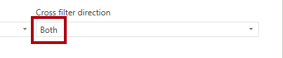
		
    *The rows of **Geography** table store cities, so the values found in the **State-Province** column contain duplicate values (for example, there are many cities in the state of California). When you create the relationship, Power BI Desktop automatically determines column cardinalities and discovered that it’s a many-to-one relationship. To ensure filters propagate from the **Geography** table to the **US State Population** table, the relationship must cross filter in both directions.*

26. Click **OK**.

    
	
27. To hide the new table, in the header of the **US State Population** table, click the visibility icon.

    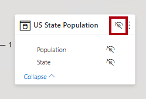
		
    *The table is hidden because it will only be used by a measure calculation that you will create in the next task.*

### **Subtask 4: Create a Measure**

In this task, you will create a measure to calculate sale per capita.

1. Switch to Report view.

2. In the **Fields** pane, right-click the **Sale** table, and then select **New Measure**.

		
   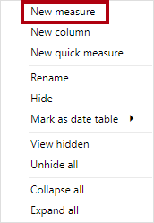

3. In the formula bar, enter the following measure definition.

	```
	DAX
	Sale per Capita =
	DIVIDE(
		SUM('Sale'[Sale Amount]),
		SUM('US State Population'[Population])
	)
	```
	
    *The measure is named **Sale per Capita**. The expression uses the DAX DIVIDE function to divide the sum of the **Sale Amount** column by the sum of the **Population** column.*

4. On the **Measure Tools** contextual ribbon tab, from inside the **Formatting** group, in the **Format** dropdown list, select **Currency**.

5. In the decimal places box, enter **2**.

   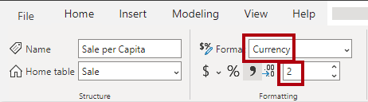
		
6. To add the measure to the matrix visual, in the **Fields** pane, from inside the **Sale** table, drag the **Sale per Capita** field into the matrix visual.

   *The measure evaluates the result by combining data sourced from a remote model in the Power BI service with imported table local to your new model.*

### **Subtask 5: Repair a Data Issue**

In this task, you will modify data in the **US State Population** table to address a data issue in the data warehouse.

1. In the matrix visual, notice there is no measure value for the state of Massachusetts.

   
	
   *It’s because the state name, as stored in the Azure Synapse Analytics data warehouse, is misspelled (with trailing characters [E]). One approach to fix the spelling is to ask the data warehouse team to update their data, but that’s likely to take some time to achieve, if ever. The other approach is to modify the data loaded into the **US State Population** table, which you will do now.*	
	
2. On the Home ribbon tab, from inside the **Queries** group, click the **Transform Data** icon.	
		
   
		
3. In the Power Query Editor window, right-click the **State** column, and then select **Replace Values.**		
		
   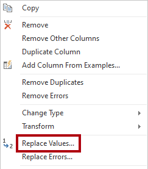
				
4. In the **Replace Values** window, in the **Value to Find** box, enter the correctly spelled state name: **Massachusetts**

5. In the **Replace With** box, enter the misspelled state name: **Massachusetts[E]**
		
   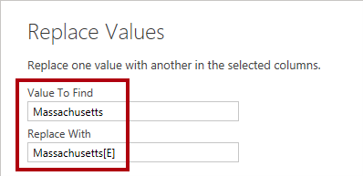
		
6. Click **OK**.		
		
   
		
7. To apply the query, on the **Home** ribbon tab, from inside the **Close** group, click the **Close & Apply** icon.
		
   
		
8. When the query applies (and data is reimported into the model), in the matrix visual, notice that there is now a sale per capita value for the state of Massachusetts.
		
   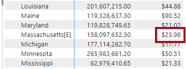
		
   *The development and testing of the data model is now complete. You will now remove the visual in preparation for authoring a new report design in **Exercise 09**.*
	
9. Select the matrix visual.

10. To remove the visual, press the **Delete** key.
 
11. In the **Filters** pane, remove the **Country** filter.
		
    
		
12. Save the Power BI Desktop solution.

13. Leave the solution open for the next exercise.

    *The lab is now complete. As a data analyst, you will author a multi-page report design in **Exercise 09**.*


# Summary

In this exercise, you used Power BI Desktop to live connect to the **Sale Analysis** dataset published in **Exercise 07** by the BI developer. You then converted the live connection to a DirectQuery model, allowing you to extend the remote model with a calculated column and a new table of imported data sourced from a web page.
