# Exercise 9: Author a Power BI Report

In this lab, you are working in the role of a **data analyst**.

You will use Power BI Desktop to continue the development of the solution created in Exercise 08. You will author a multi-page report that will include synced slicers, a custom visual, page drill through, a measure, bookmarks, and buttons. You will finalize the exercise by publishing the report to the Power BI service.

---

**Important**

Important: You must successfully complete Exercise 7 before commencing this lab.

---

## **Task 1: Develop the Report Layout**

In this task, you will develop a two-page report.


### **Subtask 1: Develop Page 1**

In this task, you will develop the first report page.

The completed report page will look like the following:
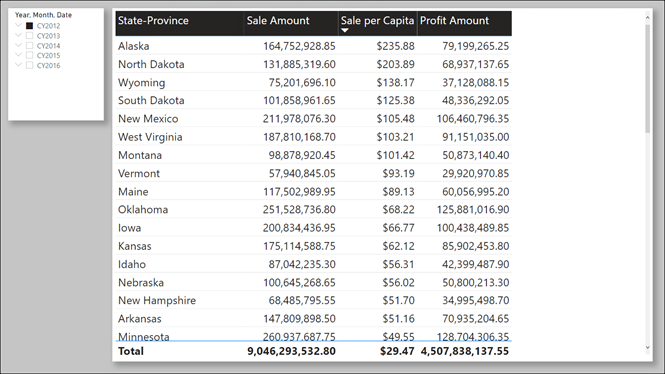
    
   *Important: You must continue the development of the Power BI Desktop solution that was created in Exercise 08.*

1. In Power BI Desktop, in the **Fields** pane, in the **Geography** table, right-click the **Country** field, and then select **Add to Filters | Report-level Filters**.

   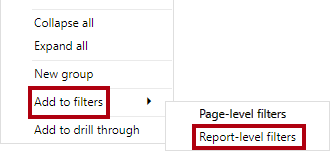

2. In the **Filters** pane, in the **Country** filter tile, check the **United States** item.

   
 
3. To hide the filter, in the Filters pane, hover the cursor over the Country filter tile, and then click the visibility icon.

   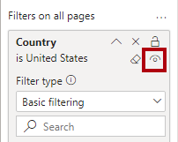
	
   *Hiding the filter ensures that report users cannot modify the filter.*

4. In the **Filters** pane, at the top-left, click the arrow to collapse the pane.

   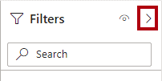
 
5. To rename the report page, at the bottom-left, double-click **Page 1**.

6. Replace the text with **Sale Analysis**, and then press **Enter**.

   
 
7. To format the page, in the **Visualizations** pane, select the **Format** pane (paint roller icon).

   
 
   *You’ll format many report elements in this lab to produce a professional report layout. To format an element, you’ll select it, and then access formatting options in this pane. Formatting options are organized into sections*.
   
8. Expand the **Page Background** section.

   
 
9. Open the **Color** palette, click **Custom Color**, and set the custom color **C5C5C5**.

10. Set the **Transparency** property to **0%**.

11. Add a slicer to the page.

    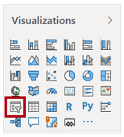
 
12. Position and size the slicer at the top-left of the report page.
    
    
 
13. In the **Fields** pane, expand the **Date** table, and then drag the **Calender** field  into the slicer.

    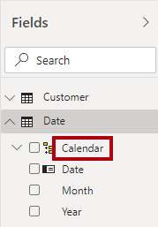
 
14. Ensure that the slicer is selected, and then open the **Format** pane.

15. Turn the **Shadow** property on.

    
 
    *For a consistent style, you’ll be instructed to add shadow to all elements you add to the report*.
 
16. In the slicer, select **CY2012**.

    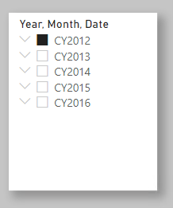
 
17. To create a new visual, first select an empty area of the report canvas.

18. To add a table visual to the report canvas, in the **Visualizations** pane, click the table visual icon.

    
 
19. Position the table visual at the right of the slicer, and resize it to fill the remaining page space.

    
 
20. Add the following fields to the table visual:

    -	**Geography** table **State-Province** field
    -	**Sale** table **Sale Amount** field
    -	**Sale** table **Sale per capita** field
    -	**Sale** table **Profit Amount** field

21. Apply the following table visual formats:

    -	In the **Style** section, set the **Style** to **Bold Header**.
    -	In the **Grid** section, increase the **Text Size** property to **16** pt.
    -	Turn **Shadow** on.

22. To sort the table visual rows, click the **Sale per Capita** column header to sort by descending profitability.

    
 
23. Save the Power BI Desktop solution.
 
## **Task 2: Develop Page 2**

In this task, you will develop the second report page.

The completed report page will look like the following:


 
1. To duplicate the report page, at the bottom-left, right-click the **Sale Analysis** page, and then select **Duplicate Page**.

   
 
   *Tip: Duplicating the page copies the formatting options. It can be quicker to duplicate than to reapply formats. And, it’s likely to result in more design consistency.*

2. Rename the new page as **Sale Chord**.

   
 
3. To delete the table visual, select the visual, and then press the **Delete key**.
 
4. To sync the slicers, on the **View** ribbon tab, from inside the **Show Panes** group, select **Sync Slicers**.
 
   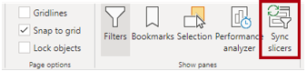
   
5. In the report page, select the **Year** slicer.

6. In the **Sync Slicers** pane (located at the left), check both pages to sync.

   
 
   *When a report user changes either **Year** slicer, the filter will propagate between these pages. Both slicers will remain in sync.*
   
7. In the **Sync Slicers** pane, at the top-left, click **X**.

   
 
8. To import a custom visual, in the **Visualizations** pane, click the ellipsis (…), and then select **Get More Visuals**.

   
 
9. In the **Power BI Visuals** window, in the **Search** box, enter **Chord**, and then press **Enter**.

   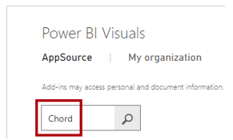
 
10. When the **Chord** search result appears, click **Add**.

    
 
11. When the custom visual imports, click **OK**.

12. In the **Visualizations** pane, notice that the chord custom visual sits in an area beneath the core Power BI visuals.

    
 
13. Add a chord visual to the report page.
 
14. Position the chord visual at the right of the slicer, and resize it to fill the remaining page space.

    
 
15. Configure the following visual field wells:

    -	**From: Geography** table **Sales Territory** field
    -	**To: Customer** table **Buying Group** field
    -	**Values: Sale** table **Sale Amount** field

    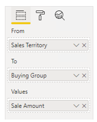
 
16. Format the chord visual to add shadow.

17. Change the **Year** slicer values, and notice how the chord visual animates.

18. Hover the cursor over the outer segments and the internal chords to reveal tooltips describing inter-relationships between sales territories and buying groups.

19. Set the **Year** slicer back to **CY2012**.

20. Save the Power BI Desktop solution.

## **Task 2: Develop a Drill Through Page**

In this exercise, you will develop a drill through page.

### **Subtask 1: Develop a Drill Through Page**

In this task, you will develop a drill through page allowing report users to see detail data for a state-province.

The completed report page will look like the following:

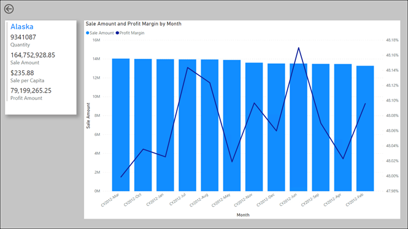
 
1. Create a new report page by duplicating the **Sale Chord** page.

2. Rename the new page as **State-Province Details**.

   
 
3. Remove the slicer and chord visual.
 
4. From the **Fields** pane, in the **Geography** table, drag the **State-Province** field to the **Drill Through** section (beneath the **Visualizations** pane), into the well.

   
 
5. Apply a filter to the first state, **Alabama**.

   
 
   *The filter will be applied when the report user drills through. You applied this filter now to help design the page for a single state.*
   
6. At the top-left of the report page, notice the back arrow button.

   *The button was added automatically when you added a drill through filter. It allows report users to navigate back to where they drilled.*
   
7. Select the button, and the in the **Visualizations** pane, turn the **Background** off.

   
 
8. Add a multi-row card visual to the report page.

   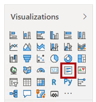
 
9. Position and size the multi-row card visual at the top-left of the report page.

   
 
10. Add the following five fields to the multi-row card visual:

    -	**Geography** table **State-Province** field
    -	**Sale** table **Quantity** field
    -	**Sale** table **Sale per capita** field
    -	**Sale** table **Sale Amount** field
    -	**Sale** table **Profit Amount** field
    -	**Product** table **Profit % All Geography** field

11. Apply the following formats:

    -	In the **Data Labels** section, set the **Text Size** to **16** pt.
    -	In the **Card Title** section, set the **Text Size** property to **20** pt.
    -	Turn **Shadow** on.

    
   
    *If the card values form more than one column, reduce the width of the multi-row card visual*
 
12. Add a line and clustered column chart visual to the report page.

    
 
13. Position the line and clustered column visual at the right of the slicer, and resize it to fill the remaining page space.

    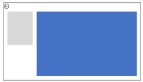
 
14. Configure the following field mappings:

    -	**Shared Axis: Date** table **Month** field
    -	**Column Values: Sale** table **Sale Amount** field

    
 
15. To add a report-level measure, in the **Fields** pane, right-click the **Sale** table, and then select **New Measure**.

    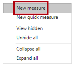
 
    *A report-level measure can be added by the report author. It allows them to define complex summarization logic that’s not already defined in the model.*
    
16. In the formula bar, enter the following measure definition:

    ```
      DAX
        Profit Margin =
        DIVIDE(
		SUM(Sale[Profit Amount]),
	   	SUM(Sale[Sale Amount])
       )
       ```
    *The measure is named **Profit Margin**. The formula divides the sum of the **Profit Amount** column by the sum of the **Sale Amount** column.*
 
17. On the **Measure Tools** contextual ribbon tab, set the format to percentage.

    
 
18. Add the **Profit Margin** measure to the **Line Values** well of the line and clustered column visual.

    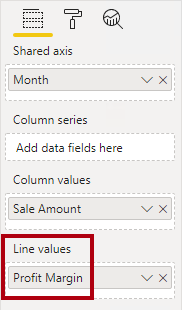
 
19. Format the line and clustered column visual to add shadow.

    *The design of the drill through page is now complete.*

20. Right-click the **State-Province Details** page tab, and then select **Hide Page**.

    
 
    *Report users won’t see the page tab, but they’ll be able to drill through to the page. You’ll now test the drill through experience.*
 
### **Subtask 2: Explore Drill Through**

In this task, you will explore the drill through experience.

1. Select the **Sale Analysis** page.

2. Ensure the **Year** slicer is set to **CY2012**.

3. In the table visual, right-click any state, and then select **Drill Through > State-Province Details**.

   
 
   *Drill through is available from any report visual that groups by the State-Province field.*
   
4. In the drill through page, notice the state you drilled from is the title of the multi-row card visual.

   
 
5. Hover the cursor over the top-left corner of the line and clustered column chart visual, and then hover over the filter (funnel) icon.

   
 
   *The tooltip reveals all applied filters.*

6.  Notice that the **Year** slicer value was passed to the drill through page, too.

7.  To return back to where you drilled from, at the top-left corner, while pressing the **Ctrl** key, click the back button.
    
    *When editing a report, you must press the **Ctrl** key when clicking buttons. If you don’t press the **Ctrl** key, the designer understands you’re selecting it so it can be configured.*
   
8. Save the Power BI Desktop solution.

## **Task 3: Work with Bookmarks**

In this exercise, you will superimpose visuals on the drill through page. You’ll then create bookmarks and assign them to buttons. This design will allow the report user to determine which visual to display.

### **Subtask 1: Create a New Visual**

In this task, you will add a new visual to the drill through page.

1. Select the **State-Province Details** page.

2. Select the line and clustered column chart visual.

3. To clone the visual, press **Ctrl+C**, and then press **Ctrl+V**.

   *Tip: Copy and paste commands are also available on the **Home** ribbon tab.*

4. Position the cloned visual precisely over the top of the original visual.

5. Modify the top visual field **Shared Axis** field mappings by removing the **Month** field, and then replacing it with the **Salesperson** table **Employee** field.

   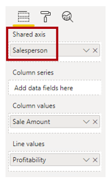
 
6. Format the visual data color by setting the **Default Color** to purple.

   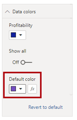
 
### **Subtask 2: Create Bookmarks**

In this task, you will create two bookmarks to show or hide the superimposed visuals.

1. On the **View** ribbon tab, from inside the **Show Panes** group, select **Bookmarks** and **Selection**.

   
 
2. In the **Selection** pane, notice there are two similarly named report elements.

   
 
3. Hover the cursor over each to reveal a tooltip describing their full title.

4. Notice that one ends in “by Month”, and the other ends in “by Salesperson”.

5. Determine which of the visuals groups by salesperson, and then click the **Hide** icon.

   
 
6. Verify that the “by Month” visual is now visible.

7. In the **Bookmarks** pane, click **Add**.

   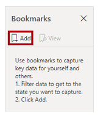
 
8. To rename the bookmark, double-click **Bookmark 1**.

9. Rename the bookmark as **By Month**, and then press **Enter**.

10. Click the ellipsis at the right of the bookmark, and then select **Data**.

    
 
    *By selecting Data, you’re disabling the bookmark from capturing any applied filters. It means that when the bookmark is applied, it’ll use the filters applied by the report user.*
    
11. Click the ellipsis again, and then select **Update**.

    
 
12. In the **Selection** pane, unhide the "by salesperson" visual, and then hide the “by month” visual.

13. Create a second bookmark, and then name it **By Salesperson**.

14. Configure the bookmark to not override filters (turn off **Data**), and then update the bookmark.

15. Verify there are two bookmarks.

    
 
16. Close the **Selection** pane.

    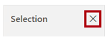
 
17. Close the **Bookmarks** pane.

    
 
### **Subtask 3: Add Buttons**

In this task, you will add two buttons to the report page, and then configure each to select a bookmark.

1. On the **Insert** ribbon tab, from inside the **Elements** group, click **Buttons**, and then select **Blank**.

   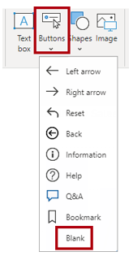

2. Position and size the button so that it is directly beneath the multi-row card visual and it is the same width.

   
 
3. In the **Visualizations** pane, apply the following button formats:

   -	Set the **Button Text** section to **On**.
   -	Expand the **Button Text** section, and then set the **Button Text** to **By Month**.
   -	Set the button text **Font Color** to **Black**.
   -	Set the button text **Text Size** to **16** pt.
   -	Set the **Fill** section to **On**.
   -	Set the fill **Fill Color** to **Blue**.
   -	Set the **Shadow** section to **On**.
   -	Set the **Action** section to **On**.
   -	Set the action **Type** to **Bookmark**.
   -	Set the action **Bookmark** to **By Month**.

4. Clone(Copy and paste) the button, and then position it directly beneath the first button.

   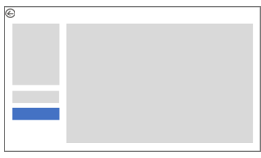
 
5. Modify the button formats, as follows:

   -	Set the **Button Text** to **By Salesperson**.
   -	Set the fill **Fill Color** to **Purple**.
   -	Set the action **Bookmark** to **By Salesperson**.
 
6. Verify that the buttons looks like the following:
 
   
 
7. Test each button by pressing the **Ctrl** key and clicking a button.

## **Task 4: Publish the Report**

In this exercise, you will prepare the report for publication, and then publish it to Power BI.


### **Subtask 1: Prepare the Report**

In this task, you will prepare the report for publication.

1. On the **State-Province Details** page, ensure the **By Month** visual is displayed.

2. Select the **Sale Analysis** page.

3. Ensure the **Year** slicer is set to **CY2012**.

   *It’s important to select the initial page and reset filters just before publishing the report. It will become the report state when report users first open the report.*

4. Save the Power BI Desktop solution as **Sale Report**.

### **Subtask 2: Publish the Report**

In this task, you will publish the report to Power BI.

1. On the **Home** ribbon tab, from inside the **Share** group, click **Publish**.

   

2. If prompted to save changes, click **Yes**.

3. In the **Publish to Power BI** window, select the lab workspace (do not use **My Workspace**).

4. Click **Select**.

   
 
5. When publication has completed, click **Got It**.

6. Close Power BI Desktop.

### **Subtask 3: Review the Published Dataset**

In this task, you will review the published dataset.

1. In the Power BI web browser session, open your lab workspace.

2. In the **Navigation** pane, notice the addition of the **US Sale Analysis** dataset.

   
	
3. In the **Navigation** pane, hover the cursor over the **US Sale Analysis** dataset, and when the ellipsis appears click it, select **View Lineage**.	
	
   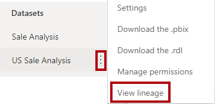
	
4. In the lineage view diagram, notice the two sources which contribute to the **US Sale Analysis** dataset.
		
   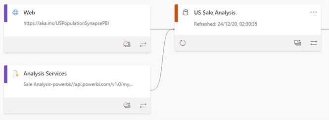	
	
   *Your new **US Sale Analysis** dataset comprises two data connections: Web and Analysis Services. Note that the Analysis Services connection is used by Power BI to connect to the Power BI dataset*

5. To open the report, in the **Navigation** pane, click the **US Sale Analysis** report.

6. In the report viewer, beneath the menu bar, notice the error message that describes that the web data source is missing credentials.

   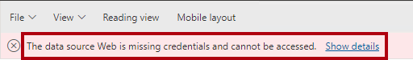	
	
   *The **US State Population** table is loaded from a web page, which requires that a gateway be setup. It’s not possible to create or view a report in the Power BI service until the gateway is installed and the web connector credentials applied.
In the next section, you will install a gateway in personal mode, and then apply data source credentials. This section of the lab is optional. However, you must complete this section if you’re to explore the report later in that section.
*
## **Task 5: Install the Gateway (Optional)**

In this section, you will install a gateway and configure the US Sale Analysis dataset data source credentials.

*Important: If you’re using the lab VM, it is possible to complete this lab. If you’re using your own machine, you can only install the gateway if you’re using a 64-bit operating system and policy allows installing this software. If you have already installed a personal gateway on your machine, you will need to uninstall it first.*

### **Subtask 1: Install the Gateway**

In this task, you will install the Power BI gateway in personal mode.

1. In the Power BI web browser session, at the top-right, click the download icon (down-pointing arrow), and then select **Data Gateway**.

   
	
   *A new web browser tab opens to the Power BI gateway page.*
	
2. In the Power BI gateway web page, click **Download Personal Mode**.	
	
   
	
   *There are two types of gateway: The standard gateway and gateway in personal mode. For the data analyst, it can be appropriate to install the gateway in personal mode. Note that if you configured scheduled data refresh, you would need to ensure your machine is running and connected to the Internet for the refresh to succeed.*
	
3.  When the installer software downloads, open it.
		
    	
	
4. In the gateway setup window, check the acceptance checkbox, and then click **Install**.

   	

5. When prompted to enter an email address, enter your lab Azure account.

6. Click Sign In.

   	

7. Complete the sign in process by entering your password.

8. When the gateway installation and setup has completed, click **Close**.

9. Close the Power BI gateway web page.

   *The gateway is now setup and running. In the next task, you will assign the gateway to the **US Sale Analysis** dataset and configure data source credentials.*
	
### **Subtask 2: Configure Dataset Settings**

In this task, you will configure the **US Sale Analysis** dataset settings.

1. In the Power BI web browser session, in the **Navigation** pane, hover the cursor over the **US Sale Analysis** dataset, and when the ellipsis appears click it, select **Settings**.
	
   	
	
2. In the **Data Source Credentials** section, read the messages.

   *Credentials must be set for only the Web connection. There is no need to set credentials for the connection to the **Sale Analysis** dataset.*
	
3. For the **Web** connection, click **Edit Credentials**.

   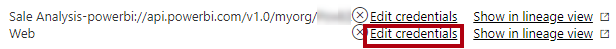
	
4. In the window, in the **Privacy Level Settings** dropdown list, select **Public**.

   *Privacy levels allows Power Query to determine the most efficient, yet secure way, to refresh data when combining data from multiple data sources. In your model, Power Query is not used to combine data.*
	
5. Click **Sign In**.

   
	
   *It’s now possible to perform and schedule data refresh for your model. You won’t do that in this lab.*
	
6. To test the dataset, in the **Navigation** pane, click the **US Sale Analysis** report.

7. Notice that it is now possible to see the report data and interact with the report.

### **Subtask 3: Explore the Report**

In this task, you will explore the report to determine root cause for low-profit earning state.

1. In the **Navigation** pane, click the **US Sale Analysis**.

2. At the left, notice there are only two pages.

   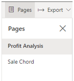
 
   *Recall that the drill through page was hidden.*
   
3. Set the **Year** slicer to **CY2014**.

   *Understand that the page refreshed quickly because Power BI is querying an aggregation that you created in **Exercise 07**.*
	
4. To see low-sale per capita states, modify the table sort to **Sale per Capita** ascending.

5. To understand **Tennessee** sales in more detail, right-click **Tennessee**, and then drill through to the details page.

6. Review the monthly sales.

7. Click the **By Salesperson** button, and then review the result by salespeople.

   *The lab is now complete.*

### Summary

In this exercise, you used Power BI Desktop to continue the development of the solution created in **Exercise 07**. You authored a multi-page report that includes synced slicers, a custom visual, page drill through, a measure, bookmarks, and buttons. You then finalized the exercise by publishing the report to the Power BI service.
In order to explore and interact with the report in the Power BI service, you had the opportunity to install a gateway.
