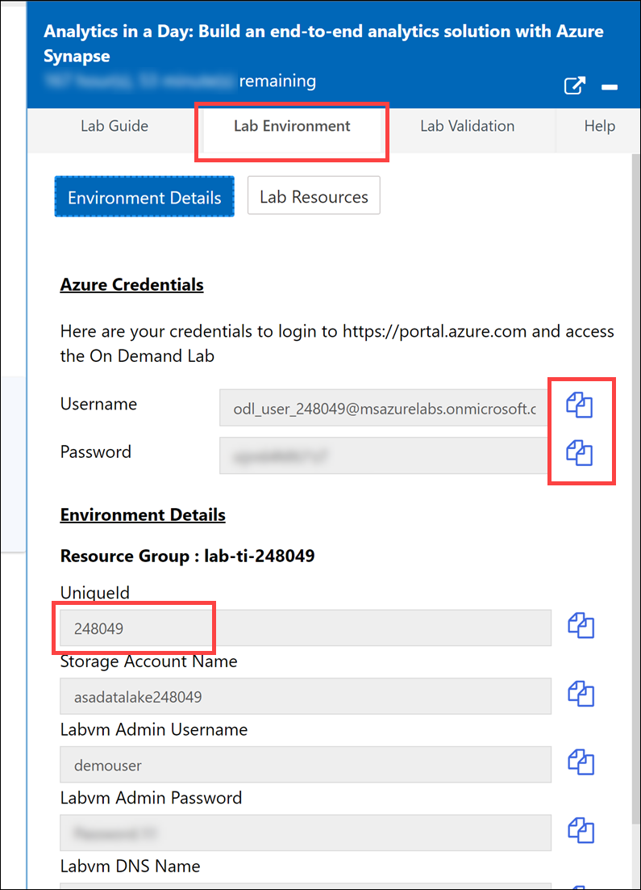
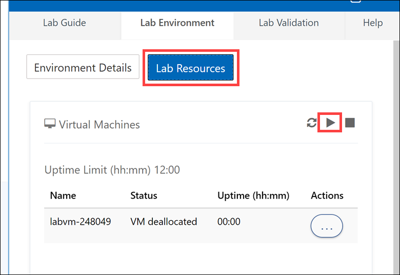
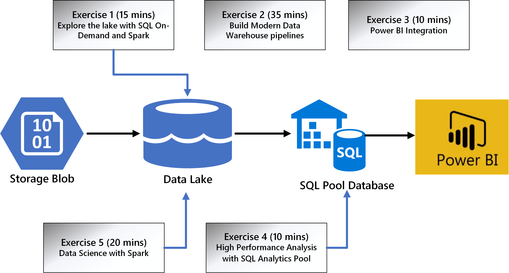

# Azure Synapse Analytics in a Day Lab

## Wide World Importers

Wide World Importers (WWI) is a wholesale novelty goods importer and distributor operating from the San Francisco bay area.

As a wholesaler, WWI's customers are mostly companies who resell to individuals. WWI sells to retail customers across the United States, including specialty stores, supermarkets, computing stores, tourist attraction shops, and some individuals. WWI sells to other wholesalers via a network of agents who promote the products on WWI's behalf. While all of WWI's customers are currently based in the United States, the company intends to expand into other countries.

WWI buys goods from suppliers, including novelty and toy manufacturers, and other novelty wholesalers. They stock the goods in their WWI warehouse and reorder from suppliers as needed to fulfill customer orders. They also purchase large volumes of packaging materials and sell these in smaller quantities as a convenience for the customers.

Recently WWI started to sell a variety of edible novelties such as chili chocolates. The company previously did not have to handle chilled items. To meet food handling requirements, they must monitor the temperature in their chiller room and any of their trucks that have chiller sections.

## Lab context

Wide World Importers is designing and implementing a Proof of Concept (PoC) for a unified data analytics platform. Their soft goal is to bring siloed teams to work together on a single platform.

In this lab, you will play the role of various persona: a data engineer, a business analyst, and a data scientist. The workspace is already set up to focus on some of the core development capabilities of Azure Synapse Analytics.

By the end of this lab, you will have performed a non-exhaustive list of operations that combine the strength of Big Data and SQL analytics into a single platform.

### How to get started with a provided lab environment

If you are using a hosted lab environment, please follow the steps below to get started:

1. Select the **Lab Environment** tab above the lab guide to copy the Azure credentials used for the lab. Make note of the `UniqueId` value. This value may be referenced at different points during the lab.

    

2. Select **Lab Resources** under Lab Environment to start the Virtual Machine (VM) provided for this lab. However, you do not need to use the VM to complete the lab. It is there for your convenience to make it easier to sign into Azure if you have an existing account and do not want to log out of it.

    

## Solution architecture

The diagram below provides a unified view of the exercises in the lab and their estimated times for completion.

## Exercise 1 - Explore the data lake with Azure Synapse Serverless SQL Pool and Azure Synapse Spark

In [this exercise](01-explore-data-lake.md), you will explore data using the engine of your choice (SQL or Spark).

Understanding data through data exploration is one of the core challenges faced today by data engineers and data scientists as well. Depending on the data's underlying structure and the specific requirements of the exploration process, different data processing engines will offer varying degrees of performance, complexity, and flexibility.

In Azure Synapse Analytics, you have the possibility of using either the SQL Serverless engine, the big-data Spark engine, or both.

## Exercise 2 - Working with Azure Synapse Pipelines

In [this exercise](02-build-modern-dw-pipelines.md), you will use a pipeline with parallel activities to bring data into the Data Lake, transform it, and load it into the Azure Synapse SQL Pool. You will also monitor the progress of the associated tasks.

Once data is properly understood and interpreted, moving it to the various destinations where processing steps occur is the next big task. Any modern data platform must provide a seamless experience for all the typical data wrangling actions like extractions, parsing, joining, standardizing, augmenting, cleansing, consolidating, and filtering.

Azure Synapse Analytics provides two significant categories of features - data flows and data orchestrations (implemented as pipelines). They cover the whole range of needs, from design and development to triggering, execution, and monitoring.

## Exercise 3 - High Performance Analysis with Azure Synapse Dedicated SQL Pools

In [this exercise](03-high-performance-analysis.md), you will try to understand customer details using a query and chart visualizations. You will also explore the performance of various queries.

SQL data warehouses have been for a long time the center of gravity in data platforms. Current data warehouses are capable of providing high performance, distributed, and governed workloads, regardless of the data volumes at hand.

The Azure Synapse SQL Pools in Azure Synapse Analytics is the new incarnation of the former Azure SQL Data Warehouse. It provides all the state-of-the-art SQL data warehousing features while benefiting from the advanced integration with all the other Synapse services.

## Exercise 4 - Lake Databases and Database templates

In [this exercise](04-lake-databases-database-templates.md), you will explore the concept of a lake database and you will learn how to use readily available database templates for lake databases.

The lake database in Azure Synapse Analytics enables you to bring together database design, meta information about the data that is stored and a possibility to describe how and where the data should be stored. Lake database addresses the challenge of today's data lakes where it is hard to understand how data is structured.

## Exercise 5 - Log and telemetry analytics

In [this exercise](05-log-telemetry-analytics.md), you will explore the capabilities of the newly integrared Data Explorer runtime in Synapse Analytics.

Azure Synapse data explorer provides you with a dedicated query engine optimized and built for log and time series data workloads. With this new capability now part of Azure Synapse's unified analytics platform, you can easily access your machine and user data to surface insights that can directly improve business decisions. To complement the existing SQL and Apache Spark analytical runtimes, Azure Synapse data explorer is optimized for efficient log analytics, using powerful indexing technology to automatically index structured, semi-structured, and free-text data commonly found in telemetry data.

## Exercise 6 - Data governance with Azure Purview

In [this exercise](06-data-governance-purview.md), you will use several of the capabilities provided by the integration between Azure Synapse Analytics and Azure Purview workspaces.

Azure Purview is a unified data governance solution that helps you manage and govern your on-premises, multicloud, and software-as-a-service (SaaS) data. Purview enables you to easily create a holistic, up-to-date map of your data landscape with automated data discovery, sensitive data classification, and end-to-end data lineage. It also enables data consumers to find valuable, trustworthy data.

Azure Synapse Analytics and Azure Purview workspaces are tightly integrated, enabling seamless data discovery and lineage.

## Exercise 7 - Power BI integration

In [this exercise](07-power-bi-integration.md), you will build a Power BI report in Azure Synapse Analytics.

The visual approach in data exploration, analysis, and interpretation is one of the essential tools for both technical users (data engineers, data scientists) and business users. Having a highly flexible and performant data presentation layer is a must for any modern data platform.

Azure Synapse Analytics integrates natively with Power BI, a proven and highly successful data presentation and exploration platform. The Power BI experience is available inside Synapse Studio.

>**Extension module**
>
>The exercise is accompanied by a [Power BI extension module](./power-bi-extension-module/README.md) with four additional (optional) exercises.

## Exercise 8 - Data Science with Spark (optional)

In [this exercise](08-data-science-with-spark.md), you will leverage a model trained with Azure Machine Learning AutoML using Spark compute to make predictions using the T-SQL PREDICT statement in an Azure Synapse Analytics dedicated SQL pool.

Azure Synapse Analytics provides support for using trained models (in ONNX format) directly from dedicated SQL pools. What this means in practice, is that your data engineers can write T-SQL queries that use those models to make predictions against tabular data stored in a SQL Pool database table.

The model is trained and registered by Azure Machine Learning automated ML (AutoML) using the compute resources provided by a Synapse Analytics Spark pool (the main requirement is that the model format must be supported by ONNX). Using the integration of the Azure Machine Learning experience into Synapse Analytics Studio, the trained model is deployed to the dedicated SQL pool where it is used for inference via the T-SQL PREDICT statement.
